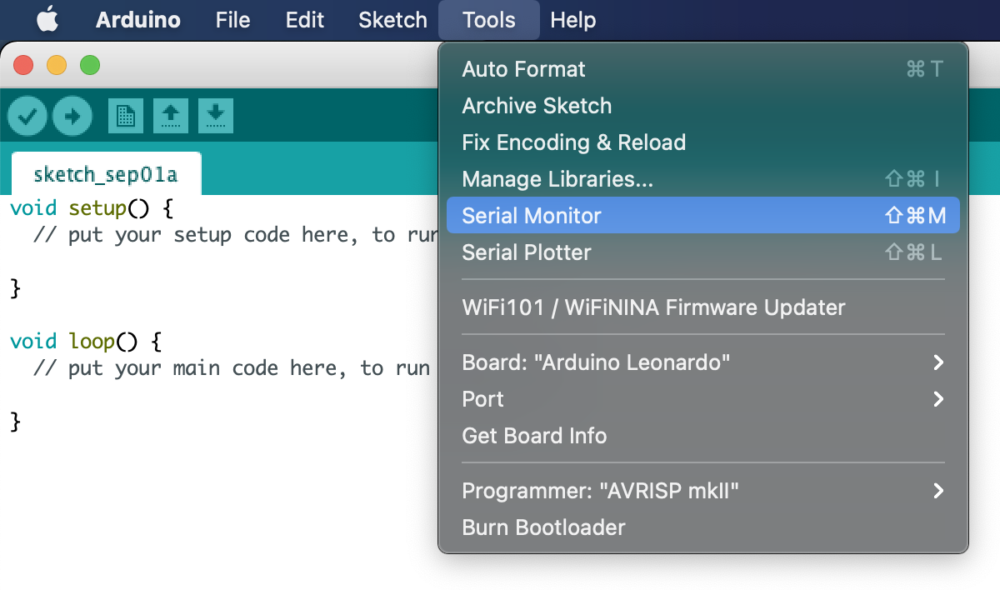
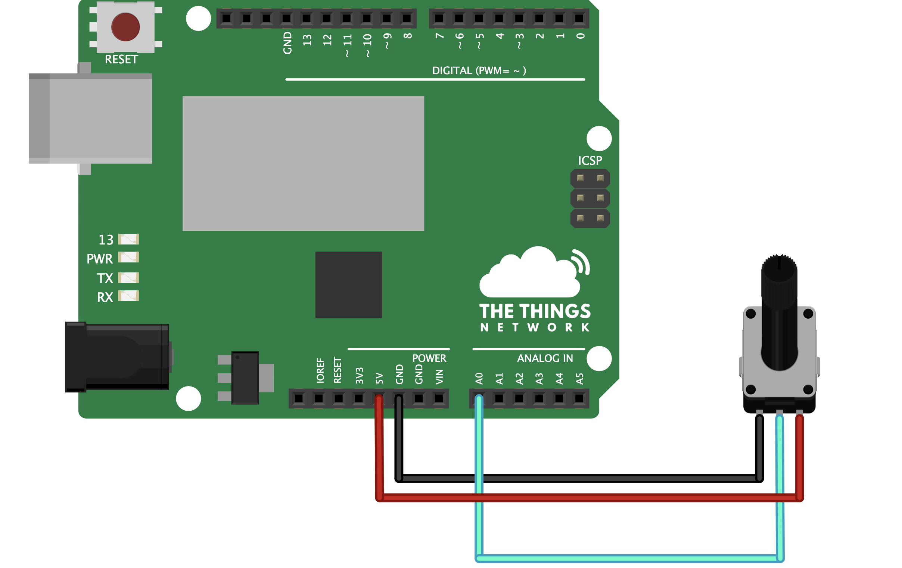

# Getting Started With LoRaWAN

This workshop will guide you through working with The Things Uno to send sensor data over The Things Stack to an application.

## Pre-requisites

1. The Things Uno
2. Micro-USB cable
3. Sensors, jumpers and optional breadboard as provided, ex: a Potentiometer and connecting wires.
4. Computer running Windows 7 or higher, Mac OS X or Linux
5. Wifi for your laptop.
6. Gateway coverage to The Things Stack instance that you are sending data to.

## Preparation

### Setting up the Arduino IDE

Head over to the documentation page on [The Things Uno](https://www.thethingsindustries.com/docs/devices/the-things-uno/#setting-up-arduino-ide) and setup the IDE.

### Setting up an account with The Things Stack Community Edition

To follow along with this workshop, you'll need an account with an instance of The Things Stack. Check the page on setting up [an account with The Things Stack Community Edition](https://www.thethingsindustries.com/docs/getting-started/ttn/).

## Procedure

### General steps with the Arduino IDE

For this workshop there are two actions with the Arduino IDE that will be used the most.

The Serial Monitor is used to read serial data from the Arduino. It's recommended to keep this window open in the background.

To enable this go to `Tools` > `Serial Monitor`. Set the baud-rate to `9600` if not set already.



Secondly, to upload your code to the Arduino, use the options under `Sketch`. For this guide, since you're using a USB connection, always upload via the `Upload` option (and not `Upload using programmer`).

### "Calibrate" the sensor

- Connect the USB cable to the Arduino IDE and select the port as explained the preparatory step.
- Connect the Pot with the 

- Open the [PotMeter.ino](./1_PotMeter/Potmeter.ino) sketch in the Arduino IDE.
- Upload it.
- Play around with the pot and note the values printed on the screen.
- Choose a lower threshold and and upper threshold for your specific pot. These values will be used in later steps.

### Register the Device

- Connect the USB cable to the Arduino IDE and select the port as explained the preparatory step.
- Open the [DeviceInfo.ino](./2_DeviceInfo/DeviceInfo.ino) sketch in the Arduino IDE and upload it.
- Copy the screen the `DevEUI` and `JoinEUI` values to a separate file.
- Register this device on [The Things Stack Community Edition](https://www.thethingsindustries.com/docs/devices/adding-devices/).
- For the App Key, provide an arbitrary value or to generate one from the Console.
```bash
openssl rand -hex 16
```

### Perform a LoRaWAN Join

- Connect the USB cable to the Arduino IDE and select the port as explained the preparatory step.
- Open the [Join.ino](./3_Join/Join.ino) sketch in the Arduino IDE.
- Replace the following fields in the sketch
  - `appEUI`: Value you noted earlier
  - `appKey`: The same random value used for the `App Key` field while registering the device.
  - `freqPlan`: Replace the word `REPLACE_ME` with the correct frequency plan based on your region.
- Go to `Sketch` -> `Verify/Compile`. If correct, upload the sketch.
- Check the serial monitor for the device to Join the network.

### Send Sensor Data

- Connect the USB cable to the Arduino IDE and select the port as explained the preparatory step.
- Open the [Traffic](./4_Traffic/traffic.ino) sketch in the Arduino IDE.
- Set the `SENSOR_THRESHOLD_LOW` and `SENSOR_THRESHOLD_HIGH` values based on your own sensor value that were noted in step 1.
- Go to `Sketch` -> `Verify/Compile`. If correct, upload the sketch.
- Head over to the application tab of [The Things Stack Community Edition](https://console.cloud.thethings.network) and check your data payloads.


