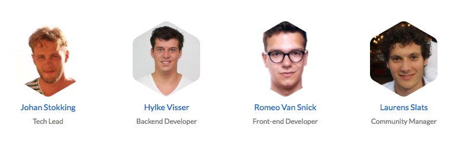
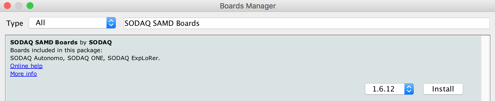
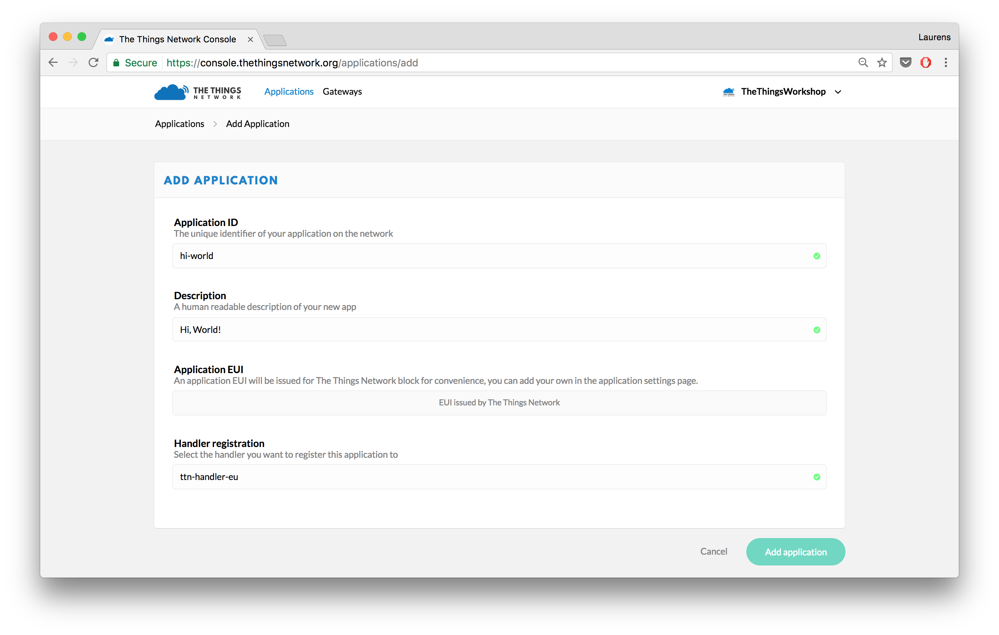
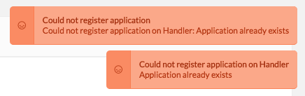
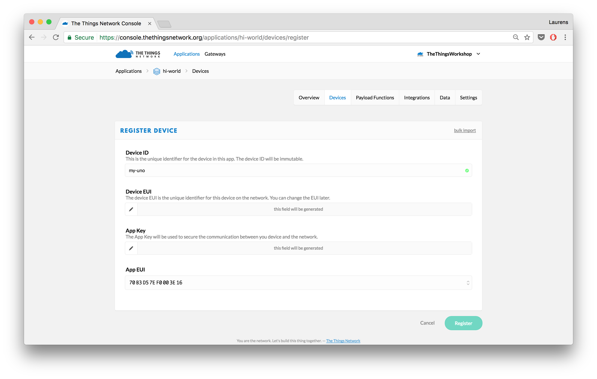
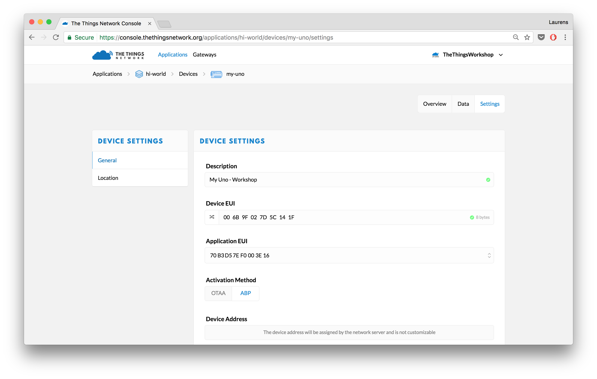
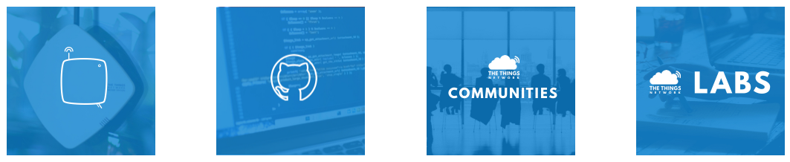

# IOT HACKATHON


## Hack the world of IoT with the Things Network

The Things Network (TTN) is back at the IoT Tech Day with a new, bigger hackathon. Novel Internet of Things technology and abundant data connectivity open up a new world of opportunities. We challenge the tech-savvy and the creative minded people to start exploring the new world of IoT and change the way we use technology. During the hackathon we will use the open standard LoRaWAN.
 
## About The Things Network
The Things Network is on a mission to build an open, global and crowdsourced Internet of Things data network, owned and operated by its users. In July 2015, The Things Network managed to cover the entire city of Amsterdam with a new type of wireless technology called LoRaWAN (Long Range Wide Area Network). The network was built, bottom-up, funded by its users. Now, hundreds of cities in over 80 countries worldwide are covered and lots of use cases are built on top of it. Join us in our mission to create abundant data connectivity so applications and businesses can flourish.

### Your The Things Network Support Team
Face any difficulties during the Hackathon? Ask for these guys who can help you out:



## Useful links
* [The Things Network Console](https://console.thethingsnetwork.org/) (developer environment)
* [SODAQ ONE support page](http://support.sodaq.com/sodaq-one/)
* [Official TTN documentation](https://www.thethingsnetwork.org/docs/)


## Getting started with SODAQ ONE
This workshop will support you in setting-up your SODAQ ONE board and send data over The Things Network to the IBM Watson IoT Platform.

### Pre-requisites

1. SODAQ ONE board V2
2. Active GPS antenna
3. Antenna 
4. Micro-USB cable
5. LiPo battery 240mAh
6. Headers Sensors
7. Computer running Windows 7 or higher, Mac OS X or Linux
8. Wifi for your laptop.


### Register with The Things Network and join Slack

To start using The Things Network, you need an account:

1. [Create an account][https://account.thethingsnetwork.org/register].
2. Once your account has been created, go to your [profile page](https://account.thethingsnetwork.org/) and `request a Slack invite`
3. A mail has been sent with an invitation to join Slack. Open up Slack and join our dedicated channel `#iot-tech-day`


## Set up your Arduino IDE
Set up the Arduino Software (IDE) and connect your SODAQ ONE.

1.  [Download](https://www.arduino.cc/en/Main/Software) and install the latest version of the Arduino Software.
2.  Navigate to **Sketch > Include Library > Manage Libraries...**.
3.  Search for **TheThingsNetwork**, click on it and select the latest version.
4.  Click the **Install** button which should appear:

    

5.  Install the SODAQ ONE board files. Click on **File **(or **Arduino** on a MAC) **> Preferences** and at the bottom you should see **Additional Boards Manager URLs**. Paste the following URL and click **OK** 
 ```
 http://downloads.sodaq.net/package_sodaq_samd_index.json
 ```
6.  Click on **Tools > Board > Boards Manager...**.
7. Search for **SODAQ SAMD Boards**, select the latest version and click and **Install**

 

8. We’re almost there! Now go to **Tools > Board** and select **SODAQ ONE** at the bottom. 


### Add an Application in the Console

Add your first The Things Network Application.

1.  In the [console][https://console.thethingsnetwork.org/], click [add application][https://console.thethingsnetwork.org/applications/add].

	* For **Application ID**, choose a unique ID of lower case, alphanumeric characters and nonconsecutive `-` and `_` (e.g. `hi-world`).
	* For **Application Description**, enter anything you like (e.g. `Hi, World!`).

	

2.  Click **Add application** to finish.

    You will be redirected to the newly added application, where you can find the generated **Application EUI** and default **Access Key** which we'll need later.
    
    > If the Application ID is already taken, you will end up at the Applications overview with the following error. Simply go back and try another ID.
    
        

### Register the Device

The Things Network supports the two LoRaWAN mechanisms to register devices: Over The Air Activation (OTAA) and Activation By Personalization (ABP). In this workshop, we will use ABP.

> In production, you'll want to use OTAA, which is the default. This is more reliable because the activation will be confirmed and more secure because the session keys will be negotiated with every activation. ABP is useful for workshops because you don't have to wait for a downlink window to become available to confirm the activation.

1.  On the Application screen, scroll down to the **Devices** box and click **register device**.

    * For **Device ID**, choose a - for this application - unique ID of lower case, alphanumeric characters and nonconsecutive `-` and `_` (e.g. `my-sodaq-one`).
    * For **Device EUI**, click the **randomize** button. 

    

2.  Click **Register**.

    You will be redirected to the newly registered device.
    
3.  On the device screen, select **Settings** from the top right menu.

    

    * You can give your device a description like `My SODAQ ONE - IoT Tech Day`
    * Change *Activation method* to *ABP*.
    * Uncheck **Frame counter checks** at the bottom of the page.

        > **Note:** This allows you to restart your device for development purposes without the routing services keeping track of the frame counter. This does make your application vulnerable for replay attacks, e.g. sending messages with a frame counter equal or lower than the latest received. Please do not disable it in production.

4.  Click **Save** to finish.

    You will be redirected to the device, where you can find the **Device Address**, **Network Session Key** and **App Session Key** that we'll need next.
    
    


### Open the SODAQ ONE sketch in the Arduino IDE
Our friends at SODAQ built quite some amazing software: the [SODAQ ONE Tracker](http://support.sodaq.com/sodaq-one/tracker-software/)

1.  Download the .zip file of the `One v2 – Cayenne LPP` by clicking [here](http://support.sodaq.com/wp-content/uploads/2016/07/SodaqOne-UniversalTracker-v2-Cayenne.zip).

2. Open the file `SodaqOneTracker_v2.ino` in the `SodaqOne-UniversalTracker-v2-Cayenne` folder

3. Remove the `//` before `#define CAYENNE` on line 51

4. Click on **Tools > Boards > SODAQ ONE**.

5. Click on **Tools > Port ** and *select the right USB Port*.

 
### Upload your first sketch

Now it's time to alter some variables in the Arduino Sketch which results in data being sent to the application you just created in the Console of The Things Network.

*For this part you have to be quite fast. If you're too slow and the Serial Monitor displays the text below, worry not, just disconnect the usb cable from your laptop and connect it again.*

```
** Boot-up completed successfully!
The USB is going to be disabled now.
```

1. Select **Sketch > Upload** `Ctrl/⌘ U` to upload the sketch.
  Wait for the status bar to say *Done uploading*.
  
2. Select **Tools > Serial Monitor** `Ctrl/⌘ Shift M` to open the Serial Monitor.

3. Look at the bottom of your Serial Monitor and change `no line ending' to `Both NL and & CR`

    It should look something like this:

  

4. Set the following variables in your Sketch via the Serial Monitor:

		otaa= 0

		fi= 1

		dev= <`Device Address`>

		app= <`App Session Key`>

		key= <`Network Session Key`>
	
  
	  You can find the `Device Address`, `App Session Key` and `Network Session Key` in the **Device Overview** page in the **Console** of The Things Network 

5. After changing the variables, go back to the **Console** and click on the tab `Data`. Now, wait patiently and see your first LoRa package arriving (this might take a few minutes).

 Do you see your data appearing?

 No? Too bad, but worry not! Please check if you set all the variables correctly.
 
 Yes? 🎉 Great job! Now impress your neighbours with this amazing thing you created. Don't forget to add The Things Network in your Tweet: @thethingsntwrk


## So. I'm done. What's Next?
Done already? Good, now let's start for real.

We recommend you start with the following taksk:
1. Display the data in a nice and fancy dashboard of **Cayenne myDevices**. [Here](https://github.com/TheThingsNetwork/workshops/blob/master/myDevices.md) you can find some tips & tricks.

2. Send you data to IBM Watson IoT. Check [this link](https://github.com/TheThingsNetwork/workshops/blob/master/IBM.md)

3. Looking for more challenges? What about **soldering your Lipo battery** to the SODAQ ONE so you can take it along wirelessly.

4. Now, you have all the skills required to start building a real use case. What innovative stuff can you create?


Mny thanks for joining our hackathon. As you might have heard in the presentation:
### We're building this thing together

So join us:


