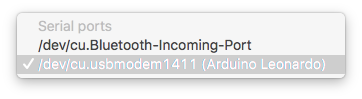
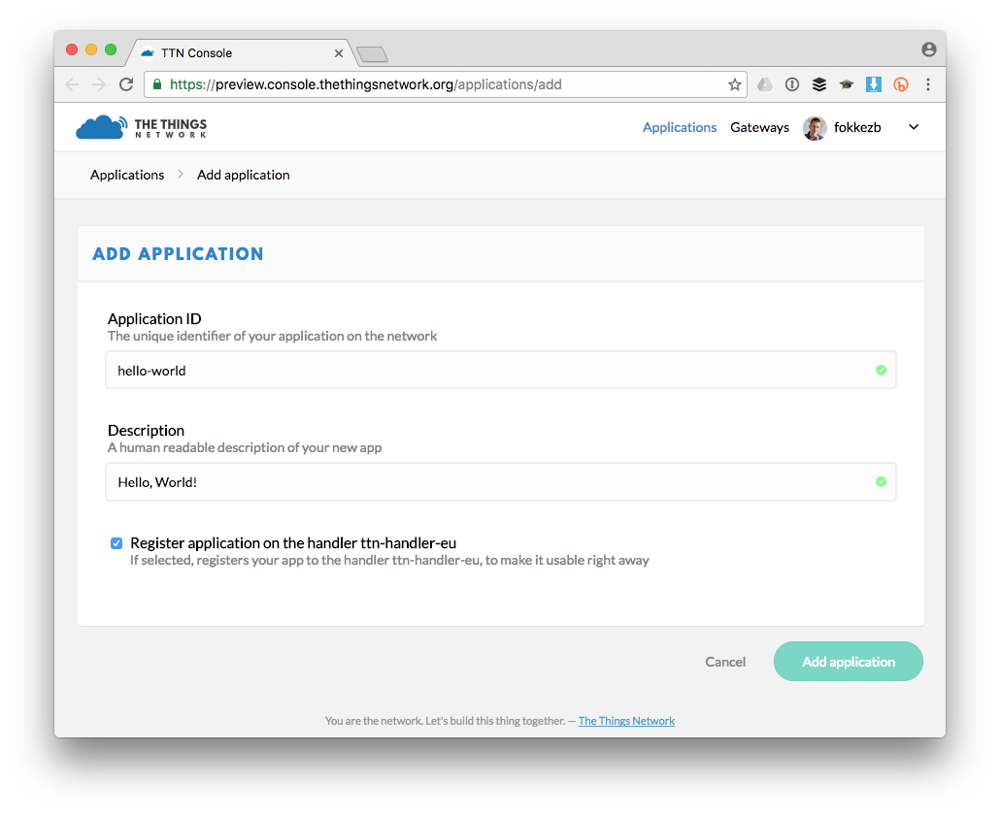
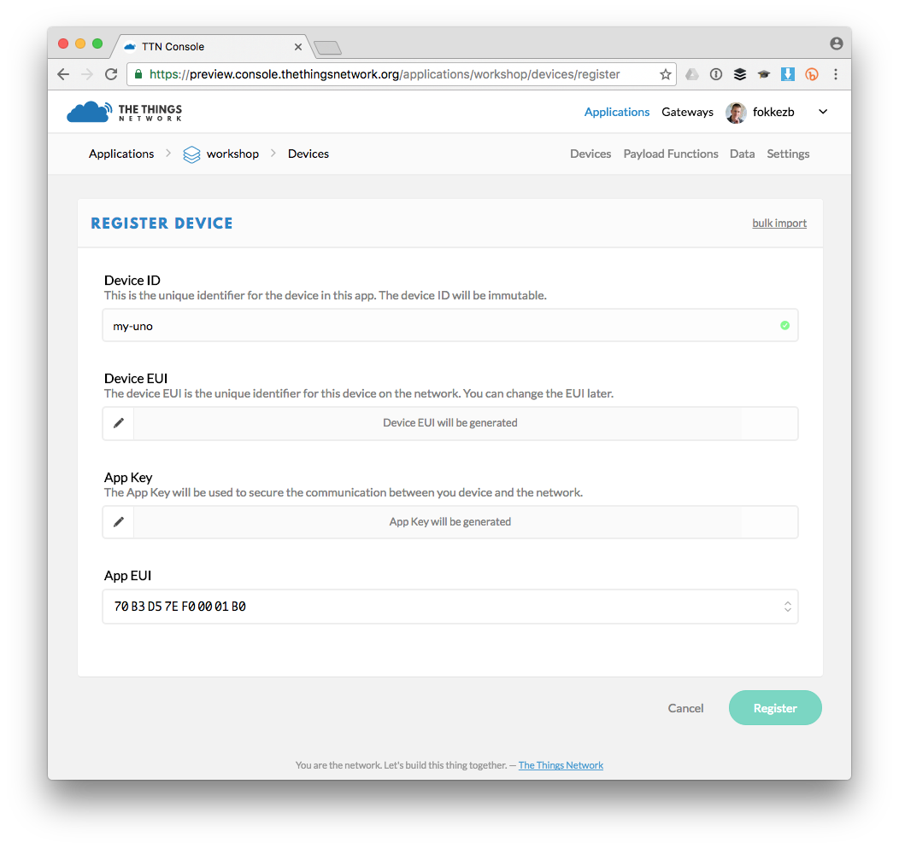
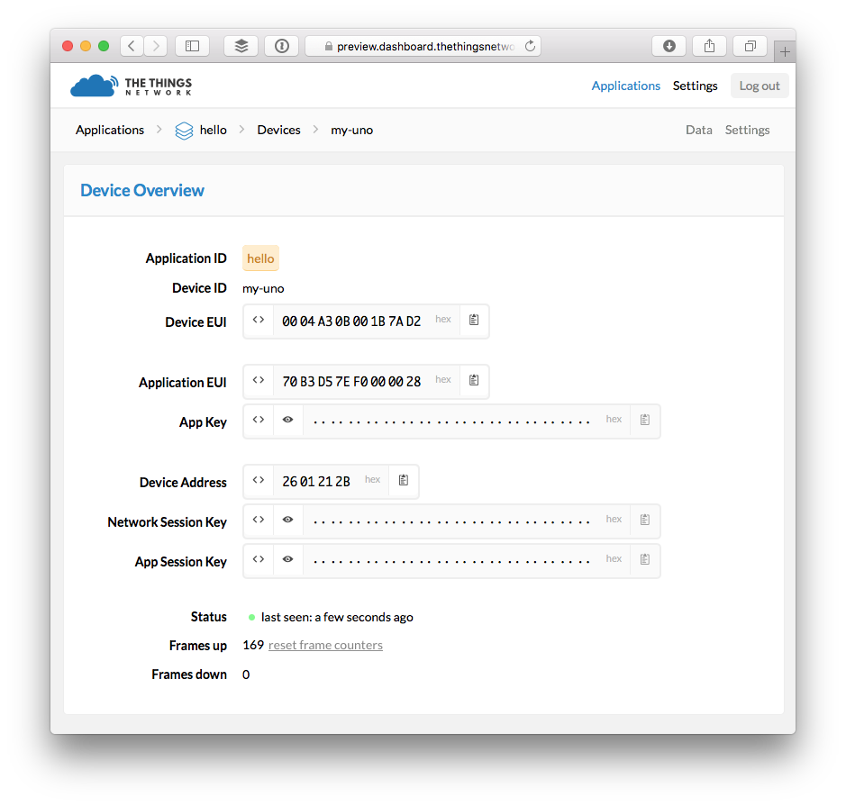
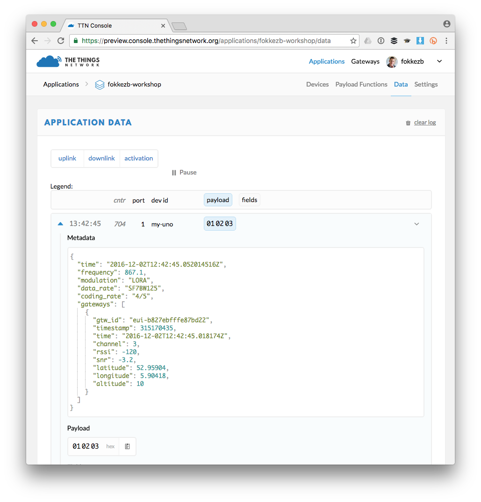
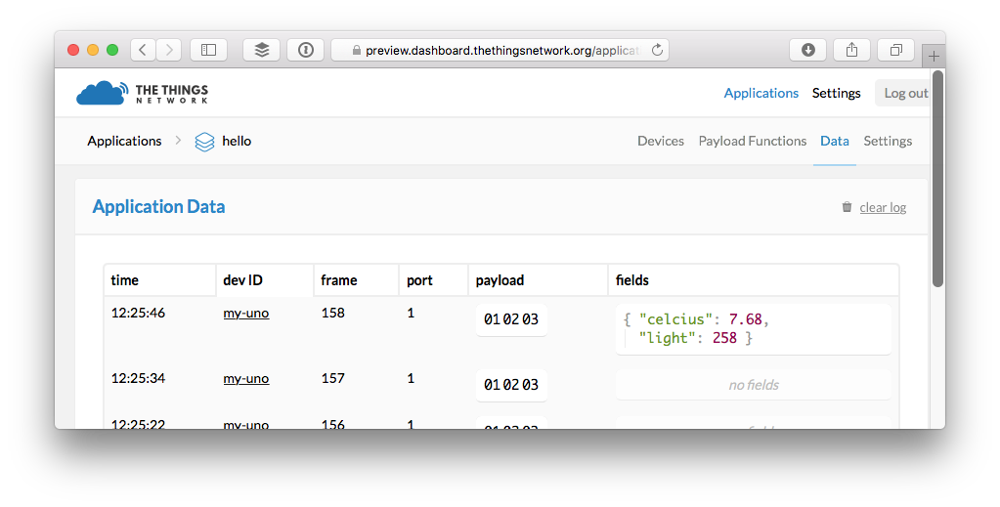
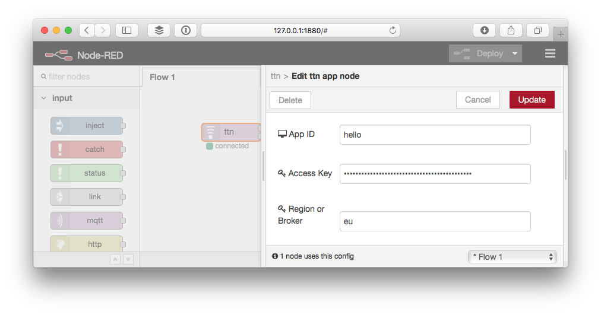
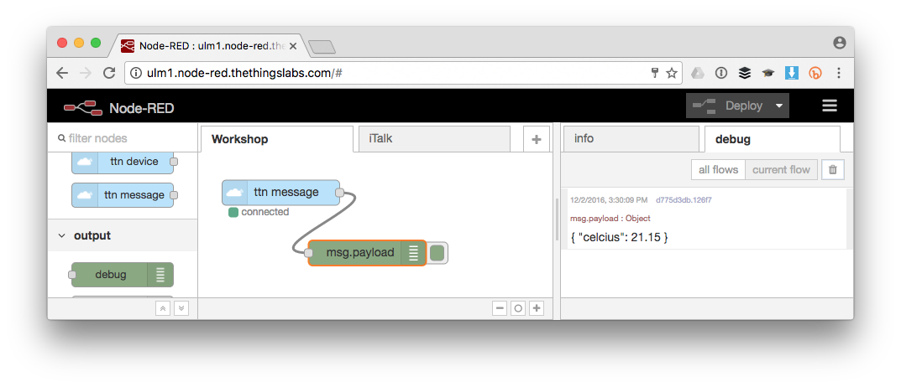

# The Things Uno Workshop / Ulm Digital
This workshop will guide you through working with The Things Uno to send sensor data over The Things Network to an application.


## Pre-requisites

1. The Things Uno
2. Micro-USB cable
3. Sensors, jumpers and optional breadboard as provided:
    * [Grove Temperature sensor](https://www.seeedstudio.com/Grove-Temperature-Sensor-p-774.html)
    * Grove [Button](https://www.seeedstudio.com/Grove-Button-p-766.html) or [Water](https://www.seeedstudio.com/Grove-Water-Sensor-p-748.html) sensor
    * [4 pin Male Jumper to Grove 4 pin Conversion Cable](https://www.seeedstudio.com/Grove-4-pin-Male-Jumper-to-Grove-4-pin-Conversion-Cable-(5-PCs-per-Pack)-p-1565.html)
4. Computer running Windows 7 or higher, Mac OS X or Linux
5. Wifi for your laptop.
6. The Things Network coverage.
7. A pre-configured Node-RED server.
    * Go to https://docs.google.com/spreadsheets/d/1uMzCxTNxh69-df0xIY2Pbcqg7AAfcITcAoNxY8ZX0WQ/edit?usp=sharing
    * Claim the first available URL by adding your name

## Connect to The Things Uno

Set up the Arduino Software (IDE) and connect to your Uno.

1.  [Download](https://www.arduino.cc/en/Main/Software) and install the latest version of the Arduino Software.
2.  Navigate to **Sketch > Include Library > Manage Libraries...**.
3.  Search for **TheThingsNetwork** and click the result to select it.
4.  Click the **Install** button which should appear:

    

5.  Connect the The Things Uno to your computer using the Micro-USB cable.
6.  Select **Tools > Board > Arduino Leonardo**
7.  Select **Tools > Port** > the port that identifies as **Arduino Leonardo**:

    
    
    > For Windows, see [Getting Started with the Arduino Leonardo and Micro](https://www.arduino.cc/en/Guide/ArduinoLeonardoMicro#toc2) on installing drivers and finding the COM port to select.

## Register with The Things Network

Managed your applications and devices via [The Things Network Console][console].

### Create an Account

To use the console, you need an account.

1.  [Create an account][create-account].
2.  Select [Console][console] from the top menu.
3.  Click **Authorize ttn-dashboard-preview**.
4.  From the top right menu, select your name and then [Settings][settings] from the dropdown menu to change the default Handler if the one currently selected is not where you'll be deploying your devices.

### Add an Application

Add your first The Things Network Application.

1.  In the [console][console], click [add application][add-application].

	* For **Application ID**, choose a unique ID of lower case, alphanumeric characters and nonconsecutive `-` and `_` (e.g. `hello-world`).
	* For **Application Description**, enter anything you like (e.g. `Hello, World!`).

	

2.  Click **Add application** to finish.

    You will be redirected to the newly added application, where you can find the generated **Application EUI** and default **Access Key** which we'll need later.
    
    > If the Application ID is already taken, you will end up at the Applications overview with the following error. Simply go back and try another ID.
    
        

### Register the Device

The Things Network supports the two LoRaWAN mechanisms to register devices: Over The Air Activation (OTAA) and Activation By Personalization (ABP). In this workshop, we will use ABP.

> In production, you'll want to use OTAA, which is the default. This is more reliable because the activation will be confirmed and more secure because the session keys will be negotiated with every activation. ABP is useful for workshops because you don't have to wait for a downlink window to become available to confirm the activation.

1.  On the Application screen, scroll down to the **Devices** box and click **register device**.

    * For **Device ID**, choose a - for this application - unique ID of lower case, alphanumeric characters and nonconsecutive `-` and `_` (e.g. `my-uno`).
    * For **Device EUI**, click the **randomize** link.

    

2.  Click **Register**.

    You will be redirected to the newly registered device.
    
3.  On the device screen, select **Settings** from the top right menu.

    

    * Change *Activation method* to *ABP*.
    * Uncheck **Frame counter checks**.

        > **Note:** This allows you to restart your device for development purposes without the routing services keeping track of the frame counter. This does make your application vulnerable for replay attacks, e.g. sending messages with a frame counter equal or lower than the latest received. Please do not disable it in production.

4.  Click **Save** to finish.

    You will be redirected to the device, where you can find the **Device Address**, **Network Session Key** and **App Session Key** that we'll need next.
    
    

## Send a Message

Activate your device and send an hello world to verify it works.

### Configure

1.  In the Arduino IDE, select **File > Examples > TheThingsNetwork > [Workshop](https://github.com/TheThingsNetwork/arduino-device-lib/blob/master/examples/Workshop/Workshop.ino)**.
2.  Set the values for `devAddr`, `nwkSKey` and `appSKey` using the information from the device in the console. Use the 📋 buttons next to fields to copy their (hidden) value.
   
    * For `devAddr ` use the **Device Address**.
    * For `nwkSKey ` use the **Network Session Key**.
    * For `appSKey` use **App Session Key**.

3.  Change the line for `freqPlan` with:

    ```c
    const ttn_fp_t freqPlan = TTN_FP_EU868;
    ```

    > If you use a device with the RN2903 LoRa module, then use `TTN_FP_US915` instead.

### Upload

1.  Select **Sketch > Upload** `Ctrl/⌘ U` to upload the sketch.
 
    Wait for the status bar to say *Done uploading*.
 
2.  Select **Tools > Serial Monitor** `Ctrl/⌘ Shift M` to open the Serial Monitor.

    Soon, you should see something like this:

    ```
    Sending: mac tx uncnf 1 010203
    Airtime added: 1.25 s
    Total Airtime: 876.11 s
    Successful transmission
    ```

### Monitor

From the device or application in the console, select **Data** in the top right menu. You should soon see the messages come in. Click on the blue ▶ to see all data:



As you can see you are sending 3 bytes. In the sketch you have uploaded you can find we do this in the [`loop()`](https://www.arduino.cc/en/Reference/Loop) function:

```c
void loop() {
  // Create a buffer with three bytes  
  byte payload[3] = { 0x01, 0x02, 0x03 };

  // Send it to the network
  ttn.sendBytes(payload, sizeof(payload));

  // Wait 10 seconds
  delay(10000);
}
```

## Send Sensor Data

Instead of sending 3 bytes, we're going to send real sensor data. But first, we need to connect our sensors. In this workshop, we will use a light and a temperature sensor.

### Connect the Sensors

#### With a Grove shield
Use the Grove cables to connect the temperature and the button or water sensor:

1. Connect the temperature sensor to `A2`.
2. Connect the button or water sensor to `D2`.

#### Without a Grove shield
Use the Grove to 4-pin Male cables to connect the temperature and the button or water sensor:

1.  Connect the black `GND` (ground) to one of the 3 `GND` on the Uno.
2.  Connect the red `VCC` (voltage) to either the `3v3` or `5V` on the Uno (both sensors can take both voltages).
3.  Connect the yellow `SIG` (signal) to the Uno:

    * For the temperature sensor use an analog input: `A2`.
    * For the button or water sensor use a digital input: `2` from the group labeled as **Digital**.

### Read the Sensors

Now that the sensors are connected, we have to write some code in the sketch to read their values.

1.  Replace your `loop()` function with the following code:

    ```c
    // See http://www.seeedstudio.com/wiki/Grove_-_Temperature_Sensor
    float getCelcius(int pin) {
      int a = analogRead(pin);
      float resistance = (1023.0 - a) * 10000 / a;
      return 1 / (log(resistance/10000)/3975 + 1 / 298.15) - 273.15;
    }
    
    bool wasPressedOrWet = false;
    
    void loop() {
    
      // Read digital sensor
      bool pressedOrWet = (digitalRead(2) == LOW);
      
      // State unchanged
      if (pressedOrWet == wasPressedOrWet) {
        return;
      }
      
      wasPressedOrWet = pressedOrWet;
          
      // Not pressed or wet
      if (!pressedOrWet) {
        return;
      }
      
      // Read the temperature
      float celcius = getCelcius(A2);
    
      // Log the value
      debugSerial.print("Temperature: ");
      debugSerial.println(celcius);
    
      // Encode float as int (20.98 becomes 2098)
      int16_t celciusInt = round(celcius * 100);
    
      // Encode int as bytes
      byte payload[2];
      payload[0] = highByte(celciusInt);
      payload[1] = lowByte(celciusInt);
    
      ttn.sendBytes(payload, sizeof(payload));
    }
    ```

2.  Select **Sketch > Upload** `Ctrl/⌘ U`.
3.  Select **Tools > Serial Monitor** `Ctrl/⌘ Shift M`.

    When you press the button or place your finger on the water sensor you should see something like:
    
    ```
    Temperature: 20.98
    Sending: mac tx uncnf 1 0832
    Airtime added: 1.25 s
    Total Airtime: 2.51 s
    Successful transmission
    ```

4.  Switch back to the **Data** screen in the console to verify you see the payload (here: `0832`) come in when you press the button.

### Decode the Payload

The Things Network allows you to decode bytes to a meaningful data structure before passing it on to your application.

> We will only use the **decoder** in this workshop. You can also use a **converter** to combine values or convert units and a **validator** to drop invalid payloads.

1.  From the application in the console, select **Payload Functions** from the top right menu.
2.  Leave **decoder** selected and copy-paste the following JavaScript code:

    ```js
    function Decoder(bytes, port) {
      // Decode an uplink message from a buffer
      // (array) of bytes to an object of fields.
      var decoded = {};
    
      // Decode bytes to int
      var celciusInt = (bytes[0] << 8) | bytes[1];
    
      // Decode int to float
      decoded.celcius = celciusInt / 100;
    
      return decoded;
    }
    ```

3.  Enter the bytes you saw in the Serial Monitor (e.g. `0832` in the **Payload** input and click **Test**.

    You should get an object with the temperature in celcius. For `0832` this would be:
    
    ```json
    {
      "celcius": 20.98
    }
    ```
    
4.  Click **Save payload functions**.
5.  Select **Data** from the top right menu to see how the next payloads will be decoded:

    

## Process Sensor Data

We will use [Node-RED](http://nodered.org) to get the data from The Things Network and process it.

> Node-RED allows you to build all kinds of flows with basic business logic. You can add switches, triggers, custom functions and install thousands of nodes with additional functionality, for example storing data in a database.

### Retrieve Data

1.  Go to https://docs.google.com/spreadsheets/d/1uMzCxTNxh69-df0xIY2Pbcqg7AAfcITcAoNxY8ZX0WQ/edit?usp=sharing to find the first available Node-RED instance
2.  Add your name to claim the Node-RED instance and go to the URL.
3.  From the **input** category in the toolbox on the left, drag a new **ttn message** node to your flow.
4.  Double-click the node.
5.  Click the `✏️` to *Add new ttn app...*.

    Copy-paste the following information from the console:
    
    * For **App ID**, copy **Application ID** from the **Application Overview** box.
    * For **Access Key**, scroll down to the **Access Keys** and click 📋 to copy the **default key**.
    * For **Region or Broker**, scroll back again to use **Handler Status** from the **Application Overview** box. Only copy the last bit following `ttn-handler-` (e.g. `eu`).

    
    
6.  Click **Add**.
7.  Click **Done**.
8.  From the **output** category, drag a new **debug** node to the flow and drag the output of the **ttn message** node to the input of the **debug** node to connect them.
9.  Click **Deploy** and monitor the **debug** tab on the right for incoming messages.

    

### Push to IFTTT

A common use case is to invoke a HTTP request to an external web service of your application. To complete the end-to-end workshop, we're going to use If This Then That (IFTTT) to connect to APIs.

#### Create the IFTTT Applet
Let's start on IFTTT.

1.  Go to [IFTTT](https://ifttt.com) and create an account or login.
2.  Select [New Applet](https://ifttt.com/create) from your account menu.
3.  Click **this** to Choose Trigger Channel.

    1.  Search for `maker`.
    2.  Click the **Maker** channel.

    The first time you'll need to click **Connect**, then **Done** in the popup that opens and finally **Continue to the next step**.
    
4.  Click **Receive a web request**.

    *  For **Event Name**, let's enter `workshop`.
    
5.  Click **that** to configure an action, e.g. post a tweet on Twitter, e-mail or a notification to your phone.

    Use the fields `value1` and `value2` as ingredient. For example, a tweet could be:
    
    ```
    The temperature is: {{value1}} #thethingsnetwork
    ```

7.  Click **Create action**.
8.  Click **Finish**.
9.  Go to [ifttt.com/maker and then **Settings**](https://ifttt.com/services/maker/settings).
10. Your key is the last part of the URL (after `/use/`)

#### Update the Node-RED flow

1.  In Node-RED, drop a new **function** on the flow from the **function** category of the toolbox.
2.  Drag a wire from the output of the **ttn message** node to the input of the new node.
3.  Double click the new node to edit it.
4.  Enter a **Name** like `create request`.
5.  As the actual **Function** IFTTT expects a payload with `value[1-3]`. Use the following function to pass the temperature as `value1`:

    ```javascript
    return {
      payload: {
        value1: msg.payload.celcius
      }
    };
    ```

    This should look something like:

    

6.  Drag a **http request** node from the same **function** category.
7.  Drag a wire from the output of the **create request** node to the input of the **http request** node.
8.  Double click the new node to edit it.
9.  As **Method** select **POST**.
10. For **URL** enter `https://maker.ifttt.com/trigger/{event}/with/key/{key}`.

    * Replace `{event}` with the **Event Name** `workshop` we used at IFTTT.
    * Replace `{key}` with the key you found at the [Maker Channel](https://ifttt.com/maker).

    
    
11. Click **Done**.
12. Click **Deploy**.
13. Now use the button or water sensor to trigger the action you have configured on IFTTT.

## OK. Done. What's Next?

🎉 Congratulations! You just learned how to create an account, an application, register a device, send data from a device, decode it, get it in Node-RED, process it and push it to IFTTT to connect to the world of APIs.

Node-RED can be used to build complex applications too. You can store data in a database, query data on an interval, add all kinds of business rules and invoke any web service.

From this starting point, you can start building a real world application. Here are some useful links:

- [Set up Node-RED and install the TTN node locally.](https://www.thethingsnetwork.org/docs/v2-preview/node-red/#quick-start)
- Use Node-RED to store data in a time series database, for example [InfluxDB](https://influxdata.com) via the [InfluxDB node](http://flows.nodered.org/node/node-red-contrib-influxdb).
- [Install additional nodes for Node-RED.](http://flows.nodered.org)
- [Receive and process data on any platform using MQTT.](https://www.thethingsnetwork.org/docs/v2-preview/mqtt/)
- Visualize your data, for example with [Grafana](http://grafana.org) which works good with InfluxDB.
- Create your own charts and maps, e.g. combine our [Socket.io example](https://github.com/TheThingsNetwork/node-app-sdk/tree/master/examples/socketio) with [Flot](http://flotcharts.org) or [Google Maps API](https://developers.google.com/maps/).
- [Send messages back to the device.](https://www.thethingsnetwork.org/docs/v2-preview/mqtt/#send-messages-down)
- Integrate with IoT cloud platforms like [Azure IoT Hub](https://github.com/TheThingsNetwork/azure-integration) and [AWS IoT](https://github.com/theThingsNetwork/aws-app-lib).

[account]:         https://preview.account.thethingsnetwork.org
[create-account]:  https://preview.account.thethingsnetwork.org/register
[profile]:         https://preview.account.thethingsnetwork.org/users/profile
[console]:         https://preview.console.thethingsnetwork.org
[settings]:        https://preview.console.thethingsnetwork.org/settings
[add-application]: https://preview.console.thethingsnetwork.org/applications/add

## Bonus: Play with iTalk

1. Get one of the 4 iTalks
2. Import the flow at https://gist.github.com/FokkeZB/ce8b912ceafa6c9b1db645cf99f06ab0
3. Filter on your iTalk (see the number on the box): `italk-95`, `italk-9e`, `italk-a6`, `italk-a7`, `italk-a8`
4. Use an MQTT output node to send the data to MyDevices as [described here](http://www.cayenne-mydevices.com/docs/#bring-your-own-thing-api-manually-publishing-subscribing)
