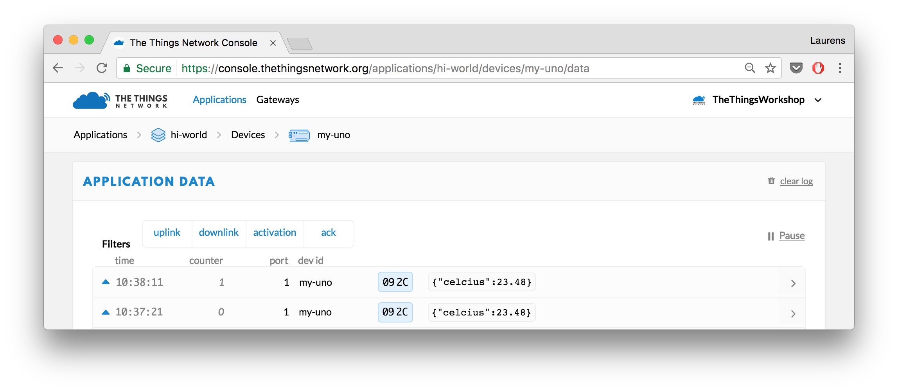

# The Things Uno Workshop
This workshop will guide you through working with The Things Uno to send sensor data over The Things Network to an application.

## Pre-requisites

1. The Things Uno
2. Micro-USB cable
3. Sensors, jumpers and optional breadboard as provided:
    * [Grove Temperature sensor](https://www.seeedstudio.com/Grove-Temperature-Sensor-p-774.html)
    * Grove [Button](https://www.seeedstudio.com/Grove-Button-p-766.html) and / or Grove [Water sensor](https://www.seeedstudio.com/Grove-Water-Sensor-p-748.html) 
    * Three [4 pin Male Jumper to Grove 4 pin Conversion Cables](https://www.seeedstudio.com/Grove-4-pin-Male-Jumper-to-Grove-4-pin-Conversion-Cable-(5-PCs-per-Pack)-p-1565.html)
4. Computer running Windows 7 or higher, Mac OS X or Linux
5. Wifi for your laptop.
6. The Things Network coverage.

## Connect to The Things Uno

Set up the Arduino Software (IDE) and connect to your Uno.

1.  [Download](https://www.arduino.cc/en/Main/Software) and install the latest version of the Arduino Software.
2.  Navigate to **Sketch > Include Library > Manage Libraries...**.
3.  Search for **TheThingsNetwork** and click the result to select it.
4.  Click the **Install** button which should appear:

    

5.  Connect the The Things Uno to your computer using the Micro-USB cable.
6.  Select **Tools > Board > Arduino Leonardo**
7.  Select **Tools > Port** > the port that identifies as **Arduino Leonardo**:

    
    
    > On Windows, you might need to [install drivers](https://www.arduino.cc/en/Guide/ArduinoLeonardoMicro#toc2).

## Register with The Things Network

Manage your applications and devices via [The Things Network Console][console].

### Create an Account

To use the console, you need an account.

1.  [Create an account][create-account].
2.  Select [Console][console] from the top menu.

### Add an Application in the Console

Add your first The Things Network Application.

1.  In the [console][console], click [add application][add-application].

	* For **Application ID**, choose a unique ID of lower case, alphanumeric characters and nonconsecutive `-` and `_` (e.g. `hi-world`).
	* For **Application Description**, enter anything you like (e.g. `Hi, World!`).

	

2.  Click **Add application** to finish.

    You will be redirected to the newly added application, where you can find the generated **Application EUI** and default **Access Key** which we'll need later.
    
    > If the Application ID is already taken, you will end up at the Applications overview with the following error. Simply go back and try another ID.
    
        

### Register the Device

The Things Network supports the two LoRaWAN mechanisms to register devices: Over The Air Activation (OTAA) and Activation By Personalization (ABP). In this workshop, we will use ABP.

> In production, you'll want to use OTAA, which is the default. This is more reliable because the activation will be confirmed and more secure because the session keys will be negotiated with every activation. ABP is useful for workshops because you don't have to wait for a downlink window to become available to confirm the activation.

1.  On the Application screen, scroll down to the **Devices** box and click **register device**.

    * For **Device ID**, choose a - for this application - unique ID of lower case, alphanumeric characters and nonconsecutive `-` and `_` (e.g. `my-uno`).
    * For **Device EUI**, click the **randomize** button. 

    

2.  Click **Register**.

    You will be redirected to the newly registered device.
    
3.  On the device screen, select **Settings** from the top right menu.

    

    * You can give your device a description like `My Uno - Workshop`
    * Change *Activation method* to *ABP*.
    * Uncheck **Frame counter checks** at the bottom of the page.

        > **Note:** This allows you to restart your device for development purposes without the routing services keeping track of the frame counter. This does make your application vulnerable for replay attacks, e.g. sending messages with a frame counter equal or lower than the latest received. Please do not disable it in production.

4.  Click **Save** to finish.

    You will be redirected to the device, where you can find the **Device Address**, **Network Session Key** and **App Session Key** that we'll need next.
    
    

## Send a Message

Activate your device and send your first byte to verify that it works.

### Configure

1.  In the Arduino IDE, select **File > Examples > TheThingsNetwork > [SendABP](https://github.com/TheThingsNetwork/arduino-device-lib/blob/master/examples/SendABP/SendABP.ino)**.
2.  Set the values for `devAddr`, `nwkSKey` and `appSKey` using the information from the device in the console. Use the 📋 buttons next to fields to copy their (hidden) value.
   
    * For `devAddr ` use the **Device Address**.
    * For `nwkSKey ` use the **Network Session Key**.
    * For `appSKey` use **App Session Key**.

3.  Change the line `#define freqPlan REPLACE_ME` to:

    ```
    #define freqPlan TTN_FP_EU868
    ```

    > If you use a device with the RN2903 LoRa module, then use `TTN_FP_US915` instead.

### Upload

1.  Select **Sketch > Upload** `Ctrl/⌘ U` to upload the sketch.
 
    Wait for the status bar to say *Done uploading*.
 
2.  Select **Tools > Serial Monitor** `Ctrl/⌘ Shift M` to open the Serial Monitor.

    Soon, you should see something like this:

    ```
    Sending: mac tx uncnf 1 010203
    Successful transmission
    ```

### Monitor

From the device or application in the console, select **Data** in the top right menu. You should soon see the messages come in. Click on the blue ▶ to see all data:


As you can see you are sending 1 byte. In the sketch you have uploaded you can find we do this in the [`loop()`](https://www.arduino.cc/en/Reference/Loop) function:

```c
void loop() {
  byte payload[1];
  payload[0] = (digitalRead(LED_BUILTIN) == HIGH) ? 1 : 0;

  // Send it off
  ttn.sendBytes(payload, sizeof(payload));
}
```

## Send Sensor Data

Instead of sending 1 byte, we're going to send real sensor data. But first, we need to connect our sensors. In this workshop, we will use a temperature sensor.

### Connect the Sensors

<!-- #### With a Grove shield
Use the Grove cables to connect the temperature and the button or water sensor:

1. Connect the temperature sensor to `A2`.
2. Connect the button or water sensor to `D2`.

#### Without a Grove shield
-->
Use the Grove to 4-pin Male cables to connect the temperature and the button or water sensor:

1.  Connect the black `GND` (ground) to one of the 3 `GND` on the Uno.
2.  Connect the red `VCC` (voltage) to the `3v3` and `5V` on the Uno (connect the temperature sensor to the 5V).
3.  Connect the yellow `SIG` (signal) to the Uno:

    * For the temperature sensor use an analog input: `A2`.
    * For the button or water sensor use a digital input: `2` from the group labeled as **Digital**.

### Read the Sensors

Now that the sensors are connected, we have to write some code in the sketch to read their values.

1.  Replace your `loop()` function with the following code:

    ```c
    // See http://www.seeedstudio.com/wiki/Grove_-_Temperature_Sensor
    float getCelcius(int pin) {
      int a = analogRead(pin);
      float resistance = (1023.0 - a) * 10000 / a;
      return 1 / (log(resistance/10000)/3975 + 1 / 298.15) - 273.15;
    }
    
    bool wasPressedOrWet = false;
    
    void loop() {
    
      // Read digital sensor
      bool pressedOrWet = (digitalRead(2) == LOW);
      
      // State unchanged
      if (pressedOrWet == wasPressedOrWet) {
        return;
      }
      
      wasPressedOrWet = pressedOrWet;
          
      // Not pressed or wet
      if (!pressedOrWet) {
        return;
      }
      
      // Read the temperature
      float celcius = getCelcius(A2);
    
      // Log the value
      debugSerial.print("Temperature: ");
      debugSerial.println(celcius);
    
      // Encode float as int (20.98 becomes 2098)
      int16_t celciusInt = round(celcius * 100);
    
      // Encode int as bytes
      byte payload[2];
      payload[0] = highByte(celciusInt);
      payload[1] = lowByte(celciusInt);
    
      ttn.sendBytes(payload, sizeof(payload));
    }
    ```

2.  Select **Sketch > Upload** `Ctrl/⌘ U`.
3.  Select **Tools > Serial Monitor** `Ctrl/⌘ Shift M`.

    When you press the button or place your finger on the water sensor you should see something like:
    
    ```
    Temperature: 18.58
    Sending: mac tx uncnf 1 0742
    Successful transmission
    ```

4.  Switch back to the **Data** screen in the console to verify you see the payload (here: `0742`) come in when you press the button.

### Decode the Payload in the Console

The Things Network allows you to decode bytes to a meaningful data structure before passing it on to your application.

> We will only use the **decoder** in this workshop. You can also use a **converter** to combine values or convert units and a **validator** to drop invalid payloads.

1.  From the **application** in the **Console**, select **Payload Functions** from the top right menu.

	

2.  Leave **decoder** selected and copy-paste the following JavaScript code:

    ```js
    function Decoder(bytes, port) {
      // Decode an uplink message from a buffer
      // (array) of bytes to an object of fields.
      var decoded = {};
    
      // Decode bytes to int
      var celciusInt = (bytes[0] << 8) | bytes[1];
    
      // Decode int to float
      decoded.celcius = celciusInt / 100;
    
      return decoded;
    }
    ```

3.  Enter the bytes you saw in the Serial Monitor (e.g. `0832` in the **Payload** input and click **Test**.

    You should get an object with the temperature in celcius. For `0832` this would be:
    
    ```json
    {
      "celcius": 20.98
    }
    ```
    
4.  Click **Save payload functions**.
5.  Select **Data** from the top right menu to see how the next payloads will be decoded:

    

## Process Sensor Data

A common use case is to invoke an HTTP request to an external web service. for this workshop we are going to process the sensor data and send it to [IFTTT](https://ifttt.com) (If This Then That) to trigger an event of your own choice. 

> IFTTT is a free web-based service that you can use to create simple conditional statements, called applets. An applet is triggered by changes that occur within other web services such as Gmail, Facebook, Instagram, or The Things Network.

#### Create the IFTTT Applet
Let's start on IFTTT.

1.  Go to [IFTTT](https://ifttt.com) and create an account or login.
2.  Select [New Applet](https://ifttt.com/create) from your account menu.
3.  Click **This** to Choose Trigger Channel.

    1.  Search for `maker`.
    2.  Click the **Maker** channel.

    The first time you'll need to click **Connect**, then **Done** in the popup that opens and finally **Continue to the next step**.
    
4.  Click **Receive a web request**.

    *  For **Event Name**, let's enter `workshop`.
    
5.  Click **That** to configure an action, e.g. post a tweet on Twitter, e-mail or a notification to your phone.

    Use the field `value1` as ingredient. For example, a tweet could be:
    
    ```
    The temperature is: {{value1}} #thethingsnetwork
    ```

7.  Click **Create action**.
8.  Click **Finish**. 
    Good job! You created the Applet on IFTTT. The only thing you have to do now it connect The Things Network to your Applet and trigger the event with the sensor data.
    

#### Connect The Things Network to IFTTT

1.  Go back to your application in the [Console](https://console.thethingsnetwork.org/applications) and click on **Integrations**.

    

2. Add as a new integration the **IFTTT Maker**.

    

3.  Think of a fancy Process ID, like `temperature-tweet` and fill in the **Event Name** you just created on IFTTT.
4.  To find your secret **Key**, go to [ifttt.com/maker and then **Settings**](https://ifttt.com/services/maker/settings). Your key is the last part of the URL (after `/use/`)
5.  As **Value 1** write `celcius`
6.  Click on **Add Integration** to finalize the integration.

### The moment of truth
It's time for a live demonstration. It's important to gather a small audience which you can impress with your end-to-end IoT application.

Now, use the button or water sensor to trigger the action you have configured on IFTTT.


### Bonus Exercise

You can even go one level further. Maybe you only want to activate the IFTTT event when the temperature is above or below a certain degree. You can enable or disable the trigger in the **Decoder** of the **Payload Fuctions** (remember where to find this?).

For doing so, you need to add the code before the `return decoded;`

```
  decoded.trigger = decoded.celcius > 20;
```

You can replace the `> 20` with any value that you want to set as the minimal temperature to activate the trigger.


## OK. Done. What's Next?

🎉 Congratulations! You just learned how to create an account, an application, register a device, send data from a device, decode it, process it and push it to IFTTT to connect to the world of APIs.

From this starting point, you can start building a real world application. Here are some useful links:


- Visualize your data in a nice dashboard using the [**Cayenne - myDevices**](https://github.com/TheThingsNetwork/workshops/blob/master/myDevices.md) integration.

    
- [Send messages back to the device](https://www.thethingsnetwork.org/docs/devices/uno/quick-start.html#message-your-device) to control an LED
- [Receive and process data on any platform using MQTT.](https://www.thethingsnetwork.org/docs/v2-preview/mqtt/)
- Create your own charts and maps, e.g. combine our [Socket.io example](https://github.com/TheThingsNetwork/node-app-sdk/tree/master/examples/socketio) with [Flot](http://flotcharts.org) or [Google Maps API](https://developers.google.com/maps/).
- Integrate with IoT cloud platforms like [Azure IoT Hub](https://github.com/TheThingsNetwork/azure-integration) and [AWS IoT](https://github.com/theThingsNetwork/aws-app-lib).

[account]:         https://account.thethingsnetwork.org
[create-account]:  https://account.thethingsnetwork.org/register
[profile]:         https://account.thethingsnetwork.org/users/profile
[console]:         https://console.thethingsnetwork.org
[settings]:        https://console.thethingsnetwork.org/settings
[add-application]: https://console.thethingsnetwork.org/applications/add
