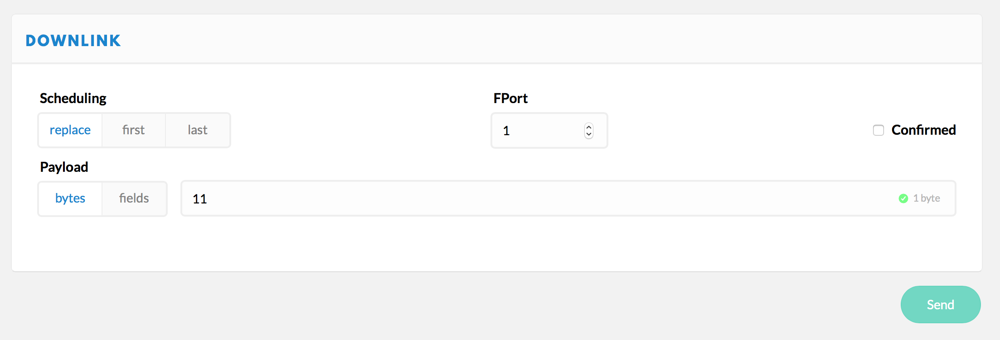
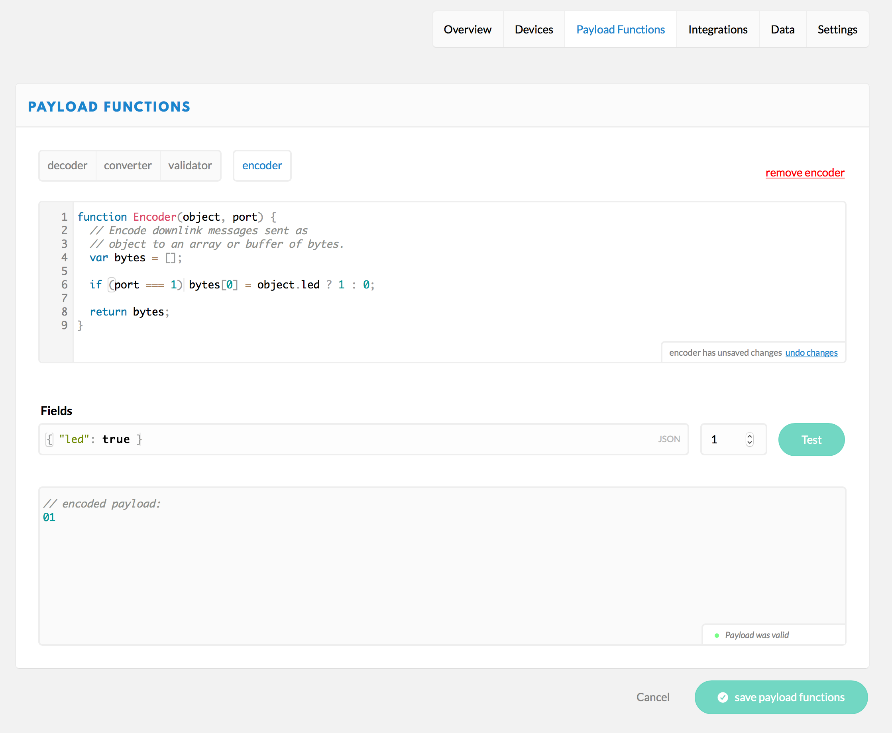

# The Things Uno Workshop
This workshop will guide you through working with The Things Uno to send sensor data over The Things Network to an application.

このWSでは、The Things Unoを使ってセンサーデータをThe Things Network経由でアプリケーションに送る方法を学びます。

## Pre-requisites

1. The Things Uno
2. Micro-USB cable
3. Sensors, jumpers and optional breadboard as provided:
（TTIから）供給されるセンサー、ジャンパー、オプションのブレッドボード:
    * [Grove Temperature sensor](https://www.seeedstudio.com/Grove-Temperature-Sensor-p-774.html)
    * Grove [Button](https://www.seeedstudio.com/Grove-Button-p-766.html) and / or Grove [Water sensor](https://www.seeedstudio.com/Grove-Water-Sensor-p-748.html)
    * Three [4 pin Male Jumper to Grove 4 pin Conversion Cables](https://www.seeedstudio.com/Grove-4-pin-Male-Jumper-to-Grove-4-pin-Conversion-Cable-(5-PCs-per-Pack)-p-1565.html)
4. Computer running Windows 7 or higher, Mac OS X or Linux
5. Wifi for your laptop.
6. The Things Network coverage.

## Connect to The Things Uno

Set up the Arduino Software (IDE) and connect to your Uno. Arduino Software (IDE)を設定し、Unoに繋げます

1.  [Download](https://www.arduino.cc/en/Main/Software) and install the latest version of the Arduino Software.

    Arduino software の最新版をダウンロードし、インストールします
2.  [Download](https://github.com/TheThingsNetwork/arduino-device-lib/archive/feature/as920_923.zip) The Things Network Arduino library.

    The Things Network Arduino をダウンロードします
3.  Navigate to **Sketch > Include Library > Add ZIP Library...**

4.  Select the ZIP file you just downloaded in step 2 and click **Choose**.

    上記2．でダウンロードしたZIPファイルを選択し、**Choose** をクリックします
5.  Connect the The Things Uno to your computer using the Micro-USB cable.

    Micro-USB ケーブルでThe Things UnoをPCに繋ぎます
6.  Select **Tools > Board > Arduino Leonardo**

7.  Select **Tools > Port** > the port that identifies as **Arduino Leonardo**:

    

    > On Windows, you might need to [install drivers](https://www.arduino.cc/en/Guide/ArduinoLeonardoMicro#toc2).

    > Windows はバージョンによってドライバのインストールが必要な場合があります

## Register with The Things Network

Manage your applications and devices via [The Things Network Console][console].

The Things Network Console でアプリケーションとデバイスを管理します

### Create an Account

To use the console, you need an account.

コンソールを使用するため、アカウントを作成します

1.  [Create an account][create-account].
2.  Select [Console][console] from the top menu.

### Add an Application in the Console

Add your first The Things Network Application.

The Things Networkアプリケーションを追加します

1.  In the [console][console], click [add application][add-application].

	* For **Application ID**, choose a unique ID of lower case, alphanumeric characters and nonconsecutive `-` and `_` (e.g. `hi-world`).

      **Application ID** には、小文字でアルファベットまたは数字で、連続しない（ハイフン-とアンダーバー_を使う）ユニークなIDを選択します。 (e.g. `hi-world`).

	* For **Application Description**, enter anything you like (e.g. `Hi, World!`).

	

2.  Click **Add application** to finish.

    You will be redirected to the newly added application, where you can find the generated **Application EUI** and default **Access Key** which we'll need later.

    新しく追加したアプリケーションにリダイレクトされます。生成された **Application EUI** と、後で必要になるデフォルトの **Access Key** があります。

    > If the Application ID is already taken, you will end up at the Applications overview with the following error. Simply go back and try another ID.

    > Application IDが既に使われている場合、次のエラーが出て、 Applications overview に戻ります。他のIDを試してください。

        

### Register the Device

The Things Network supports the two LoRaWAN mechanisms to register devices: Over The Air Activation (OTAA) and Activation By Personalization (ABP). In this workshop, we will use ABP.

The Things Networkは、デバイスの登録に2つのLoRaWAN方式をサポートしています。Over The Air Activation (OTAA) と Activation By Personalization (ABP)です。このWSでは、ABPを使います。

> In production, you'll want to use OTAA, which is the default. This is more reliable because the activation will be confirmed and more secure because the session keys will be negotiated with every activation. ABP is useful for workshops because you don't have to wait for a downlink window to become available to confirm the activation.

> プロダクトを製品化する際には、デフォルトのOTAAを使われたほうがよいでしょう。アクティベーション毎にセッションキーがネゴシエートされるため、よりセキュアで、より信頼できる方法です。ABPはワークショップのみで用います。アクティベーションをconfirmするためにダウンリンクウィンドウが開くのを待つ必要がないためです。


1.  On the Application screen, scroll down to the **Devices** box and click **register device**. Applicationの画面で、**Devices** boxまでスクロールダウンし、**register device** をクリックします。

    * For **Device ID**, choose a - for this application - unique ID of lower case, alphanumeric characters and nonconsecutive `-` and `_` (e.g. `my-uno`).

      **Device ID** には、小文字でアルファベットまたは数字で、連続しない（ハイフン`-`とアンダーバー`_`を使って）一意のIDを選択します。 (e.g. `my-uno`).
    * For **Device EUI**, click the **randomize** button. 

    

2.  Click **Register**.

    You will be redirected to the newly registered device.

    新しく追加したデバイスにリダイレクトされます。

3.  On the device screen, select **Settings** from the top right menu.

    デバイスの画面で右上のメニューから **Settings** を選択します。

    

    * You can give your device a description like `My Uno - Workshop`

      デバイスに`My Uno - Workshop`等のdescriptionを入れることができます。
    * Change *Activation method* to *ABP*.

      *Activation method* を *ABP* に変えます。
    * Uncheck **Frame counter checks** at the bottom of the page.

      ページ下の **Frame counter checks** のチェックを外します

        > **Note:** This allows you to restart your device for development purposes without the routing services keeping track of the frame counter. This does make your application vulnerable for replay attacks, e.g. sending messages with a frame counter equal or lower than the latest received. Please do not disable it in production.

        > **注意**: これで、ルーティングサービスでフレームカウンタをトラックせずにデバイスをリスタートすることができます。ただし、アプリケーションがリプレイ攻撃（例：最新で受信したフレームカウンタと同等かそれ以下でメッセージを送る）に脆弱になるのでご注意ください。製品化の際には、ディセーブルにしないでください。

4.  Click **Save** to finish.

    You will be redirected to the device, where you can find the **Device Address**, **Network Session Key** and **App Session Key** that we'll need next.

    デバイスにリダイレクトされます。次に必要な **Device Address**, **Network Session Key** and **App Session Key** があります。

    

## Send a Message

Activate your device and send your first byte to verify that it works.

デバイスをアクティベートし、動作確認のため、試しにデータを送ってみてください。

### Configure

1.  In the Arduino IDE, select **File > Examples > TheThingsNetwork > [SendABP](https://github.com/TheThingsNetwork/arduino-device-lib/blob/master/examples/SendABP/SendABP.ino)**.
2.  Set the values for `devAddr`, `nwkSKey` and `appSKey` using the information from the device in the console. Use the 📋 buttons next to fields to copy their (hidden) value.

    コンソールでデバイスの情報を用いて `devAddr`, `nwkSKey` and `appSKey` の値を設定します。フィールドの横の📋ボタンを使って（隠れている）値をコピーします。

    * For `devAddr ` use the **Device Address**.
    * For `nwkSKey ` use the **Network Session Key**.
    * For `appSKey` use **App Session Key**.


3.  Change the line `#define freqPlan REPLACE_ME` to:

    ```
    #define freqPlan TTN_FP_AS920_923
    ```

### Upload

1.  Select **Sketch > Upload** `Ctrl/⌘ U` to upload the sketch.

    Wait for the status bar to say *Done uploading*.

    ステータスバーに *Done uploading* と表示されるまで待ちます

2.  Select **Tools > Serial Monitor** `Ctrl/⌘ Shift M` to open the Serial Monitor.

    Soon, you should see something like this:

    ```
    Sending: mac tx uncnf 1 010203
    Successful transmission
    ```

### Monitor

From the device or application in the console, select **Data** in the top right menu. You should soon see the messages come in. Click on the blue ▶ to see all data:

コンソールのデバイスまたはアプリケーションから、右上のメニューのDataを選択します。メッセージが表示されます。全データを見るにはブルーの▶をクリックします。


As you can see you are sending 1 byte. In the sketch you have uploaded you can find we do this in the [`loop()`](https://www.arduino.cc/en/Reference/Loop) function:

いま1byteを送っています。アップロードしたスケッチで、[`loop()`](https://www.arduino.cc/en/Reference/Loop) ファンクションで行っているのが分かります:

```c
void loop() {
  byte payload[1];
  payload[0] = (digitalRead(LED_BUILTIN) == HIGH) ? 1 : 0;

  // Send it off
  ttn.sendBytes(payload, sizeof(payload));
}
```

## Send Sensor Data

Instead of sending 1 byte, we're going to send real sensor data. But first, we need to connect our sensors. In this workshop, we will use a temperature sensor.

1 byteを送る代わりに、実際のセンサーデータを送ってみます。最初にセンサーを繋げます。このWSでは、温度センサーを使います。

### Connect the Sensors

<!-- #### With a Grove shield
Use the Grove cables to connect the temperature and the button or water sensor:

Grove to 4-pin Male cablesを使って、温度センサーとボタン、または水センサーを繋げます。

1. Connect the temperature sensor to `A2`.
2. Connect the button or water sensor to `D2`.

#### Without a Grove shield
-->
Use the Grove to 4-pin Male cables to connect the temperature and the button or water sensor:

1.  Connect the black `GND` (ground) to one of the 3 `GND` on the Uno.

    黒の`GND`（アース）をUnoの3`GND`に繋げます
2.  Connect the red `VCC` (voltage) to the `3v3` and `5V` on the Uno (connect the temperature sensor to the 5V).

    赤の`VCC`（電圧）をUnoの`3v3`と `5V`に繋げます。（温度センサーを 5Vに）
3.  Connect the yellow `SIG` (signal) to the Uno:

    黄色の`SIG`（シグナル）をUnoに繋げます。

    * For the temperature sensor use an analog input: `A2`.

        温度センサーにはアナログ出力`A2`を使います
    * For the button or water sensor use a digital input: `2` from the group labeled as **Digital**.

        ボタンまたは水センサーには **Digital** 出力`2`を使います

### Read the Sensors

Now that the sensors are connected, we have to write some code in the sketch to read their values.
センサーがつながりました。値を読み取るため、スケッチにコードを書きます。

1.  Replace your `loop()` function with the following code:

    次のコードで`loop()`機能をリプレースします:

    ```c
    // See http://www.seeedstudio.com/wiki/Grove_-_Temperature_Sensor
    float getCelcius(int pin) {
      int a = analogRead(pin);
      float resistance = (1023.0 - a) * 10000 / a;
      return 1 / (log(resistance/10000)/3975 + 1 / 298.15) - 273.15;
    }

    bool wasPressedOrWet = false;

    void loop() {

      // Read digital sensor
      bool pressedOrWet = (digitalRead(2) == LOW);

      // State unchanged
      if (pressedOrWet == wasPressedOrWet) {
        return;
      }

      wasPressedOrWet = pressedOrWet;

      // Not pressed or wet
      if (!pressedOrWet) {
        return;
      }

      // Read the temperature
      float celcius = getCelcius(A2);

      // Log the value
      debugSerial.print("Temperature: ");
      debugSerial.println(celcius);

      // Encode float as int (20.98 becomes 2098)
      int16_t celciusInt = round(celcius * 100);

      // Encode int as bytes
      byte payload[2];
      payload[0] = highByte(celciusInt);
      payload[1] = lowByte(celciusInt);

      ttn.sendBytes(payload, sizeof(payload));
    }
    ```

2.  Select **Sketch > Upload** `Ctrl/⌘ U`.
3.  Select **Tools > Serial Monitor** `Ctrl/⌘ Shift M`.

    When you press the button or place your finger on the water sensor you should see something like:

    ボタンを押す、または水センサーに指を置くと、次のような値が出てきます。

    ```
    Temperature: 18.58
    Sending: mac tx uncnf 1 0742
    Successful transmission
    ```

4.  Switch back to the **Data** screen in the console to verify you see the payload (here: `0742`) come in when you press the button.

    コンソールで **Data** の画面に戻り、 ボタンを押して　(here: `0742`）のペイロードが見えるかどうか確認します。

### Decode the Payload in the Console - コンソールでペイロードを復号する

The Things Network allows you to decode bytes to a meaningful data structure before passing it on to your application.

The Things Networkでは、アプリケーションに送る前に、意味のあるデータ構造にバイトを復号できます。

> We will only use the **decoder** in this workshop. You can also use a **converter** to combine values or convert units and a **validator** to drop invalid payloads.

> このWSでは、**decoder** のみを使います。**converter** を使って、値を組み合わせたり、ユニットを変換したりできます。**validator** で不正なペイロードを破棄することもできます。

1.  From the **application** in the **Console**, select **Payload Functions** from the top right menu.

    **Console** の **application** で、右上のメニューから **Payload Functions** を選択します。

	
2.  Leave **decoder** selected and copy-paste the following JavaScript code:

    選択した **decoder** はそのままで、次のJavaScriptコードをコピーペーストします。

    ```js
    function Decoder(bytes, port) {
      // Decode an uplink message from a buffer
      // (array) of bytes to an object of fields.
      var decoded = {};

      // Decode bytes to int
      var celciusInt = (bytes[0] << 8) | bytes[1];

      // Decode int to float
      decoded.celcius = celciusInt / 100;

      return decoded;
    }
    ```

3.  Enter the bytes you saw in the Serial Monitor (e.g. `0832` in the **Payload** input and click **Test**.

    で見たバイトを入力し (例：**Payload** 入力`0832` ）**Test** をクリックします。

    You should get an object with the temperature in celcius. For `0832` this would be:

    摂氏℃で温度のオブジェクトが取得できるはずです。`0832`の場合:

    ```json
    {
      "celcius": 20.98
    }
    ```

4.  Click **Save payload functions**.
5.  Select **Data** from the top right menu to see how the next payloads will be decoded:

    次のペイロードがどう複合されるか確認するため、右上のメニューから **Data** を選択します。

    

## Process Sensor Data

A common use case is to invoke an HTTP request to an external web service. for this workshop we are going to process the sensor data and send it to [IFTTT](https://ifttt.com) (If This Then That) to trigger an event of your own choice.

よくあるのが、外部のウェブサービスへのHTTPリクエストを呼び出すパターンです。このWSでは、センサーデータを処理し、[IFTTT](https://ifttt.com) (If This Then That) に送り、選択したいイベントをトリガします。

> IFTTT is a free web-based service that you can use to create simple conditional statements, called applets. An applet is triggered by changes that occur within other web services such as Gmail, Facebook, Instagram, or The Things Network.

> IFTTTは、フリーのウェブベースのサービスで、Appletsという簡単な条件文を用いることができます。Appletは、Gmail, Facebook, Instagram, or The Things Network等、他のウェブサービス内で起きる変化によってトリガされます。

#### Create the IFTTT Applet
Let's start on IFTTT.

1.  Go to [IFTTT](https://ifttt.com) and create an account or login.

    [IFTTT](https://ifttt.com) にアカウント作成またはログインします
2.  Select [New Applet](https://ifttt.com/create) from your account menu.

    アカウントメニューから[New Applet](https://ifttt.com/create) を選択します
3.  Click **This** to Choose Trigger Channel.

    1.  Search for `maker`.
    2.  Click the **Maker** channel.

    The first time you'll need to click **Connect**, then **Done** in the popup that opens and finally **Continue to the next step**.

    初めて **Connect** をクリックすると、 ポップアップ画面に **Done** と表示され、その後、**Continue to the next step** と表示されます。

4.  Click **Receive a web request**.

    *  For **Event Name**, let's enter `workshop`.

5.  Click **That** to configure an action, e.g. post a tweet on Twitter, e-mail or a notification to your phone.
    **That** をクリックしてアクションを設定します。

    Use the field `Value1` as ingredient. For example, a tweet could be:
    `Value1`をフィールド値に使います。例：

    ```
    The temperature is: {{Value1}} #thethingsnetwork
    ```

6.  Click **Create action**.
7.  Click **Finish**.
    Good job! You created the Applet on IFTTT. The only thing you have to do now it connect The Things Network to your Applet and trigger the event with the sensor data.

    **Finish** をクリックします。できました！IFTTT上でAppletを作成しました。あとはAppletにThe Things Network を繋げ、センサーデータでイベントをトリガするだけです。


#### Connect The Things Network to IFTTT

1.  Go back to your application in the [Console](https://console.thethingsnetwork.org/applications) and click on **Integrations**.

    [Console](https://console.thethingsnetwork.org/applications) でアプリケーションに戻り、**Integrations** をクリックします。

    

2.  Add as a new integration the **IFTTT Maker**.
    **IFTTT Maker** をnew integrationとして追加します

    

3.  Think of a fancy Process ID, like `temperature-tweet` and fill in the **Event Name** you just created on IFTTT.

    Process IDには、 `temperature-tweet` など、凝ったIDを付けます。IFTTTで作成した **Event Name** に入力します。
4.  To find your secret **Key**, go to [ifttt.com/maker and then **Settings**](https://ifttt.com/services/maker/settings). Your key is the last part of the URL (after `/use/`)

    秘密 **Key** の取得には、[ifttt.com/maker and then **Settings**](https://ifttt.com/services/maker/settings) を開きます。鍵はURLの最後の部分です。(after `/use/`)　

5.  As **Value 1** write `celcius`
	*Make sure you don't accidentally add a space before or after `celcius`*

    **Value 1** に摂氏を入力してください。`celcius` *の前後に間違ってスペースを空けないようにしてください。*
6.  Click on **Add Integration** to finalize the integration.

    **Add Integration** をクリックしてインテグレーションを実行します。

### The moment of truth
It's time for a live demonstration. It's important to gather a small audience which you can impress with your end-to-end IoT application.

それでは、ライブデモンストレーションを行います。エンドツーエンドのIoTアプリケーションのデモで好印象を残すには、聴衆の数を少なくすることが重要です。
ボタンセンサーか水センサーを使って、IFTTTに設定したアクションをトリガします。

Now, use the button or water sensor to trigger the action you have configured on IFTTT.

### Bonus Exercise

You can even go one level further. Maybe you only want to activate the IFTTT event when the temperature is above or below a certain degree. You can enable or disable the trigger in the **Decoder** of the **Payload Fuctions** (remember where to find this?).

一段上のレベルに上がりましょう。例えば、ある一定の温度を超えたり、下回ったりしたときだけにIFFTイベントをアクティベートしたい場合の方法です。**Payload Functions** の **Decoder** でトリガをイネーブルまたはディセーブルにできます。（どこか覚えていますか？）

For doing so, you need to add the code before the `return decoded;`

```
  decoded.trigger = decoded.celcius > 20;
```

You can replace the `> 20` with any value that you want to set as the minimal temperature to activate the trigger.

`> 20`の代わりにトリガをアクティベートする最低温度の値をいれて設定します


## Sending a downlink message

Good, we can receive messages from the device. But how about sending one? To set this up we need to modify our arduino script a little bit. Let's start with a simple example: turn on or of the arduino LED based on the payload of a message we send to the device.

では、デバイスからメッセージを受信します。その前に送信してみましょう。この設定にはArduinoのscriptを少し変更します。
単純な例でやります：デバイスに送るメッセージのペイロードに基づいて、Arduino LEDをONにする方法です。

### Listening for downlink

For this, we need to add a callback to our Arduino script that will be invoked when the device receives a message:

これには、デバイスがメッセージを受信したときに呼び出すArduino scriptにコールバックを追加する必要があります。

```c
void message(const uint8_t *payload, size_t size, port_t port) {
  debugSerial.println("-- MESSAGE");
  debugSerial.print("Received " + String(size) + " bytes on port " + String(port) + ":");

  for (int i = 0; i < size; i++)
  {
    debugSerial.print(" " + String(payload[i]));
  }
  debugSerial.println();

  if (size < 1) {
    return;
  }

  // turn of LED
  if (payload[0] == 0) {
    digitalWrite(LED_BUILTIN, LOW);
  } else {
    digitalWrite(LED_BUILTIN, HIGH);
  }
}
```

And we need to add it to our `setup` function:

```
void setup() {
  // add this:
  ttn.onMessage(message);
}
```

This will turn off the onboard LED when it receives a payload that has a `00` first byte, and turn it on otherwise.

`00` first byteのペイロードを受信すると、ボード上のLEDがOFFになります。それ以外ではONになります。

Note that in Lora class B, a downlink can only be received after an uplink has been sent, so we need to press the button to receive anything at all.

LoRaのclass Bでは、ダウンリンクはアップリンクが送られた後にのみ受信可能です。このため、何か受信したい場合にはボタンを押さなくてはなりません。

### Scheduling a downlink

Let's schedule a downlink to be sent on the first available uplink.
Go to the **Device Overview** page of you device and scroll down to the **Downlink** section.

まず、最初に利用可能なアップリンクに送るダウンリンクのスケジュールを設定します。**Device Overview** ページの **Downlink** セクションまでスクロールダウンします。

In here, fill in a downlink payload, like `11` and click **Send**.

ここでは、ダウンリンクのペイロード（例：`11`）を入力し、**Send** をクリックします。



Next, trigger an uplink by pressing the button. You should see a message like
this in the Arduino monitor:

次に、ボタンを押してアップリンクをトリガします。Arduinoのモニタに-というメッセージが見えるはずです:

```
-- MESSAGE
Received 1 bytes on port 1: 17
```

And the LED on you Arduino board will light up!

そしてArduinoボードのLEDが点灯します！

### Encoding a payload
Sending pure byte payloads to you device can become unwieldy quickly. That's why the `Encoder` payload function exists. This function will transform JSON fields to a binary payload.

純粋なbyteのペイロードを送っていると、すぐにデバイスは手に負えなくなります。`Encoder`ペイロード機能があるのはこのためです。この機能でJSONのフィールドをバイナリのペイロードに変換できます。

To set it, go to the **Payload Functions** tab of you application and select
**Encoder**. Here, fill in the following encoder:

アプリケーションの **Payload Functions** タブで、**Encoder** を選択します。次のエンコーダに入力します

```js
function Encoder(object, port) {
  // Encode downlink messages sent as
  // object to an array or buffer of bytes.
  var bytes = [];

  bytes[0] = object.led ? 1 : 0;

  return bytes;
}
```

This will set the first byte to `01` if the `led` field is `true`
and `0` if it is `false`.

`led` フィールドが`true`の場合、最初のbyteが `01`になり、`false`の場合、`0`となります。


To test the Encoder, enter the following in the **Fields** input:

Encoderをテストするには、**Fields** にと入力し、

```
{ "led": true }
```
and click **Test**. The output should look something like:

を Testをクリックします。 結果、このような表示になるはずです:

```
// encoded payload:
01
```



Next, click **Save**.


### Sending fields to our device

Go back to the **Device Overview** page of you device and scroll down to the
**Downlink** section.

デバイスの **Device Overview** ページに戻り、**Downlink** までスクロールダウンします。

Now, instead of **bytes** select **fields** and enter:

**bytes** の代わりに **fields** を選択し、次を入力します:

```
{ "led": false }
```

To receive the downlink and press the button. The LED on your device should now
go off.

ダウンリンクを受信するにはボタンを押します。デバイスのLEDがOFFになるはずです。

[account]:         https://account.thethingsnetwork.org
[create-account]:  https://account.thethingsnetwork.org/register
[profile]:         https://account.thethingsnetwork.org/users/profile
[console]:         https://console.thethingsnetwork.org
[settings]:        https://console.thethingsnetwork.org/settings
[add-application]: https://console.thethingsnetwork.org/applications/add
