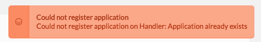
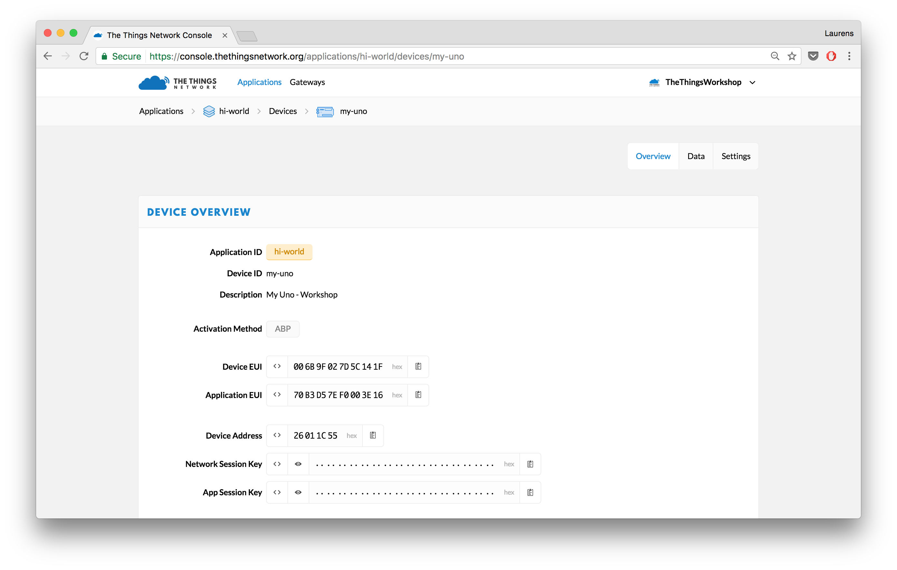
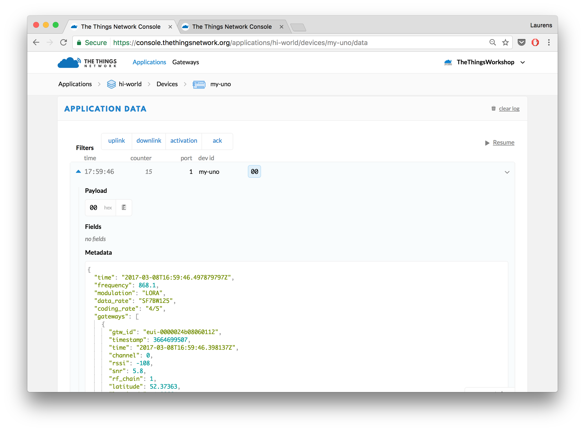
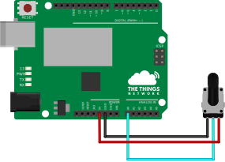
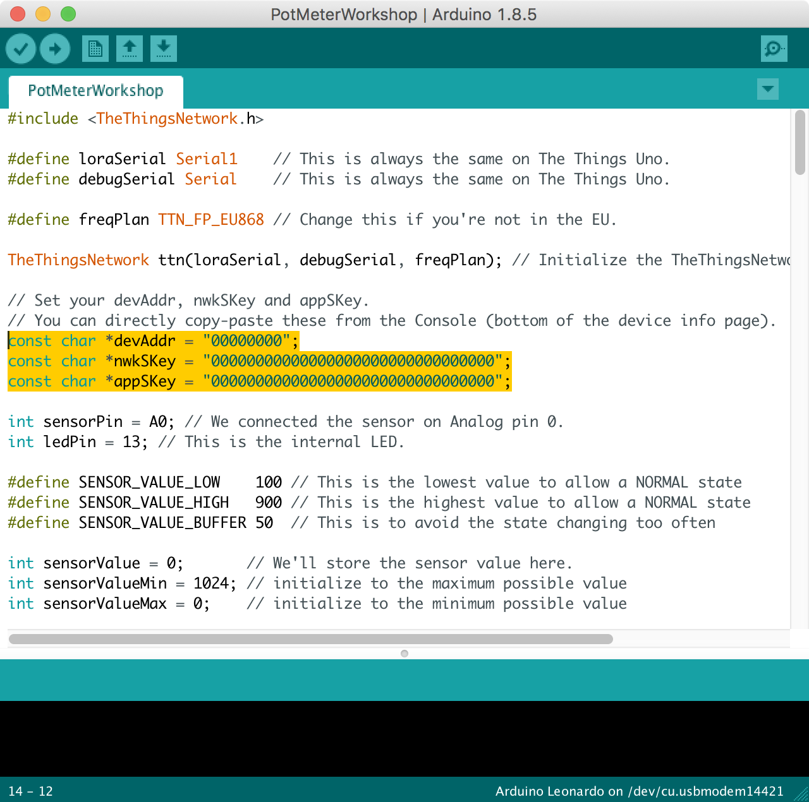
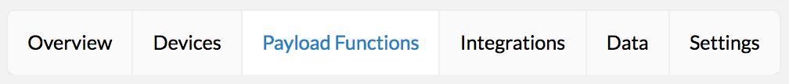
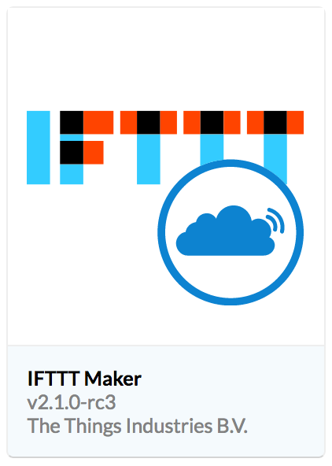

## Your Workshop Host


|**Laurens Slats**|
|--- |
||
|laurens@thethingsindustries.com|
|[LinkedIn](https://www.linkedin.com/in/laurensslats)|
|[Twitter](https://twitter.com/laurensslats)|


# Prerequisites

- A laptop with WiFi and at least one USB port
- [Install the Arduino IDE](https://www.arduino.cc/en/Main/Software) (or request USB key of Laurens)
- An [account on The Things Network](https://account.thethingsnetwork.org/)
- The Things Uno
- USB Cable
- Potentiometer
- Connection wires M/F
- The Things Network Coverage

# Introduction

In this workshop we'll build a sensor system that uses LoRaWAN technology and The Things Network infrastructure to send data to the Internet. 

Today we'll use a potentiometer that changes its resistance with rotation. We will write a short script to read the potentiometer, send the data over LoRaWAN and act on the data sent.

**Tasks during the workshop**

- Setup the Arduino environment & install the required libraries
- Create an account on The Things Network, create an application and register a device
- Connect a potmeter to the Arduino and read its value
- Send a message over LoRaWAN based on the a threshold value
- Act on data using IFTTT

Are you a fast coder? Continue with the tasks:

- Connect additional sensors to the Arduino
- Visualize sensor data using myDevices Cayenne
 

## Connect to The Things Uno

Set up the Arduino Software (IDE) and connect to your Uno.

1.  [Download](https://www.arduino.cc/en/Main/Software) and install the latest version of the Arduino Software.
2.  Navigate to **Sketch > Include Library > Manage Libraries...**.
3.  Search for **TheThingsNetwork** and click the result to select it.
4.  Click the **Install** button which should appear:

    

5.  Connect the The Things Uno to your computer using the Micro-USB cable.
6.  Select **Tools > Board > Arduino Leonardo**
7.  Select **Tools > Port** > the port that identifies as **Arduino Leonardo**:

    
    
    > On Windows, you might need to [install drivers](https://www.arduino.cc/en/Guide/ArduinoLeonardoMicro#toc2).


### Add an Application in the Console

Add your first The Things Network Application.

1.  In the [console][console], click [add application][add-application].

	* For **Application ID**, choose a unique ID of lower case, alphanumeric characters and nonconsecutive `-` and `_` (e.g. `hi-world`).
	* For **Application Description**, enter anything you like (e.g. `Hi, World!`).

	

2.  Click **Add application** to finish.

    You will be redirected to the newly added application, where you can find the generated **Application EUI** and default **Access Key** which we'll need later.
    
    > If the Application ID is already taken, you will end up at the Applications overview with the following error. Simply go back and try another ID.
    
        

### Register the Device

The Things Network supports the two LoRaWAN mechanisms to register devices: Over The Air Activation (OTAA) and Activation By Personalization (ABP). In this workshop, we use ABP.

> In production, you want to use OTAA because this is a more secure way way of working as new session keys can be created over time. 

1.  On the Application screen, scroll down to the **Devices** box and click **register device**.

    * For **Device ID**, choose a - for this application - unique ID of lower case, alphanumeric characters and nonconsecutive `-` and `_` (e.g. `my-uno`).
    * For **Device EUI**, click the **randomize** button. 

    

2.  Click **Register**.

    You will be redirected to the newly registered device.
    
3.  On the device screen, select **Settings** from the top right menu.

    

    * You can give your device a description like `My Uno - Workshop`
    * Change *Activation method* to *ABP*.
    * Uncheck **Frame counter checks** at the bottom of the page.

        > **Note:** This allows you to restart your device for development purposes without the routing services keeping track of the frame counter. This does make your application vulnerable for replay attacks, e.g. sending messages with a frame counter equal or lower than the latest received. Please do not disable it in production.

4.  Click **Save** to finish.

    You will be redirected to the device, where you can find the **Device Address**, **Network Session Key** and **App Session Key** that we'll need next.
    
    

## Send a Message

Activate your device and send your first byte to verify that it works.

### Configure

1.  In the Arduino IDE, select **File > Examples > TheThingsNetwork > [SendABP](https://github.com/TheThingsNetwork/arduino-device-lib/blob/master/examples/SendABP/SendABP.ino)**.
2.  Set the values for `devAddr`, `nwkSKey` and `appSKey` using the information from the device in the console. Use the 📋 buttons next to fields to copy their (hidden) value.
   
    * For `devAddr ` use the **Device Address**
    * For `nwkSKey ` use the **Network Session Key**
    * For `appSKey` use **App Session Key**
    

3.  Change the line `#define freqPlan REPLACE_ME` to:

    ```
    #define freqPlan TTN_FP_EU868
    ```

### Upload

1.  Select **Sketch > Upload** `Ctrl/⌘ U` to upload the sketch.
 
    Wait for the status bar to say *Done uploading*.
 
2.  Select **Tools > Serial Monitor** `Ctrl/⌘ Shift M` to open the Serial Monitor.

    Soon, you should see something like this:

    ```
    Sending: mac tx uncnf 1 010203
    Successful transmission
    ```

### Monitor

From the device or application in the console, select **Data** in the top right menu. You should soon see the messages come in. Click on the blue ▶ to see all data:



As you can see you are sending 1 byte. In the sketch you have uploaded you can find we do this in the [`loop()`](https://www.arduino.cc/en/Reference/Loop) function:

```c
void loop() {
  byte payload[1];
  payload[0] = (digitalRead(LED_BUILTIN) == HIGH) ? 1 : 0;

  // Send it off
  ttn.sendBytes(payload, sizeof(payload));
}
```

**Great work! You've sent you first message using LoRaWAN! That wasn't too hard was it?**


# Connecting the Potentiometer

- Connect the outer pins of the potentiometer to `5V` and `GND`.
- Connect the inner pin of the potentiometer to Analog port `A0`.




# Sketch for Reading the Sensor

Now it's time to start the Arduino IDE. If you didn't do so yet, **set up your Arduino IDE** and **install the libraries** as explained on the [Workshop Resources](/resources.md) page.

We'll start with the following Arduino sketch ([download](potmeter-workshop/PotMeterRead/PotMeterRead.ino)):

```cpp
int sensorPin = A0;
int sensorValue = 0;

void setup() {
  pinMode(sensorPin, INPUT);
  Serial.begin(9600);
}

void loop() {
  sensorValue = analogRead(sensorPin);
  Serial.println(sensorValue);
  delay(250);
}
```

In this piece of code we do the following things:

- In the `setup` function, we initialize the sensor pin (`A0`) as an input pin and start serial communication on the USB port.
- In the `loop` function, we read the analog value of the sensor pin, and print it as a line to the serial port.

Now **connect The Things Uno** with the USB cable to your computer and **upload the sketch** (the "right arrow" button in the menu bar). You can view the serial output by opening the **serial monitor** (the "magnifying glass" button in the menu bar). What happens when you turn the knob of the potentiometer?

**Does this works as expected? Great work, please continue!**

# Sketch for Reading the Sensor and Transmitting to TTN

You next big challenge is to combine the 2 files into one and write a program that reads the potmeter value and sends a message if the value is below, or above a certain threshold.

> Need help? See the [finished sketch here](potmeter-workshop/Potmeter_ABP/Potmeter_ABP.ino). **download it** and **open it in the Arduino IDE**.
>
>You only need to change a couple of lines to make this sketch work. [Go to your device](https://console.thethingsnetwork.org/applications/eitdigital/devices) and **copy the example code** on the bottom of the page. In the Arduino IDE, **replace the placeholder lines** with the lines you just copied. Now you can **upload** the new sketch and see if it works.



ℹ The code contains comments that explain what's going on. Let us know if you have any questions.

### Decode the Payload in the Console

The Things Network allows you to decode bytes to a meaningful data structure before passing it on to your application.

> We will only use the **decoder** in this workshop. You can also use a **converter** to combine values or convert units and a **validator** to drop invalid payloads.

1.  From the **application** in the **Console**, select **Payload Functions** from the top right menu.

	
2.  Leave **decoder** selected and copy-paste the following JavaScript code:

    ```js
	function Decoder(bytes, port) {
	  var decoded = {};
	  decoded.value = (bytes[0] << 8) + bytes[1];
	  return decoded;
	}
    ```

# Process Sensor Data

A common use case is to invoke an HTTP request to an external web service. for this workshop we are going to process the sensor data and send it to [IFTTT](https://ifttt.com) (If This Then That) to trigger an event of your own choice. 

> IFTTT is a free web-based service that you can use to create simple conditional statements, called applets. An applet is triggered by changes that occur within other web services such as Gmail, Facebook, Instagram, or The Things Network.

#### Create the IFTTT Applet
Let's start on IFTTT.

1.  Go to [IFTTT](https://ifttt.com) and create an account or login.
2.  Select [New Applet](https://ifttt.com/create) from your account menu.
3.  Click **This** to Choose Trigger Channel.

    *  Search for **Webhooks**.
    
4.  Click **Receive a web request**.

    *  For **Event Name**, let's enter `workshop`.
    
5.  Click **That** to configure an action, e.g. post a tweet on Twitter, e-mail or a notification to your phone.

    Use the field `Value1` as ingredient. For example, a tweet could be:
    
    ```
    The sensor value is: {{Value1}}, sent over #LoRaWAN. #thethingsnetwork #GCIoT
    ```

7.  Click **Create action**.
8.  Click **Finish**. 
    Good job! You created the Applet on IFTTT. The only thing you have to do now it connect The Things Network to your Applet and trigger the event with the sensor data.
    

#### Connect The Things Network to IFTTT

1.  Go back to your application in the [Console](https://console.thethingsnetwork.org/applications) and click on **Integrations**.

    

2. Add as a new integration the **IFTTT Maker**.

    

3.  Think of a fancy Process ID, like `sensor-tweet` and fill in the **Event Name** you just created on IFTTT.
4.  To find your secret **Key**, go to [ifttt.com/maker_webhooks and then **Settings**](https://ifttt.com/services/maker_webhooks/settings). Your key is the last part of the URL (after `/use/`)
5.  As **Value 1** write `value`
6.  Click on **Add Integration** to finalize the integration.

### The moment of truth
It's time for a live demonstration. It's important to gather a small audience which you can impress with your end-to-end IoT application.

Now, use the button or water sensor to trigger the action you have configured on IFTTT.


### Bonus Exercise

You can even go one level further. Maybe you only want to activate the IFTTT event when the temperature is above or below a certain degree. You can enable or disable the trigger in the **Decoder** of the **Payload Fuctions** (remember where to find this?).

For doing so, you need to add the code before the `return decoded;`

```
  decoded.trigger = decoded.value > 1000;
```

You can replace the `> 1000` with any value that you want to set as the max-value to activate the trigger.


## OK. Done. What's Next?

🎉 Congratulations! You just learned how to create an account, an application, register a device, send data from a device, decode it, process it and push it to IFTTT to connect to the world of APIs.

From this starting point, you can start building a real world application. Here are some useful links:


- Visualize your data in a nice dashboard using the [**Cayenne - myDevices**](https://github.com/TheThingsNetwork/workshops/blob/master/myDevices.md) integration.

    
- [Send messages back to the device](https://www.thethingsnetwork.org/docs/devices/uno/quick-start.html#message-your-device) to control an LED
- [Receive and process data on any platform using MQTT.](https://www.thethingsnetwork.org/docs/v2-preview/mqtt/)
- Create your own charts and maps, e.g. combine our [Socket.io example](https://github.com/TheThingsNetwork/node-app-sdk/tree/master/examples/socketio) with [Flot](http://flotcharts.org) or [Google Maps API](https://developers.google.com/maps/).
- Integrate with IoT cloud platforms like [Azure IoT Hub](https://github.com/TheThingsNetwork/azure-integration) and [AWS IoT](https://github.com/theThingsNetwork/aws-app-lib).

[account]:         https://account.thethingsnetwork.org
[create-account]:  https://account.thethingsnetwork.org/register
[profile]:         https://account.thethingsnetwork.org/users/profile
[console]:         https://console.thethingsnetwork.org
[settings]:        https://console.thethingsnetwork.org/settings
[add-application]: https://console.thethingsnetwork.org/applications/add


