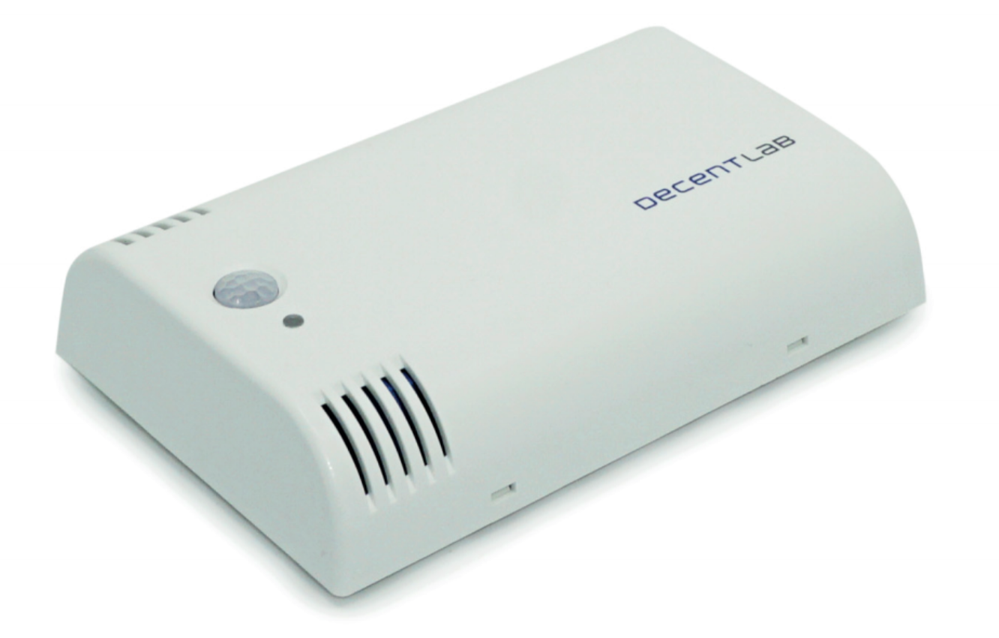
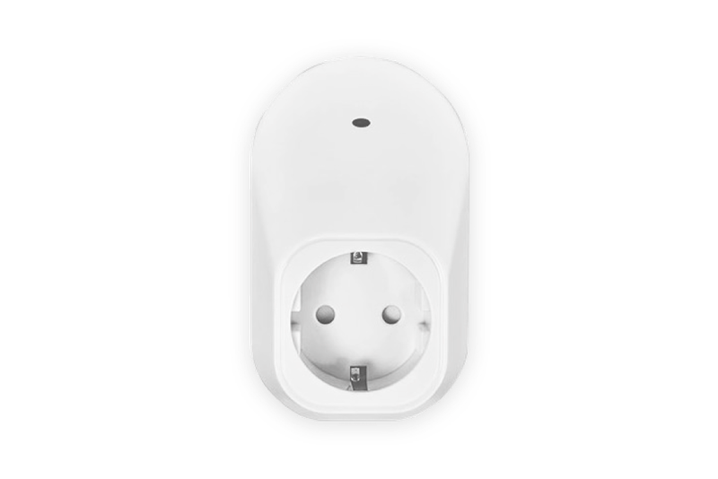
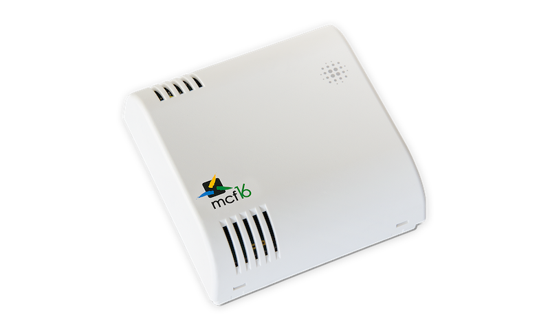

# The Things Network at BCX19

Welcome to the Bosch Connect Experience 2019. Please use the information provided to build your hack with The Things Network. Any help needed? Feel free to reach out to Krishna or Laurens 👇

## Your Hack Coaches

|**Krishna Iyer Easwaran**|**Laurens Slats**|
|--- |--- |
|||
|krishna@thethingsindustries.com |laurens@thethingsindustries.com|
[LinkedIn](https://www.linkedin.com/in/krishnaie/)|[LinkedIn](https://www.linkedin.com/in/laurensslats)|
||[Twitter](https://twitter.com/laurensslats)|

## Useful links

- Create a [The Things Network account](https://account.thethingsnetwork.org/register)
- [Download Arduino IDE](https://www.arduino.cc/en/Main/Software)
- [The Things Network documentation](https://www.thethingsnetwork.org/docs/)
 - [The Things Uno documentation](https://www.thethingsnetwork.org/docs/devices/uno/)
 - [The Things Node documentation](https://www.thethingsnetwork.org/docs/devices/uno/)

## We'll provide:

- The Things Network Coverage
- The Things Uno
- The Things Node
  - *Senses: Temperature, motion, light*
  - *Contains: Button, Led*
- Sensors
- USB cables & wires
- Indoor Ambiance Monitor by Decentlab
  - *Senses: CO2, TVOC, Temperature, Humidity, Pressure, Light, Motion*
- Indoor environmental sensor by MCF88
  - *Senses: Temperature, Humidity and Pressure*
- Energy Meter by MCF88
  - *Senses: Power consumption*
  - *Remotely switch power on/off*

## Indoor Ambiance Monitor by Decentlab

- [Connected BCX19 dashboard](https://exhibition.decentlab.com/dashboard/db/bosch-connected-world-2019?refresh=10s&orgId=2)
- [Decentlab decoder](https://github.com/decentlab/decentlab-decoders/blob/master/Indoor%20Ambiance%20Monitor/DL-IAM.js)
- [Decentlab decoder guide](https://github.com/decentlab/decentlab-decoders/blob/master/README.md)
- [More info](https://github.com/TheThingsNetwork/workshops/blob/master/The%20Things%20Network/media/Decentlab-PS-Indoor-Ambiance-Monitor.pdf)

## Energy Meter by MCF88

This compact meter can be used for monitoring the power consumption of the load, which can remotely be switched on/off. Equipped with a rechargeable battery for mains outage detection.

- Configure the device using NFC via [this Android App](https://play.google.com/store/apps/details?id=com.mcf88.loratool.client)
- [MCF88 Data Frame Format](https://github.com/TheThingsNetwork/workshops/blob/master/The%20Things%20Network/media/MCF88%20Data%20Frame%20Format%201.20.pdf)
- [Download datasheet](https://www.mcf16.com/wp-content/uploads/2018/11/mcf16-MCF-LW12PLG.pdf)

## Indoor environmental sensor by MCF88

This device reads temperature, humidity and pressure and sends collected data over the LoRaWAN™ network. Ideally suited for a wide range of applications such as building automation, condition monitoring, predictive maintenance, security, healthcare and many more use cases.

- Configure the device using NFC via [this Android App](https://play.google.com/store/apps/details?id=com.mcf88.loratool.client)
- [MCF88 Data Frame Format](https://github.com/TheThingsNetwork/workshops/blob/master/The%20Things%20Network/media/MCF88%20Data%20Frame%20Format%201.20.pdf)
- [Download datasheet](https://www.mcf16.com/wp-content/uploads/2018/02/mcf16-MCF-LW12TER.pdf)
