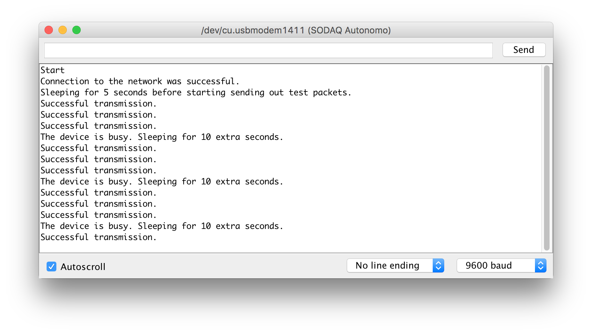

# The Things Network 'Hello world' for Arduino

This example is a step-by-step tutorial to connect your SODAQ Autonomo with LoRabee RN2483 to The Things Network.

Note: this example uses The Things Network demonstration back-end. Use the back-end for demonstration and prototyping purposes only.

## Pre-requisites

### Hardware
- [SODAQ Autonomo](http://shop.sodaq.com/nl/sodaq-autonomo.html) (pick the grove version for easy prototyping with grove sensors, actuators and displays)
- [LoRabee RN2483](http://shop.sodaq.com/en/lorabee-rn2483.html)

### Software
- [Arduino IDE](https://www.arduino.cc/en/Main/Software) 1.6.7 or higher

## Send Data

1. Open the Arduino IDE
2. In Preferences, add `http://downloads.sodaq.net/package_sodaq_index.json` to the list of Additional Board Manager URLs
3. Go to Tools > Boards > Board Manager and install **SODAQ SAMD Boards** by **SODAQ** version 1.6.4 or higher
4. Go to Tools > Boards and select **SODAQ Autonomo**
5. Go to Sketch > Include Library > Manage Libraries and install **SODAQ_RN2483** version 1.0.0 or higher
6. Open the [hello-world.ino](hello-world.ino) file
7. Change the device address at line 13 to a custom four-byte address, e.g. ```0x00, 0x00, 0xAA, 0x01``` to set a device address to `0000AA01`
8. Make sure that you are connected to the SODAQ Autonomo, see Tools > Port
9. Click Verify to compile the sketch
10. Click Upload to run the sketch on your SODAQ Autonomo
11. Go to Tools > Serial Monitor to view the debug output:

If you see the message "The device is busy", the program waits to meet the [duty cycle](https://en.wikipedia.org/wiki/Duty_cycle).

## Receive Data

Get the data from The Things Network API: http://thethingsnetwork.org/api/v0/nodes/0000AA01. Replace `0000AA01` with the device address you set in step 5.

```js
[
    {
        "data_raw": "QAGqAACACQABQM8b0aNJRipBFDMyf6Y0LI/nOfYE2LUXC7u5TPTwegEPFGo=",
        "gateway_eui": "0000024B08060112",
        "node_eui": "0000AA01",
        "frequency": 868.3,
        "data_plain": "Hello world! This is message #10",
        "time": "2016-01-18T18:29:42.060Z",
        "rssi": -78,
        "snr": 10.0,
        "datarate": "SF7BW125",
        "data": "SGVsbG8gd29ybGQhIFRoaXMgaXMgbWVzc2FnZSAjAA=="
    },
    ...
]
```

## Further Reading

* Working with live data in Node RED (todo)
* [The Things Network Examples](https://github.com/TheThingsNetwork/examples)
* [Arduino library for using the Microchip RN2483 LoRaWAN module (Class A)](https://github.com/SodaqMoja/Sodaq_RN2483)
