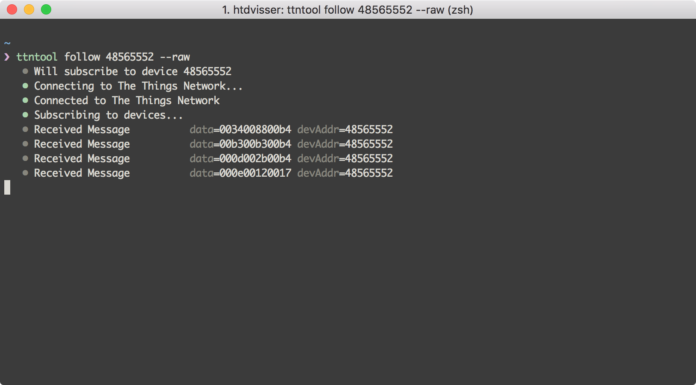

# The Things Network Ultrasonic Ranger example (binary data)

This example is exactly the same as [autonomo/proximity](../proximity), except that this example sends the sensor values as binary data instead of plain text.

The imported libraries can be found in [autonomo/proximity](../proximity).

## Console Output

The messages are sent as binary data with the format `min` (2 bytes) `avg` (2 bytes) `max` (2 bytes) to make the payload 50% smaller.
