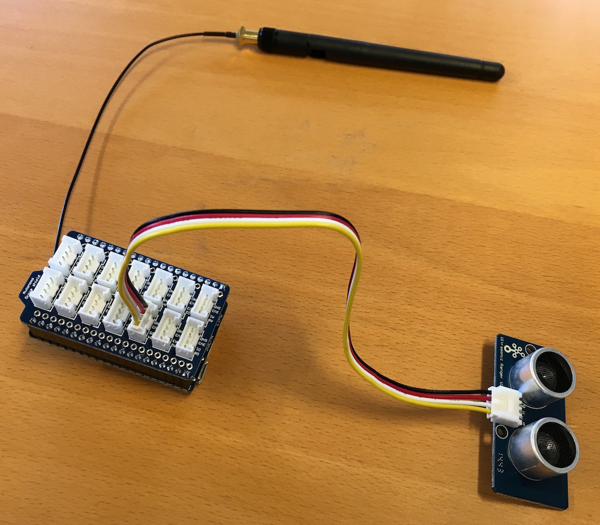
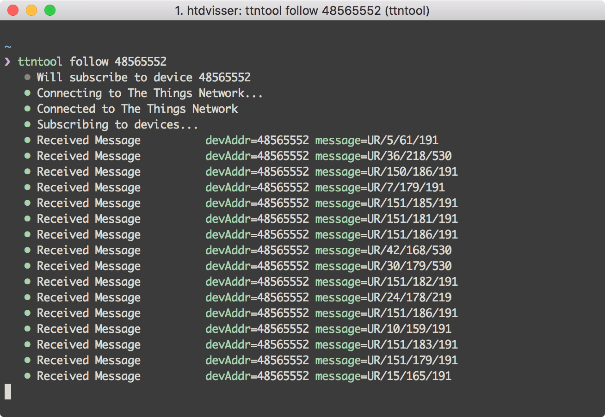

# The Things Network Ultrasonic Ranger example

This example measures the distance between the sensor and an object. Every minute,
a summary of this data is sent to The Things Network over LoRaWAN. The summary
contains the minimum, average and maximum sensor values measured in that timespan.

## Hardware



- [SODAQ Autonomo with Grove Shield](http://shop.sodaq.com/en/sodaq-autonomo-with-grove-shield.html)
- [Grove Ultrasonic Ranger](http://www.seeedstudio.com/depot/grove-ultrasonic-ranger-p-960.html)
- [LoRabee RN2483](http://shop.sodaq.com/en/lorabee-rn2483.html)

## Console Output



The messages are sent as plain text with the format `UR/min/avg/max`.

## Node-RED


Paste the following in [Node-RED](http://nodered.org/) (Menu > Import > Clipboard) to see the output of your sensor.

```
[{"id":"beea105d.4115f","type":"mqtt-broker","z":"cee529fd.311ad8","broker":"croft.thethings.girovito.nl","port":"1883","clientid":"","usetls":false,"verifyservercert":true,"compatmode":true,"keepalive":"15","cleansession":true,"willTopic":"","willQos":"0","willRetain":"false","willPayload":"","birthTopic":"","birthQos":"0","birthRetain":"false","birthPayload":""},{"id":"28ce09c5.d731f6","type":"mqtt in","z":"cee529fd.311ad8","name":"","topic":"nodes/48565552/packets","broker":"beea105d.4115f","x":125.89582824707031,"y":156.88888549804688,"wires":[["110adb08.eef525"]]},{"id":"110adb08.eef525","type":"json","z":"cee529fd.311ad8","name":"","x":321.89576721191406,"y":188.888916015625,"wires":[["19865bca.e679a4","7c3d076f.83c2f8"]]},{"id":"19865bca.e679a4","type":"debug","z":"cee529fd.311ad8","name":"","active":false,"console":"false","complete":"false","x":507.89573669433594,"y":128.88888549804688,"wires":[]},{"id":"7c3d076f.83c2f8","type":"function","z":"cee529fd.311ad8","name":"decode","func":"var sensorData = new Buffer(msg.payload.data, \"base64\").toString().split(\"/\");\n\nreturn {\n    payload: {\n        sensorId: msg.payload.nodeEui,\n        sensorMin: sensorData[1],\n        sensorAvg: sensorData[2],\n        sensorMax: sensorData[3],\n        gateway: msg.payload.gatewayEui\n    }\n}","outputs":1,"noerr":0,"x":464.89573669433594,"y":215.888916015625,"wires":[["3c4de9a1.c3b216"]]},{"id":"3c4de9a1.c3b216","type":"debug","z":"cee529fd.311ad8","name":"","active":true,"console":"false","complete":"payload","x":638.8957977294922,"y":176.888916015625,"wires":[]}]
```
