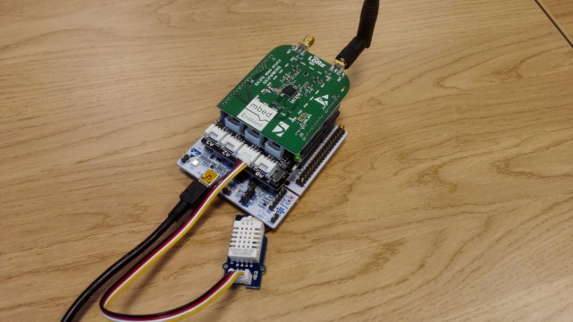

# Temperature readings using NUCLEO-L152RE and Grove – Temperature&Humidity Sensor Pro

This example measures temperature each minute. The temperature reading is shipped off to
[The Things Network](http://thethingsnetwork.org/) over LoRaWAN.

## Hardware

- [NUCLEO-L152RE](https://developer.mbed.org/platforms/ST-Nucleo-L152RE/)
- [Seeed Grove Shield V2 ](https://developer.mbed.org/components/Seeed-Grove-Shield-V2/)
- [Grove – Temperature&Humidity Sensor Pro](http://www.seeedstudio.com/depot/grove-temperaturehumidity-sensor-pro-p-838.html)

## Console output

    Temperature is 23.00
    Temperature is 23.00
    Temperature is 23.00
    Temperature is 23.00
    Temperature is 23.00
    Temperature is 23.00
    Temperature is 23.00
    Temperature is 23.00

# Code

The full code repository can be found on [embed.org](https://developer.mbed.org/users/dagga/code/lora-temperature/)
