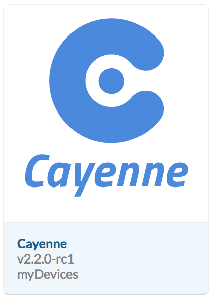
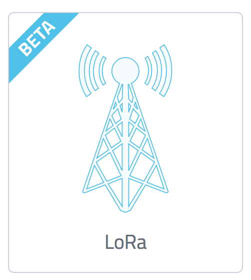
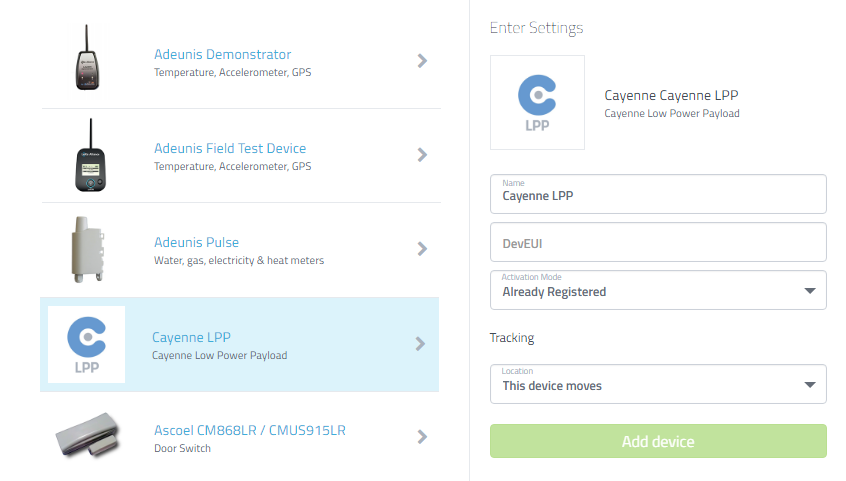
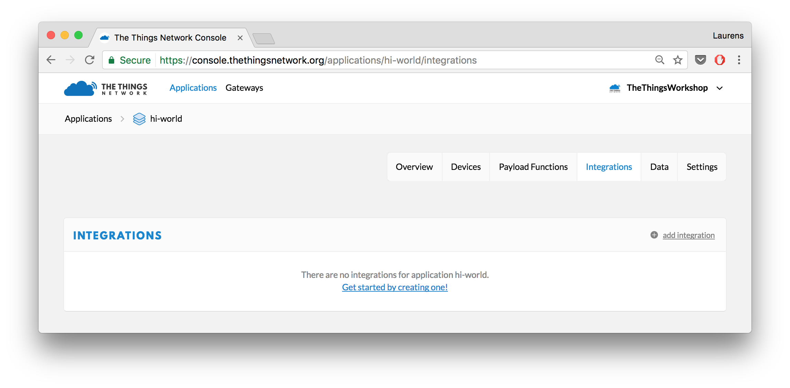
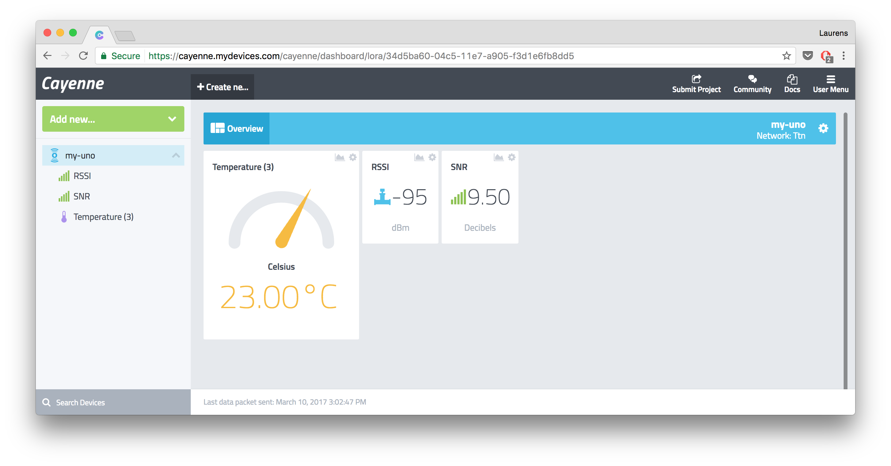

# myDevices Cayenne integration

myDevices Cayenne allows you to quickly design, prototype, and visualize IoT solutions. You can use Cayenne to build a nice-looking dashboard that showcases your data nicely.


## Who's this myDevices and what is Cayenne?


myDevices is an Internet of Things solutions company that tries to accelerate IoT development and empowers enterprises to quickly design, prototype, and commercialize IoT solutions.




To accomplish their mission to simplify the connected world, myDevices created Cayenne – the world’s first drag-and drop IoT project builder. Cayenne enables engineers, makers, network operators and system integrators to quickly and easily develop and deploy IoT solutions across a wide variety of verticals.

Developers can build complete and ready-to-use IoT solutions with little to no coding during the process. Cayenne contains a vast catalog of certified IoT- ready devices and connectivity options, and it allows users the ability to easily add any device into the library utilizing MQTT API. All devices in Cayenne are interoperable and benefit from features including rules engine, asset tracking, remote monitoring and control, and tools to visualize real-time and historical data.


## What is Cayenne LPP?
The Cayenne Low Power Payload (LPP) provides a convenient and easy way to send data over LPWAN networks such as LoRaWAN. The Cayenne LPP is compliant with the payload size restriction, which can be lowered down to 11 bytes, and allows the device to send multiple sensor data at one time. Additionally, the Cayenne LPP allows the device to send different sensor data in different frames. In order to do that, each sensor data must be prefixed with two bytes:

- Data Channel: Uniquely identifies each sensor in the device across frames.
- Data Type: Identifies the data type in the frame, eg. “temperature”.

More info about the Low Power Payload: https://mydevices.com/cayenne/docs/#lora-cayenne-low-power-payload


# Start building a fancy dashboard

## Change the payload format 

In order to display your content in the Cayenne dashboard, the format of the payload has to be adapted. 

> We need to send extra data for Cayenne to understand what data comes into their dashboard. Before we send the sensor data, we need to define what data is sent. The first byte is the so-called **Channel ID**. The sencond bytes explains the **Data Type** (so Cayenne knows that the data contains temperature values). The latter bytes contain the actualy sensor values.
 Please have a look [here](https://www.thethingsnetwork.org/docs/devices/arduino/api/cayennelpp.html) to find more information on the Cayenne Lower Power Protocol (LPP).
 
Find the documentation [here](https://www.thethingsnetwork.org/docs/devices/arduino/api/cayennelpp.html) about how to alter your Arduino sketch to encode data with the Cayenne Lower Power Protocol (LPP)

Examle code: 
```
TheThingsNetwork ttn(loraSerial, debugSerial, freqPlan);
CayenneLPP lpp(51);

lpp.reset();
lpp.addTemperature(1, 22.5);
lpp.addBarometricPressure(2, 1073.21);
lpp.addGPS(3, 52.37365, 4.88650, 2);

ttn.sendBytes(lpp.getBuffer(), lpp.getSize());
```

After encoding data with the Cayenne Lower Power Protocol, have a look at the console to change the **Payload Formats**
 
* Go to your Application in the **The Things Network Console** and click **Payload Formats**
* Select in the dropdown menu **Cayenne LPP** instead of **Custom**


## Setup your myDevices account

1.  Create an account on [myDevices](https://mydevices.com/)
2.  Log-in and click on **LoRa**
	
	
3.  Select **The Things Network** at the bottom of the left menu bar, click on **Cayenne LPP** and fill in your **DevEUI** of your device (which you can find in the [**Console**](https://console.thethingsnetwork.org/applications))
	


## Add the myDevices Cayenne integration in the Console

1.  Go to your application in the [**Console**](https://console.thethingsnetwork.org/applications) and add the myDevices integration via **Add Integration**
	 

2.  You can find your **Process ID** in the URL of the myDevices dashboard, starting after `/lora/`
3.  Add the integration


## Build your Cayenne dashboard
Click the device on the left side of your dashboard in Cayenne and you data is should be shown right away. After a bit of editing you can make quite some fancy stuff:

 


🎉 Great job! Now impress some folks with this amazing dashboard you built on Twitter. *Don't forget to add The Things Network in your Tweet: @thethingsntwrk*
