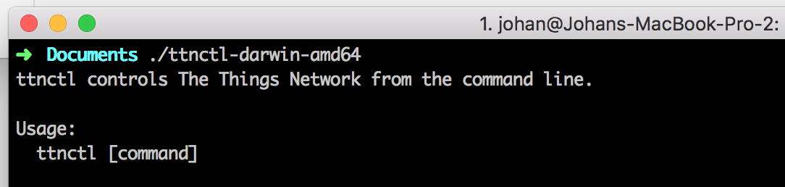
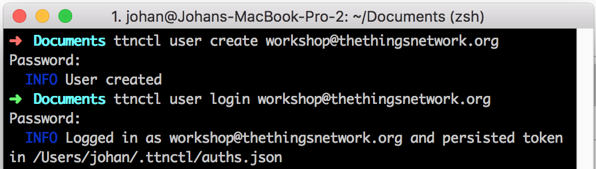
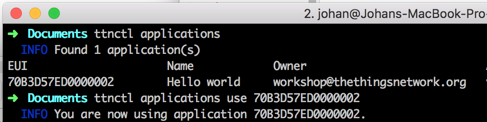
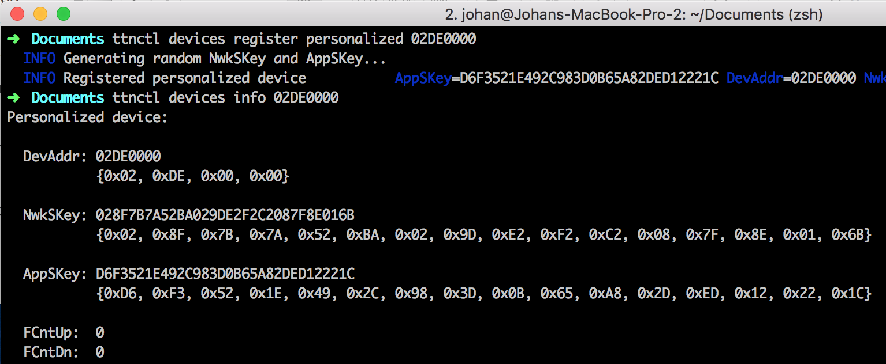
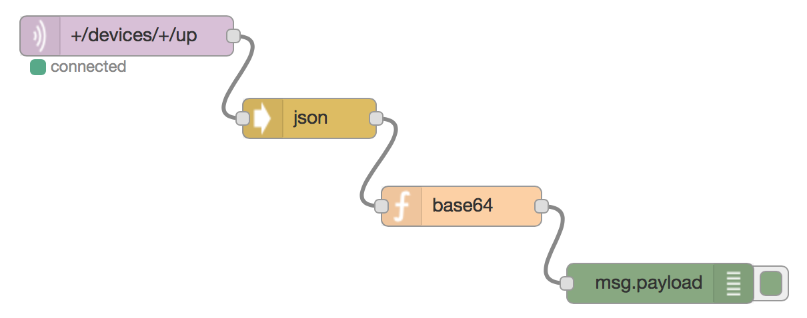

# The Things Uno Workshop

## Pre-requisites

1. The Things Uno (featuring Microchip RN2483 or RN2903)
2. Micro-USB cable
3. Laptop with Windows 7 or higher, Mac OS X or Linux

## Setup

### Arduino IDE

1. Download and install Arduino IDE 1.6.8 (for [Windows](https://www.arduino.cc/download_handler.php?f=/arduino-1.6.8-windows.exe), [Mac OS X](https://www.arduino.cc/download_handler.php?f=/arduino-1.6.8-macosx.zip) or [Linux](https://www.arduino.cc/download_handler.php?f=/arduino-1.6.8-linux64.tar.xz));
2. Download the latest The Things Uno Arduino Library ([zip](https://github.com/TheThingsNetwork/sdk/blob/master/node/TheThingsUno/release/TheThingsUno.zip?raw=true));
3. Connect the The Things Uno to your computer using the Micro-USB cable;
4. In the Arduino IDE, go to **Sketch** > **Include Library** > **Add .ZIP Library** and select the downloaded zip file;
5. Select **Tools** > **Board** > **Arduino Leonardo**;
6. Select **Tools** > **Port** > the port that identifies as **Arduino Leonardo**. For example, on Mac OS X:


### The Things Network control utility

#### Download and Install

1. Download The Things Network control utility `ttnctl` (for [Windows](https://ttnreleases.blob.core.windows.net/release/src/github.com/TheThingsNetwork/ttn/release/branch/develop/ttnctl-windows-amd64.zip), [Mac OS X](https://ttnreleases.blob.core.windows.net/release/src/github.com/TheThingsNetwork/ttn/release/branch/develop/ttnctl-darwin-amd64.zip) or [Linux](https://ttnreleases.blob.core.windows.net/release/src/github.com/TheThingsNetwork/ttn/release/branch/develop/ttnctl-linux-amd64.zip));
2. Extract the downloaded zip file to a convenient location, e.g. your user directory (`%USERPROFILE%` on Windows or `$HOME` on Mac OS X and Linux);
3. Verify that the command utility works by executing the command line utility:



*When instructed to use `ttnctl [command] ...`, replace `ttnctl` by the platform version you have, in the example above `ttnctl-darwin-amd64`*

#### Create Account

To use The Things Network, you need an user account. This is a personal account. Your login name is your e-mail address and you are free to choose a password.

1. Create a new user account by executing: `ttnctl user create demo@thethingsnetwork.org`;
2. Login with your new account: `ttnctl user login demo@thethingsnetwork.org`



#### Create Application

Users can create applications. Applications have an unique identifier, the EUI, which is issued by The Things Network and is guaranteed to be unique.

1. Create your first The Things Network application: `ttnctl applications create 'Hello world'`;
2. View your applications: `ttnctl applications`. The EUI is your unique `AppEUI`;
3. Use your newly created application: `ttnctl applications use <appEUI>`



*In the `ttnctl applications` view, you also see the Access Key. This is a secret key to get access to the data of your application. You will need this key later.*

#### Register Device (ABP)

The Things Network supports the two LoRaWAN mechanisms to register devices: activation by personalization (ABP) and over the air activation (OTAA). In this workshop, we use ABP. This requires you to generate a device address, which you can choose freely. We help you with that.

1. Generate your device address. Start with `02DE00` and add the hexadecimal representation of your workshop participation number, e.g. #43 is `2B`, so your device address becomes `02DE002B` (tip: use the [decimal to HEX converter](http://www.binaryhexconverter.com/decimal-to-hex-converter));
2. Register your device: `ttnctl devices register personalized <DevAddr>`;
3. Show your device security keys: `ttnctl device info <DevAddr>`



## Hello World

### Configure Device

1. In the Arduino IDE, open **File** > **Examples** > **TheThingsUno** > **hello-world**
2. Change your `devAddr`, `nwkSKey` and `appSKey` to the values of your device. You can copy/paste the values that `ttnctl` printed for you in the previous steps. Based on the previous example:

```
// Set your device address
const byte devAddr[4] = {0x02, 0xDE, 0x00, 0x00};

// Set your NwkSKey and AppSKey
const byte nwkSKey[16] = {0x02, 0x8F, 0x7B, 0x7A, 0x52, 0xBA, 0x02, 0x9D, 0xE2, 0xF2, 0xC2, 0x08, 0x7F, 0x8E, 0x01, 0x6B};
const byte appSKey[16] = {0xD6, 0xF3, 0x52, 0x1E, 0x49, 0x2C, 0x98, 0x3D, 0x0B, 0x65, 0xA8, 0x2D, 0xED, 0x12, 0x22, 0x1C};
```

### Run Application

1. Click **Sketch** > **Verify/Compile** and make sure that compilation works (Arduino says *Done compiling*)
2. Click **Sketch** > **Upload** (Arduino says *Done uploading*)
3. Go to **Tools** > **Serial Monitor** to see the output of your node. This should look like this:

```
Sending: mac tx uncnf 1 with 12 bytes
Successful transmission
Sending: mac tx uncnf 1 with 12 bytes
Successful transmission
...
```

### Get Your Data

We are using Node RED to get the data from The Things Network routing services, decode the data and push it to an application back-end.

1. Follow the instructions from your workshop facilitator to get to your Node RED environment;
2. From the **input** category in the toolbox on the left, drop a new **MQTT** node on your workflow;
3. Double-click the node named `mqtt`;
4. Click on the pencil icon next to **Add new mqtt-broker...**;
5. Enter for **Server**: `staging.thethingsnetwork.org`;
6. Go to **Security**;
7. Enter in **Username** your AppEUI;
8. Enter in **Password** your Access Key (tip: run `ttnctl applications` to see your AppEUI and Access Key);
9. Click **Add**;
10. Enter in **Topic**: `+/devices/+/up`. This subscribes you to all devices in your application;
11. From the **function** category, drop a new **JSON** node on the flow and connect the output of the `+/devices/+/up` node to the input of the `json` node;
12. From the **function** category, drop a new **Function** node on the flow;
13. Double-click the function node;
14. Enter in **Name**: `base64`;
15. Replace the **Function** by a Base64 decoding function to make your message printable:
```
var text = new Buffer(msg.payload.payload, 'base64').toString();
return {
    payload: text
}
```
16. From the **output** category, drop a new **Debug** node on the flow.
17. Your flow should like:

18. Click **Deploy**;
19. Go to the **Debug** pane on the right. Your **Hello world!** should come in every five seconds.

## Connect Sensors and Send Binary Data

You can connect sensors to your Arduino by using the pins directly, a pins with break-out board or a Grove shield.

1. Pick a sensor of your choice. See the [sensors examples](./samples/sensors) for sample code;
2. It is recommended to send data in a binary format. For example, if you have a single float value, send it like this:
```
float temperature = 21.5;
int data = (int)(temperature * 100); // 2150
byte buf[2];
buf[0] = (data >> 8) & 0xff;
buf[1] = data & 0xff;
ttu.sendBytes(buf, 2);
```
3. Decode the data in a decoding function in Node RED. Replace the function of the `base64`:
```
var buf = new Buffer(msg.payload.payload, 'base64');
var data = (buf[0] << 8) | buf[1];
var temperature = data / 100.0;

return {
    payload: {
        temperature: temperature
    }
}
```

## Push to IFTTT

1. Go to [IFTTT Maker Channel](https://ifttt.com/maker);
2. Click **Connect**;
3. Go to **Receive a web request**;
4. Click **Create a new Recipe**;
5. Type `Maker` in the search box to choose Maker as the trigger channel;
6. Click **Receive a web request** as the trigger;
7. Enter an **Event Name**, for example `temperature`;
8. Pick an **Action Channel** and configure it;
9. Use the fields `value1`, `value2` and/or `value3`;
10. Click **Create Action**;
11. Click **Create Recipe**;
12. Go back to Node RED;
13. Drop a new **Function** on the flow;
14. Return `value1`, `value2` and/or `value3` as JSON object. For the previous example:
```
return {
    payload: {
        value1: msg.payload.temperature
    }
}
```
15. Drop a new **HTTP request** on the flow;
16. Select the **POST** method and enter the URL as seen on **How to Trigger Events** in IFTTT, for example:


