# The Things Uno Workshop

## Pre-requisites

1. The Things Uno (featuring Microchip RN2483 or RN2903)
2. Micro-USB cable
3. Laptop with Windows 7 or higher, Mac OS X or Linux

## Setup

### Arduino IDE

1. Download and install Arduino IDE 1.6.9 (for
   [Windows](https://www.arduino.cc/download_handler.php?f=/arduino-1.6.9-windows.exe),
   [Mac OS X](https://www.arduino.cc/download_handler.php?f=/arduino-1.6.9-macosx.zip)
   or [Linux](https://www.arduino.cc/download_handler.php?f=/arduino-1.6.9-linux64.tar.xz), click **Just download**, there's no donation needed);
2. Download the latest The Things Uno Arduino Library
   ([zip](https://github.com/TheThingsNetwork/sdk/blob/master/devices/TheThingsUno/release/TheThingsUno.zip?raw=true));
3. Connect the The Things Uno to your computer using the Micro-USB cable;
4. In the Arduino IDE, go to **Sketch** > **Include Library** > **Add .ZIP Library** and select the downloaded zip file;
5. Select **Tools** > **Board** > **Arduino Leonardo**;
6. Select **Tools** > **Port** > the port that identifies as **Arduino Leonardo**. For example, on Mac OS X:
   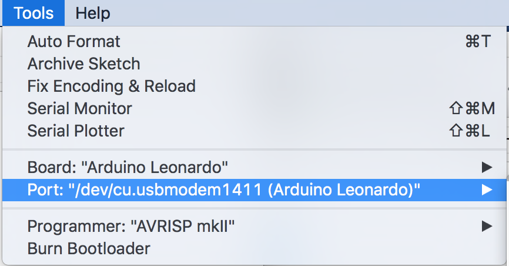
   On Windows, open the **Device Manager** from **Control Panel** to see which COM port you should use if there's more than one.

### The Things Network Dashboard

Your applications and devices can be managed by [The Things Network dashboard][dashboard].

#### Create an Account

To use the dashboard you need a The Things Network account. You can [create an account here][accounts].

After registering and validating your account, you will be able to log in to [The Things Network dashboard][dashboard].

#### Create an Application

Users can create applications. Applications have an unique identifier, the EUI,
which is issued by The Things Network and is guaranteed to be unique.

Create your first The Things Network application by clicking
[create application](https://staging.thethingsnetwork.org/applications/create).
Fill in the desired application name (something like `Julia's temperature sensornet` if your name is Julia) and click **Create application**.

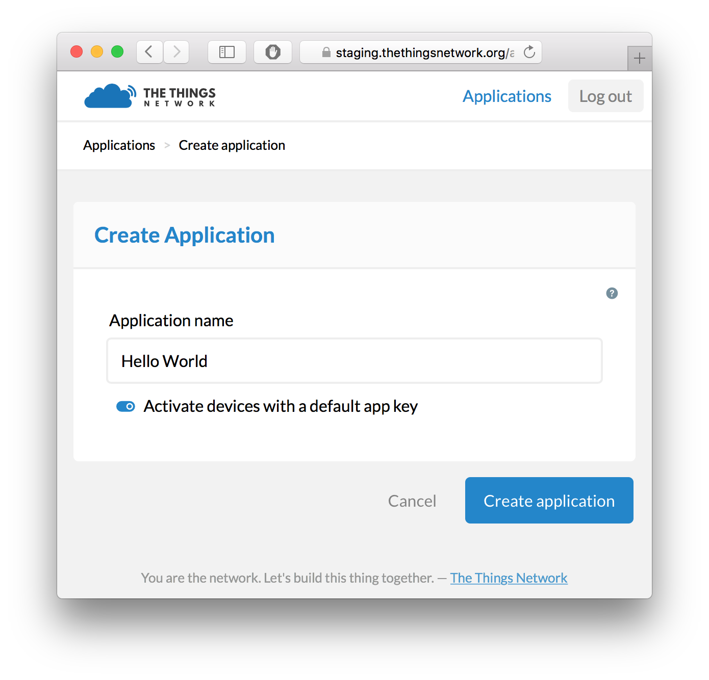

You will be redirected to the newly created Application page.

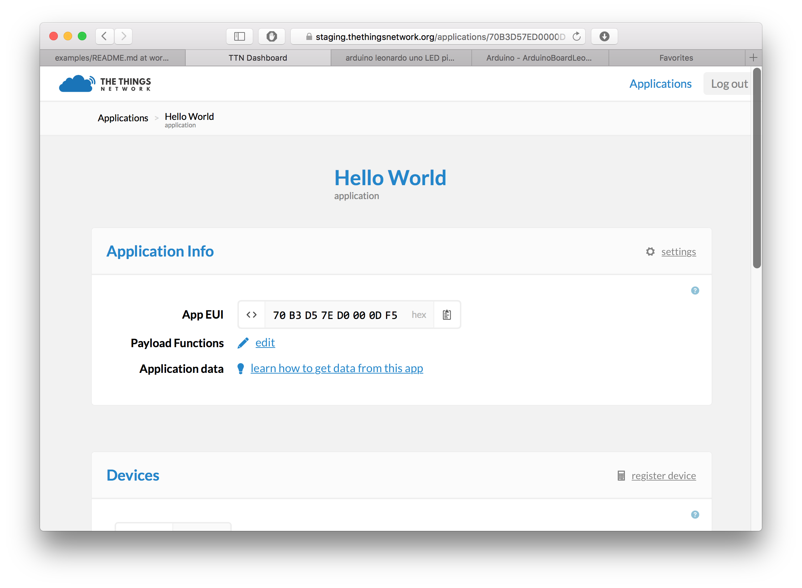

*Note: In the Application Info component, you can see the Access Key for that
application, this is a secret key to to get access to the data of your
application. You will need this key later.*

*Note: in every component on the dashboard there is a small help icon.
This opens a help message with details about that components.*

#### Register an ABP Device

The Things Network supports the two LoRaWAN mechanisms to register devices:
activation by personalization (ABP) and over the air activation (OTAA). In this
workshop, we use ABP.

##### Register the Device

To register the device, go back to The Things Network dashboard and click
**Register Device** on the application page. This will take you to the device
registration page. Here, select **ABP**. We will let both session keys to be randomly generated. To continue,
click **Register**.

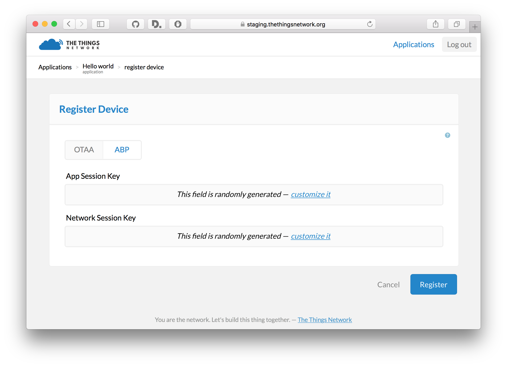

You will be redirected to the device info page. Here you can view all
information about your device, send messages to the device and view messages
that were sent by the device.

*Note*: Enable the **Relax Frame Count** option for this device. This allows you to restart your device for development purposes
without the routing services keeping track of the frame counter. Disabling this feature enables replay attacks, e.g.
sending messages with a frame counter lower than the latest received, so please do not enable relax frame count in production.

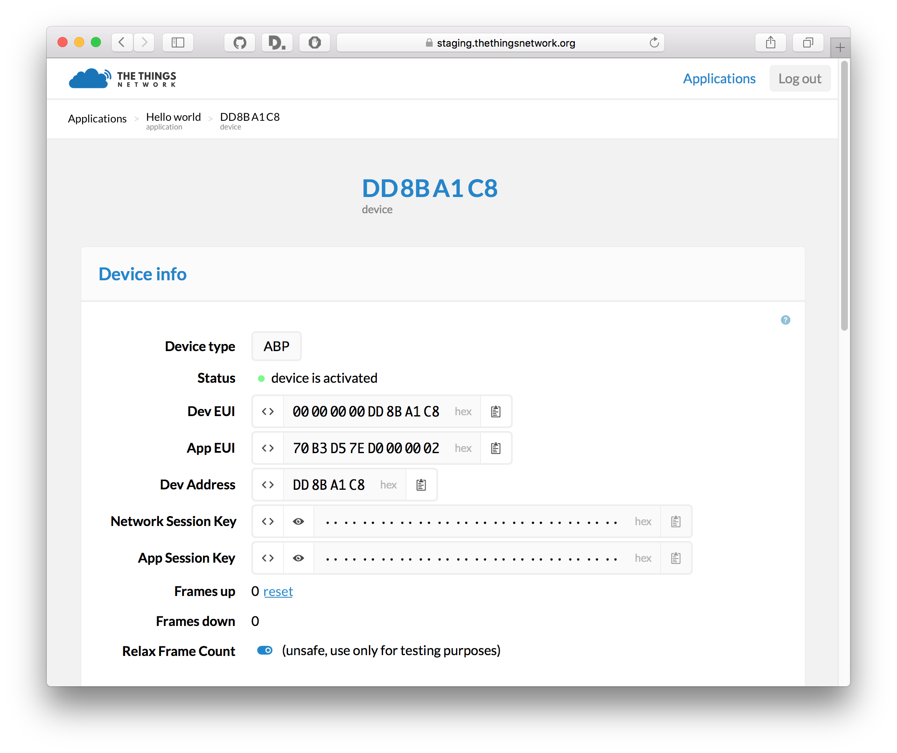

## Hello World

### Configure Device

1. In the Arduino IDE, open **File** > **Examples** > **TheThingsUno** > **SendABP**
2. Change your `devAddr`, `nwkSKey`, `appSKey` to the values you can find on the application
   page. If you click the `<>` on the each of the fields on the Device page,
   their contents are shown as a C-style byte array literal which is extra
   handy for copy-pasting.

Use the information shown on the device page to fill in following code snippet:

```c
// Set your DevAddr
const byte devAddr[4] = { <insert DevAddr> }; //for example: {0x02, 0xDE, 0xAE, 0x00};

// Set your NwkSKey and AppSKey
const byte nwkSKey[16] = { <insert NwkSKey> }; //for example: {0x2B, 0x7E, 0x15, 0x16, 0x28, 0xAE, 0xD2, 0xA6, 0xAB, 0xF7, 0x15, 0x88, 0x09, 0xCF, 0x4F, 0x3C};
const byte appSKey[16] = { <insert AppSKey> }; //for example: {0x2B, 0x7E, 0x15, 0x16, 0x28, 0xAE, 0xD2, 0xA6, 0xAB, 0xF7, 0x15, 0x88, 0x09, 0xCF, 0x4F, 0x3C};
```

### Run The Application on Your Device

1. Click **Sketch** > **Verify/Compile** and make sure that compilation works
   (Arduino says *Done compiling*)
2. Click **Sketch** > **Upload** (Arduino says *Done uploading*)
3. Go to **Tools** > **Serial Monitor** to see the output of your node. This
   should look like this:

```
Sending: mac tx uncnf 1 with 12 bytes
Successful transmission
Sending: mac tx uncnf 1 with 12 bytes
Successful transmission
...
```

### Get Your Data

If all goes well you should also be receiving messages from your device in the
Messages component on the device page. The payload you see here is
the the byte representation of the `Hello world!` string we are sending
from the device.

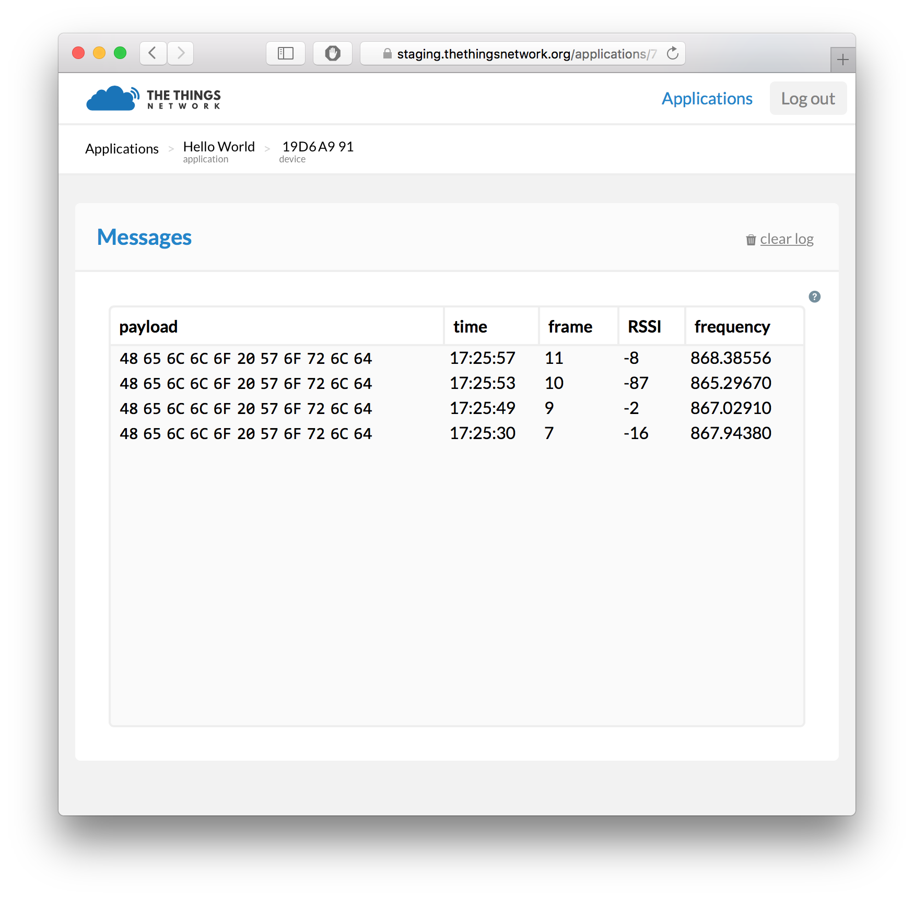

Using the payload like this is can be tricky: usually the raw bytes are of no
interest to an application using messages from a device.  That's why The Things
Network introduces the concept of *payload functions*. More on that later,
first let us send some actual data!

#### We Love Bytes

Sending strings over LoRa is often a bad practice, as a high number of bytes
increases payload size and therefore requires more power and uses more precious
airtime.

Instead, prefer to send bytes that encode your data in a compact way. For example,
to send an analog readings and send them as 16-bit unsigned integers,
so two bytes each, use the following code snippet: 

```c
// Read the analog values from pins A0 and A1
uint16_t value1 = analogRead(A0);
uint16_t value2 = analogRead(A1);

// Two 16-bit integers are 4 bytes
uint8_t buf[4];

// highByte and lowByte are helper functions to get the 8 most and 8 least
// significant bits of a uint16_t, respectively
buf[0] = highByte(value1);
buf[1] = lowByte(value1);
buf[2] = highByte(value2);
buf[3] = lowByte(value2);

// Send the buffer to The Things Network
ttu.sendBytes(buf, sizeof(buf));
```

Now, this is a nice low power way of sending values, because you're not doing
any calculations on your node. Should you need to convert analog readings, e.g.
a voltage to temperature in Celcius, you're often dealing with floating point
values, e.g. `21.5`. So let's say you have a temperature sensor connected to `A0`:

```c
float voltage = analogRead(A0) * (5.0 / 1024.0);
float celcius = (voltage - 0.5) * 100.0; // e.g. 21.5

uint16_t value1 = (uint16_t)(celcius * 100); // e.g. 2150

uint8_t buf[2];
buf[0] = highByte(value1);
buf[1] = lowByte(value1);

ttu.sendBytes(buf, sizeof(buf));
```

Remove sending a string from your `loop()` function, and use the snippets
above to send data from your sensor.

Then, click **Sketch** > **Verify/Compile**
and **Sketch** > **Upload** again.  This will make the device send bytes.

If you now have a look at the device page on the Dashboard you'll see your data
coming in.

*Note: how you encode your payload depends on the sensor values and the use case
of your application. For most values, one, two or three bytes are sufficient.

Only send strings when the text is really variable, e.g. user input. For status
messages, consider using numeric status codes.*

#### Unpacking The Bytes

To make working with byte payloads easier, The Things Network allows you to
register payload functions for each application. The payload functions are
three functions: the *decoder*, the *converter* and the *validator*.

Here, we will only be using the *decoder* to decode the bytes your device is
sending into messages that are meaningful to our application. Use the optional
*converter* function to convert units (e.g. voltage to Fahrenheit) and the
*validator* function to check whether the payload is valid (e.g. invalidate
outliers).

To set up the payload functions, go back to the Application view and click the
**edit** button in the Application Info component. This will bring you to the
Payload Function editor.


Here you can view, test and edit the payload functions for your application.

In the *decoder* section, enter the following to decode the payload. So,
let's say you're sending temperature as a floating point value, see above.
Then you do your bitshifting magic to obtain the original floating point value:

```
function (bytes) {
  var value1 = (bytes[0] << 8) | bytes[1];
  return {
    temperature: value1 / 100.0,
  };
}
```

Before saving our payload function we can test it first by entering a test
payload in the box below. For example, enter `0866` and click **Test**. The test output
should correspond to the temperature value we send earlier:

```
{
  "temperature": 21.5
}
```

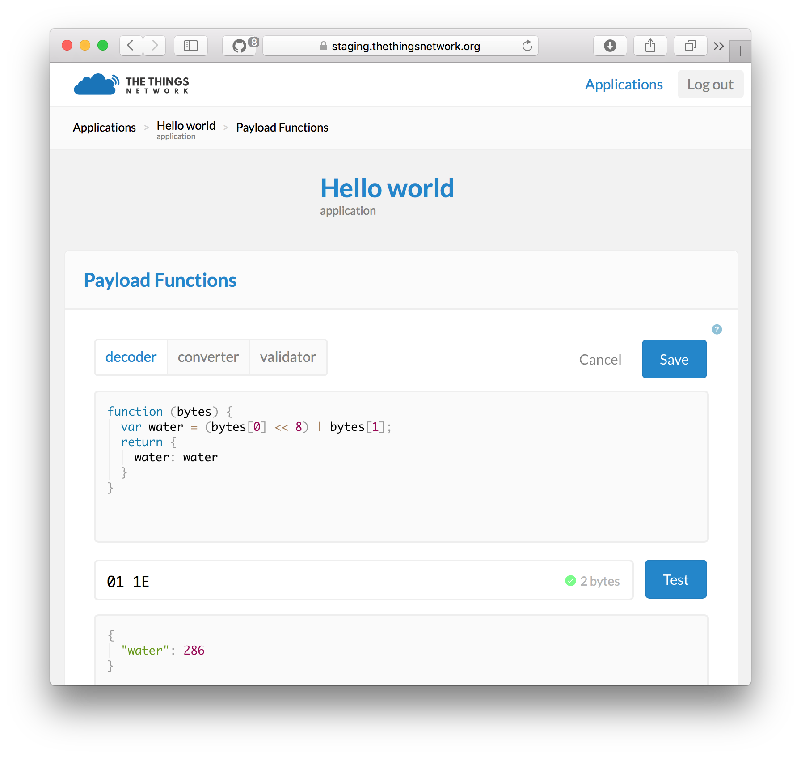

If you are happy with the output of your payload function, click **Save**. All
incoming messages will now be decoded using these payload functions. You can see
if this worked by going back to the device page and looking at the messages. The
payload will now be logged in its decoded form.

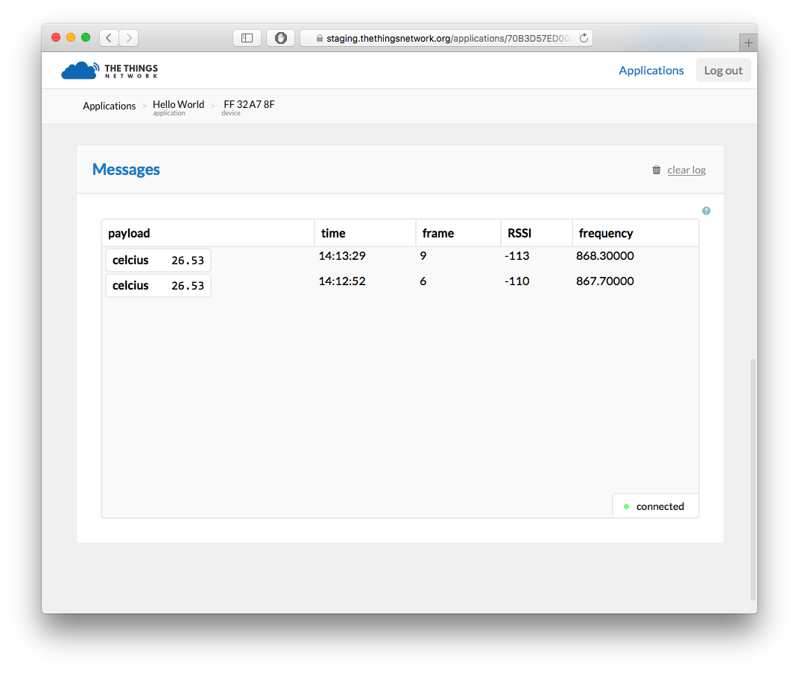

### Getting Your Data

In this tutorial, we are using Node RED to get the data from The Things Network
routing services and push it to an application back-end.

1. Install Node.js ([download installer](https://nodejs.org/en/download/))
   and Node RED (`npm install -g node-red`, [more info](http://nodered.org/docs/getting-started/installation.html))
2. Install the **TTN** node: `npm install -g node-red-contrib-ttn`
3. Open Node RED: point to [localhost:1880](http://localhost:1880) in your browser
4. From the **input** category in the toolbox on the left, drop a new **TTN**
   node on your workflow
5. Double-click the node named `ttn`
6. Enter in **App EUI** your AppEUI (check the Application page)
7. Enter in **Access Key** your Access Key (check the Application page)
8. Enter for **Broker**: `staging.thethingsnetwork.org`
9. Click **Add**
10. From the **output** category, drop a new **debug** node on the flow and
    connect the upper output of the **ttn** node to the input of the **debug**
    node.

Excellent! Your flow should look like this:

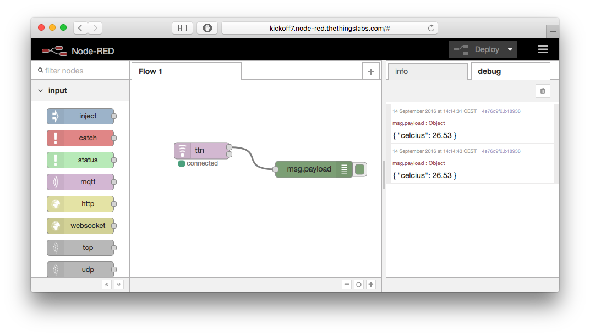

Click **Deploy** and monitor the debug tab for incoming messages. You will start
seeing messages like:
```
{ "temperature": 21.5 }
```

Node RED allows you to build all kinds of flows with basic business logic. You can
add switches, triggers, custom functions and install thousands of nodes with
additional functionality, for example to store data in a database.

A common use case is to invoke a HTTP request to an external web service, for example If This Than That (IFTTT).

## Push to IFTTT

1. Go to [IFTTT Maker Channel](https://ifttt.com/maker)
2. Click **Connect**
3. Go to **Receive a web request**
4. Click **Create a new Recipe**
5. Type `Maker` in the search box to choose Maker as the trigger channel
6. Click **Receive a web request** as the trigger
7. Enter an **Event Name**, for example `temperature`
8. Pick an **Action Channel** and configure it, e.g. Twitter, e-mail or a notification to your phone
9. Use the fields `value1`, `value2` and/or `value3` as ingredient
10. Click **Create Action**
11. Click **Create Recipe**
12. Go back to Node RED
13. Drop a new **Function** on the flow
14. Return `value1`, `value2` and/or `value3` as JSON object. For the previous
    example:
```
return {
    payload: {
        value1: msg.payload.temperature
    }
}
```
15. Drop a new **HTTP request** on the flow;
16. Select the **POST** method and enter the URL as seen on **How to Trigger
    Events** ([see here](https://ifttt.com/maker)), for example:

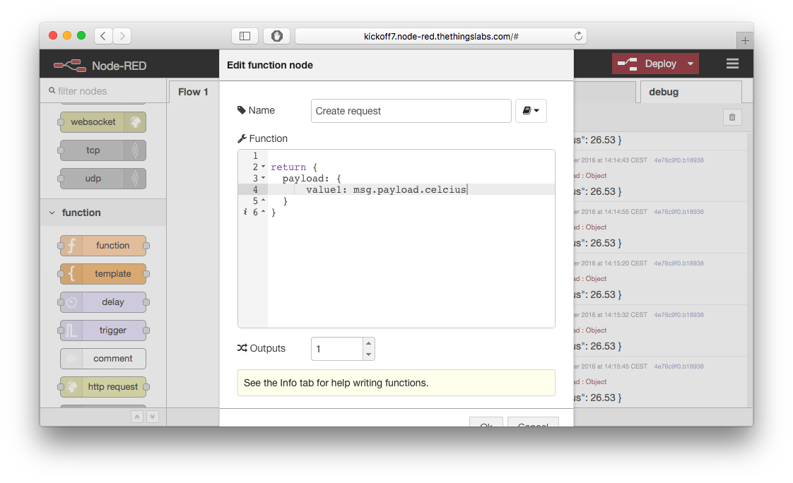
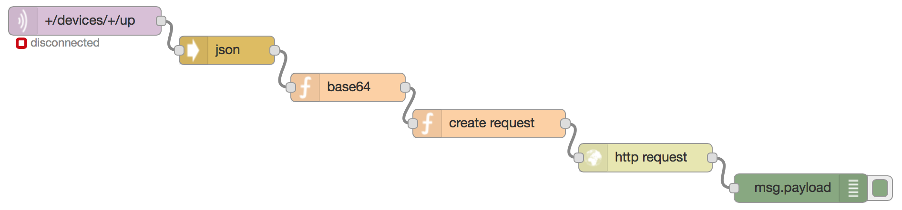

## OK. Done. What's Next?

Congratulations! You just learned how to create an account, an application,
register a device, send data from a device, decode it, get it in Node RED,
process it and push it to IFTTT to connect to the world of APIs.

Now, Node RED can be used to build complex applications too. You can store data
in a database, query data on an interval, add all kinds of business rules and
invoke any web service. However, many real world applications are usually a combination of:

- Storing data in a time series database (e.g. [InfluxDB](https://influxdata.com))
- Interactive visualization of data in charts (e.g. [Grafana](http://grafana.org))
- Do-it-yourself charts and maps (e.g. use [Socket.io to get data](https://github.com/TheThingsNetwork/examples/tree/master/socketio)
  and visualize with [Flot](http://flotcharts.org) and [Google Maps API](https://developers.google.com/maps/))
- Setting alerts on measured values, often combined with other data sets
- Control actuators by using downlink messages (see in Arduino IDE: **File** > **Examples** > **TheThingsUno** > **Downlink** example
  and the [wiki](http://staging.thethingsnetwork.org/wiki/Backend/Connect/Application) about sending downlink messages from an application)
- Integrate with internet of things cloud platforms (see [Azure IoT Hub](https://github.com/TheThingsNetwork/examples/tree/master/integrations/azure) and [AWS IoT](https://github.com/TheThingsNetwork/examples/tree/master/integrations/aws) example integrations)


[accounts]:  https://account.thethingsnetwork.org
[dashboard]: https://staging.thethingsnetwork.org