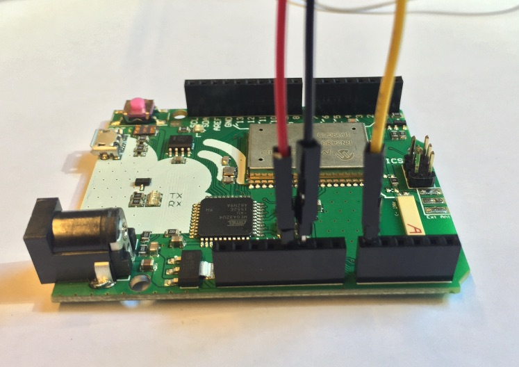
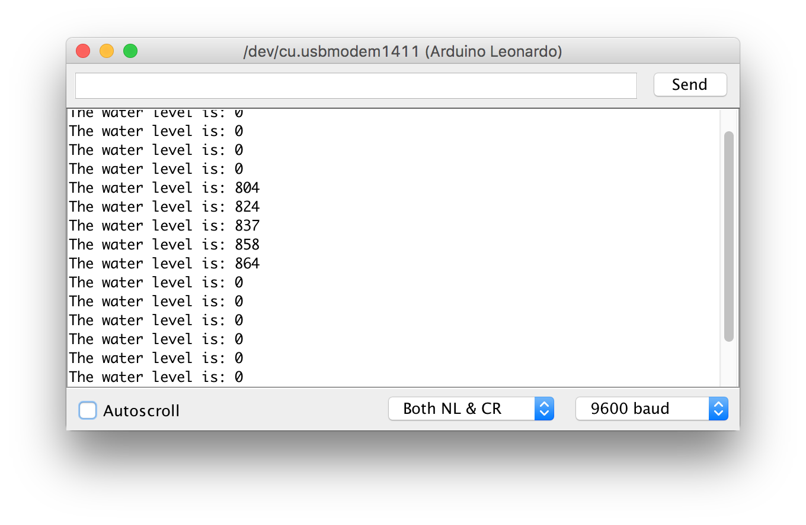
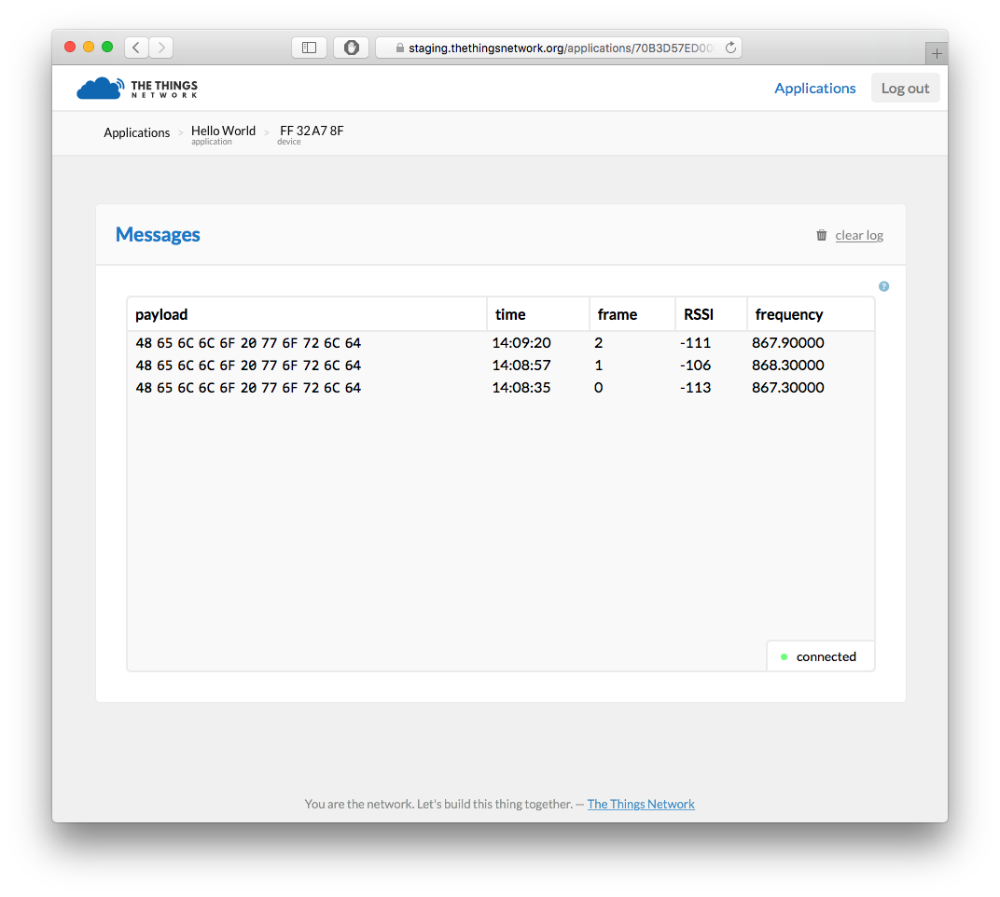
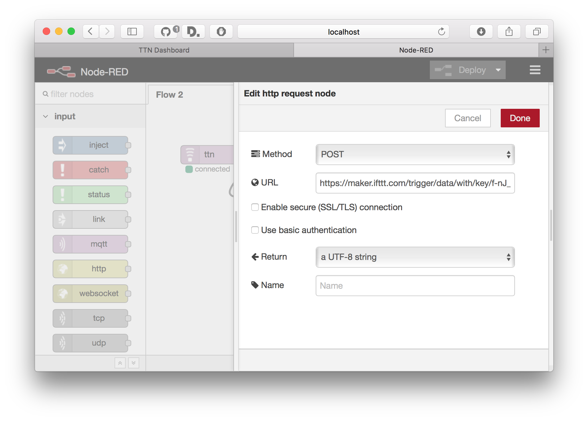

# The Things Uno Workshop

## Pre-requisites

1. The Things Uno
2. Micro-USB cable
3. Water sensor
4. Grove-to-male jumper cable
5. Laptop with Windows 7 or higher, Mac OS X or Linux

## Getting Data

### Setup

1. Download and install [Arduino IDE](https://www.arduino.cc/en/Main/Software)
2. In Arduino IDE, go to **Sketch** > **Include Library** > **Manage Library**, search for **TheThingsNetwork** and install the TheThingsNetwork's Arduino library.
3. Connect the The Things Uno to your computer using the Micro-USB cable
4. Select **Tools** > **Board** > **Arduino Leonardo**
5. Select **Tools** > **Port** > the port that identifies as **Arduino Leonardo**. For example, on Mac OS X:
   
   On Windows, in **Control Panel**, open the **Device Manager** to see which COM port you should use.
   
### Reading Sensor Value

In the Arduino IDE, start with an empty sketch (go to **File** > **New**).

Connect your water sensor to your The Things Uno by using the grove-to-male jumper cable:
- The red pin goes in `5V`
- The black pin goes in `GND`
- The yellow pin goes in digital `2`
- The white pin is not connected



Replace the `loop()` method:

```c
void loop() {
  // read a sensor value
  uint32_t water = 1023 - analogRead(A0);

  // print it
  Serial.print(F("The water level is: "));
  Serial.println(water);

  // wait a second
  delay(1000);
}
```

### Showing Sensor Value

1. Click **Sketch** > **Verify/Compile** and make sure that compilation works (Arduino says *Done compiling*)
2. Click **Sketch** > **Upload** (Arduino says *Done uploading*)
3. Go to **Tools** > **Serial Monitor** to see the output of your node. This should look like this:



## Sending Data

### The Things Network Dashboard

Your applications and devices can be managed by [The Things Network Dashboard][dashboard].

#### Create an Account

To use the dashboard, you need a The Things Network account. You can [create an account here][accounts].

After registering and validating your e-mail address, you will be able to log in to [The Things Network Dashboard][dashboard].

#### Create an Application

Create your first The Things Network application by clicking
[create application](https://staging.thethingsnetwork.org/applications/create).
Fill in the desired application name (e.g. `Hello world`) and click **Create application**.


You will be redirected to the newly created Application page.


*Note: in every component on the dashboard there is a small help icon. This opens a help message with details about that components.*

#### Register Device

To register the device, go back to the dashboard and click
**Register Device** on the application page. This will take you to the device registration page.

Select **ABP**. We will let both session keys to be randomly generated. To continue, click **Register**.


You will be redirected to the device info page. Here you can view all information about your device, send messages to the device and view messages that were sent by the device.

**Important**: Enable the **Relax Frame Count** option for this device.

*Note*: Relax Frame Count allows you to restart your device for development purposes without the routing services keeping track of the frame counter. Disabling this feature enables replay attacks, e.g. sending messages with a frame counter equal or lower than the latest received, so please do not enable relax frame count in production.


### Configure Device

1. In the Arduino IDE, open **File** > **Examples** > **TheThingsUno** > **Workshop**
2. Change your `devAddr`, `nwkSKey`, `appSKey` to the values you can find on the device page in the dashboard.

*Hint*: If you click the `<>` on the each of the fields on the Device page, their contents are shown as a C-style byte array literal which is extra handy for copy-pasting.

### Run The Application on Your Device

1. Click **Sketch** > **Verify/Compile** and make sure that compilation works
   (Arduino says *Done compiling*)
2. Click **Sketch** > **Upload** (Arduino says *Done uploading*)
3. Go to **Tools** > **Serial Monitor** to see the output of your node. This
   should look like this:

```
Sending: mac tx uncnf 1 with 3 bytes
Successful transmission
Sending: mac tx uncnf 1 with 3 bytes
Successful transmission
...
```

### Get Your Data

Go back to the dashboard. You should be receiving messages from your device in the
Messages component on the device page. The payload you see here are three bytes.



You are sending these three bytes in the `loop()` function of your Arduino, which
currently looks like this:

```c
void loop() {
  // Create a buffer with three bytes  
  byte data[3] = { 0x01, 0x02, 0x03 };

  // Send it to the network
  ttu.sendBytes(data, sizeof(data));

  // Wait 10 seconds
  delay(10000);
}
```

### Read Sensors

Now that you can send data to The Things Network, we’re going to send your sensor value. Use this code snippet that replaces your current `loop()` function:

```c
void loop() {
  // read a sensor value
  uint32_t water = 1023 - analogRead(A0);

  // print it
  Serial.print(F("The water level is: "));
  Serial.println(water);

  // encode the value in two bytes
  byte data[2];
  data[0] = value >> 8;
  data[1] = value & 0xFF;
  
  // send it to The Things Network
  ttn.sendBytes(data, sizeof(data));

  // wait 10 seconds
  delay(10000);
}
```

Then, click **Sketch** > **Upload** to update your device.

Click **Tools** > **Serial Monitor** to verify that your device is sending
sensor values:

```
The water level is: 120
Sending: mac tx uncnf 1 with 2 bytes
Successful transmission

The water level is: 286
Sending: mac tx uncnf 1 with 2 bytes
Successful transmission
...
```

Take a look at the device page on the dashboard. You should see your payload, e.g. `01 1E`.

#### Unpacking The Bytes

To make working with payloads easier, The Things Network allows you to decode bytes to a meaningful data structure for your application. The payload functions are three functions: the *decoder*, the *converter* and the *validator*.

Here, we will only be using the *decoder* to decode the bytes your device is sending. Use the optional *converter* function to convert units (e.g. Celcius to Fahrenheit) and the optional *validator* function to check whether the payload is valid (e.g. invalidate outliers).

To set up the payload functions, go back to the Application view and click the **edit** button of **Payload Functions**. This will bring you to the Payload Function editor.


Here you can view, test and edit the payload functions for your application.

In the *decoder* section, enter the following to decode the payload. This is
basically the reverse of what you did on the Arduino:

```javascript
function (bytes) {
  var water = (bytes[0] << 8) | bytes[1];
  return {
	  water: water
  };
}
```

Before saving our payload function we can test it first by entering a test payload in the box below. For example, enter `01 1E` and click **Test**. The test output
should correspond to the temperature value we sent earlier:

```json
{
  "water": 286
}
```


When you are happy with the output of your payload function, click **Save**. All incoming messages will now be decoded using these payload functions. You can see if this worked by going back to the device page and looking at the messages. The payload will now be logged in its decoded form.

This is an example with temperature and light:


### Getting Your Data

In this tutorial, we're using Node-RED to get the data from The Things Network
routing services and push it to an application back-end.

1. In the dashboard, go to your application and click **learn how to get data from this app**. You need the **AppEUI** and **Access Key** in step 5 and 6
2. Ask your workshop facilitator for the URL to your own Node-RED environment
3. From the **input** category in the toolbox on the left, drop a **TTN** node on your workflow
4. Double-click the node named `ttn`
5. Enter as **App EUI** your App EUI from the dashboard (see step 1)
6. Enter as **Access Key** your Access Key from the dashboard
7. Enter as **Broker** `staging.thethingsnetwork.org`
8. Click **Add**
9. From the **output** category, drop a new **debug** node on the flow and
    connect the *first output* of the **ttn** node to the input of the **debug**
    node.

Click **Deploy** and monitor the **debug** tab on the right for incoming messages. You will start
seeing messages like:

```
{ "water": 286 }
```


Node-RED allows you to build all kinds of flows with basic business logic. You can
add switches, triggers, custom functions and install thousands of nodes with
additional functionality, for example storing data in a database.

A common use case is to invoke a HTTP request to an external web service of your application.

To complete the end-to-end workshop, we're going to use If This Then That (IFTTT) to connect to APIs.

## Push to IFTTT

1. Go to [IFTTT](https://ifttt.com) and create an account
2. Go to [IFTTT Maker Channel](https://ifttt.com/maker)
3. Click **Connect**
4. Go to **Receive a web request**
5. Click **Create a new Recipe** and click **This** to configure the trigger
6. Choose **Maker** as the trigger channel
7. Click **Receive a web request** as the trigger
8. Enter an **Event Name**, for example `data`
9. Click **That** to configure an action, e.g. post a tweet on Twitter, e-mail or a notification to your phone
10. Use the field `value1` as ingredient, e.g. the tweet text could be `Hey, the water level is {{value1}} degrees! @thethingsntwrk`
11. Click **Create Action**
12. Click **Create Recipe**
13. Go back to Node-RED
14. Drop a new **Function** on the flow, double-click it and name it `Create request`
15. As the function body, return `value1` and `value2` as JSON object:
```javascript
return {
    payload: {
        value1: msg.payload.water
    }
}
```
16. Drop a new **HTTP request** on the flow and connect it to the function
17. Select the **POST** method and enter the URL as seen on **How to Trigger Events** of the [IFTTT Maker Channel](https://ifttt.com/maker):





## OK. Done. What's Next?

Congratulations! You just learned how to create an account, an application,
register a device, send data from a device, decode it, get it in Node-RED,
process it and push it to IFTTT to connect to the world of APIs.

Now, Node-RED can be used to build complex applications too. You can store data
in a database, query data on an interval, add all kinds of business rules and
invoke any web service.

From this starting point, you can start building a real world application. Here are some useful links:

- Install Node-RED locally: install [Node.js](https://nodejs.org/en/), [Node-RED](http://nodered.org) and the [TTN node](https://github.com/TheThingsNetwork/sdk/tree/master/apps/node-RED)
- Installing custom functionality in Node-RED, see the [Node-RED Library](http://flows.nodered.org)
- Connect your application directly using MQTT. Pick a client for your favorite programming language from [Eclipse Paho](http://www.eclipse.org/paho/), and see The Things Network wiki on [how to connect MQTT](https://www.thethingsnetwork.org/wiki/Backend/Connect/Application) 
- Storing data in a time series database (e.g. [InfluxDB](https://influxdata.com) and get the [Node-RED node for InfluxDB](http://flows.nodered.org/node/node-red-contrib-influxdb))
- Interactive visualization of data in charts (e.g. [Grafana](http://grafana.org) works good with InfluxDB)
- Do-it-yourself charts and maps (e.g. use [Socket.io to get data](https://github.com/TheThingsNetwork/examples/tree/master/socketio)
  and visualize with [Flot](http://flotcharts.org) and [Google Maps API](https://developers.google.com/maps/))
- Control actuators by using downlink messages (see in Arduino IDE: **File** > **Examples** > **TheThingsUno** > **Downlink** example
  and the [wiki](http://thethingsnetwork.org/wiki/Backend/Connect/Application) about sending downlink messages from an application)
- Integrate with internet of things cloud platforms (see [Azure IoT Hub](https://github.com/TheThingsNetwork/examples/tree/master/integrations/azure) and [AWS IoT](https://github.com/TheThingsNetwork/examples/tree/master/integrations/aws) example integrations)


[accounts]:  https://account.thethingsnetwork.org
[dashboard]: https://staging.thethingsnetwork.org
