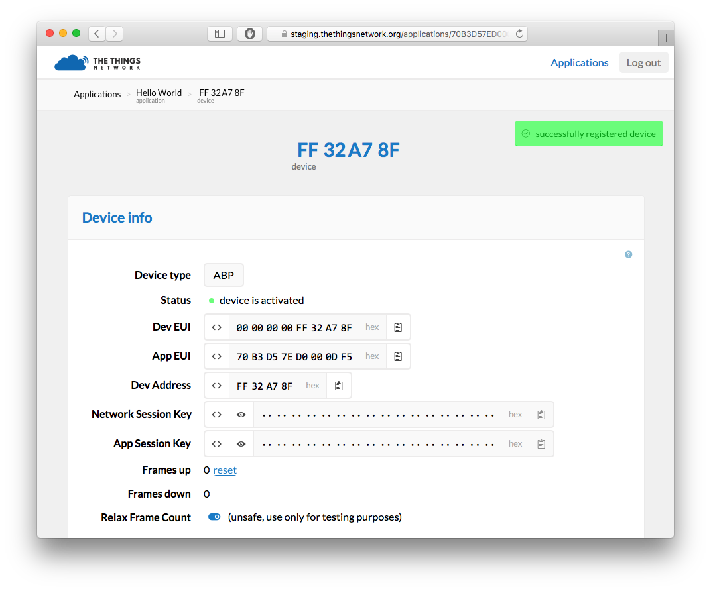

# The Things Uno Workshop

## Pre-requisites

1. The Things Uno (featuring Microchip RN2483 or RN2903)
2. Micro-USB cable
3. Laptop with Windows 7 or higher, Mac OS X or Linux

## Setup

### Arduino IDE

1. Download and install Arduino IDE 1.6.8 (for
   [Windows](https://www.arduino.cc/download_handler.php?f=/arduino-1.6.8-windows.exe),
   [Mac OS X](https://www.arduino.cc/download_handler.php?f=/arduino-1.6.8-macosx.zip)
   or [Linux](https://www.arduino.cc/download_handler.php?f=/arduino-1.6.8-linux64.tar.xz));
2. Download the latest The Things Uno Arduino Library
   ([zip](https://github.com/TheThingsNetwork/sdk/blob/master/node/TheThingsUno/release/TheThingsUno.zip?raw=true));
3. Connect the The Things Uno to your computer using the Micro-USB cable;
4. In the Arduino IDE, go to **Sketch** > **Include Library** > **Add .ZIP
   Library** and select the downloaded zip file;
5. Select **Tools** > **Board** > **Arduino Leonardo**;
6. Select **Tools** > **Port** > the port that identifies as **Arduino
   Leonardo**. For example, on Mac OS X:
   


### The Thing Network Dashboard

#### Create an account
Your applications and devices can be managed by The Thing Network dashboard.

To use the dashboard you need an account at the Things Network.  You can create
one on [here][accounts].

After registering and validating your account, you will be able to
log in to the [dashboard][dashboard].


#### Create An Application

Users can create applications. Applications have an unique identifier, the EUI,
which is issued by The Things Network and is guaranteed to be unique.

Create your first The Things Network application by clicking
[create application](https://staging.thethingsnetwork.org/applications/create).
Fill in the desired application name (`Hello world` for example) and click **Save**.


You will be redirected to that application's page.

*In the Application Info component, you can see the Access Key for that
application, this is a secret key to to get access to the data of your
application. You will need this key later.*

Also note that in every component on the dashboard there is a small help icon.
This opens a help message with details about that components.


#### Register an ABP Device

The Things Network supports the two LoRaWAN mechanisms to register devices:
activation by personalization (ABP) and over the air activation (OTAA). In this
workshop, we use ABP.  ABP device addresses are generated by The Things Network
for you.

To register the device, click **register device** on the application page.  This
will take you to the device registration page.  Here, select **ABP**.  We
will leave the App Session Key and Network Session Key to be generated for us.
To continue, click **Register**.


You will be redirected to the device info page.  Here you can view all
information about your device, send messages to the device and view messages
that were sent by the device.



## Hello World

### Configure Device

1. In the Arduino IDE, open **File** > **Examples** > **TheThingsUno** >
   **hello-world**
2. Change your `devAddr`, `nwkSKey` and `appSKey` to the values you can find on 
   the device page. If you click the `<>` on the each of the fields, their
   contents are shown as C-style byte buffer literal. You can use this to 
   quickly copy-paste them into the followin code snippet:
```
// Set your device address to your device address
const byte devAddr[4] = { 0x19, 0xD6, 0xA9, 0x91 };

// Set your NwkSKey and AppSKey to the values on the device page
const byte nwkSKey[16] = {0x02, 0x8F, 0x7B, 0x7A, 0x52, 0xBA, 0x02, 0x9D, 0xE2, 0xF2, 0xC2, 0x08, 0x7F, 0x8E, 0x01, 0x6B};
const byte appSKey[16] = {0xD6, 0xF3, 0x52, 0x1E, 0x49, 0x2C, 0x98, 0x3D, 0x0B, 0x65, 0xA8, 0x2D, 0xED, 0x12, 0x22, 0x1C};
```


### Run Application

1. Click **Sketch** > **Verify/Compile** and make sure that compilation works
   (Arduino says *Done compiling*)
2. Click **Sketch** > **Upload** (Arduino says *Done uploading*)
3. Go to **Tools** > **Serial Monitor** to see the output of your node. This
   should look like this:

```
Sending: mac tx uncnf 1 with 12 bytes
Successful transmission
Sending: mac tx uncnf 1 with 12 bytes
Successful transmission
...
```

### Get Your Data

If all goes well you should also be receiving messages from your device in the
Messages component on the device info page.  The payload you see here is
the the byte representation off the `Hello world!` we are sending with
from the device.


Using the payload like this is a bit unwieldy, so let us change that using
payload functions. But first of let us send something more useful.


#### Embracing Bytes

Sending ASCII strings like `Hello world!` over the LORA is wasteful and is
considered a bad practice.  Instead, prefer to send bytes that encode your
data in a smart way. 

Like so:

```
float temperature = 21.5;
int data = (int)(temperature * 100); // 2150
byte buf[2];
buf[0] = (data >> 8) & 0xff;
buf[1] = data & 0xff;
ttu.sendBytes(buf, 2);
```

Set up the above loop in your Arduino and click **Sketch** > **Verfiy/Compile**
and **Sketch** > **Upload** again.  This will make the UNO send bytes
representing the temperature value `21.5`.

There's one caveat though: because we reset the device, it starts sending frames 
with a frame count starting at `0` again.  For security reasons, The Things
Network only accepts new frames if their frame count is higher than that of
previous frames.

To receive the new messages, we need to reset the frame counter for the device
on the netwerk. This can be done by re-registering the device: go to the device
page and click **reset** (after Frames up).  You should now start receiving new
messages from the device.

The payload should read `08 66` (the byte representation of `21.5`).


#### Unpacking The Bytes

We will be using payload functions to unpack the bytes your device is sending
into meaningful messages.

To set up the payload functions, go back to the application view and click the
edit button `edit` in the Application Info. This will bring you to the Payload
Function editor.


Here you can view, test and edit the payload functions for your application.

In the decoder section, enter the following to decode the payload:
```
function (bytes) {
  var data = (bytes[0] << 8) | bytes[1];
  return {
    temperature: data / 100.0,
  };
}
```

Before, clicking **Save** test the decoder by enterin a test payload in the
box below: `0866` and clicking **Test**. The test output should read:

```
{
  "temperature": 21.5
}
```


If you are happy with yout payload function, click **Save**. All incoming
messages will now be decoded using your function.  You can see if this worked
by going back to the device page and looking at the messages.  The payload will
now be logged in its decoded form.


### Getting Your Data

In this tutorial, we are using Node RED to get the data from The Things Network
routing services and push it to an application back-end.

1. Follow the instructions from your workshop facilitator to get to your Node
   RED environment;
2. From the **input** category in the toolbox on the left, drop a new **MQTT**
   node on your workflow
3. Double-click the node named `mqtt`
4. Click on the pencil icon next to **Add new mqtt-broker...**
5. Enter for **Server**: `staging.thethingsnetwork.org`
6. Go to **Security**
7. Enter in **Username** your AppEUI (check the Application page)
8. Enter in **Password** your Access Key (check the Application page)
9. Click **Add**
10. Enter in **Topic**: `+/devices/+/up`. This subscribes you to all devices in
    your application
11. From the **function** category, drop a new **JSON** node on the flow and
    connect the output of the `+/devices/+/up` node to the input of the `json`
    node
12. From the **output** category, drop a new **debug** node on the flow and
    connect the output of the **json** node to the input of the **debug** node.
13. Double click the debug node and select **message property** from the Ouput
    dropdown. Enter `msg.payload.fields` in the box below. And click **Ok**.

Your flow should look like this:


Click **Deploy** and monitor the debug tab for incoming messages. You will start
seeing messages like:
```
{ temperature: 21.5 }
```


## Push to IFTTT

1. Go to [IFTTT Maker Channel](https://ifttt.com/maker)
2. Click **Connect**
3. Go to **Receive a web request**
4. Click **Create a new Recipe**
5. Type `Maker` in the search box to choose Maker as the trigger channel
6. Click **Receive a web request** as the trigger
7. Enter an **Event Name**, for example `temperature`
8. Pick an **Action Channel** and configure it
9. Use the fields `value1`, `value2` and/or `value3`
10. Click **Create Action**
11. Click **Create Recipe**
12. Go back to Node RED
13. Drop a new **Function** on the flow
14. Return `value1`, `value2` and/or `value3` as JSON object. For the previous
    example:
```
return {
    payload: {
        value1: msg.payload.fields.temperature
    }
}
```
15. Drop a new **HTTP request** on the flow;
16. Select the **POST** method and enter the URL as seen on **How to Trigger
    Events** in IFTTT, for example:


[accounts]:  https://account.thethingsnetwork.org
[dashboard]: https://staging.thethingsnetwork.org
