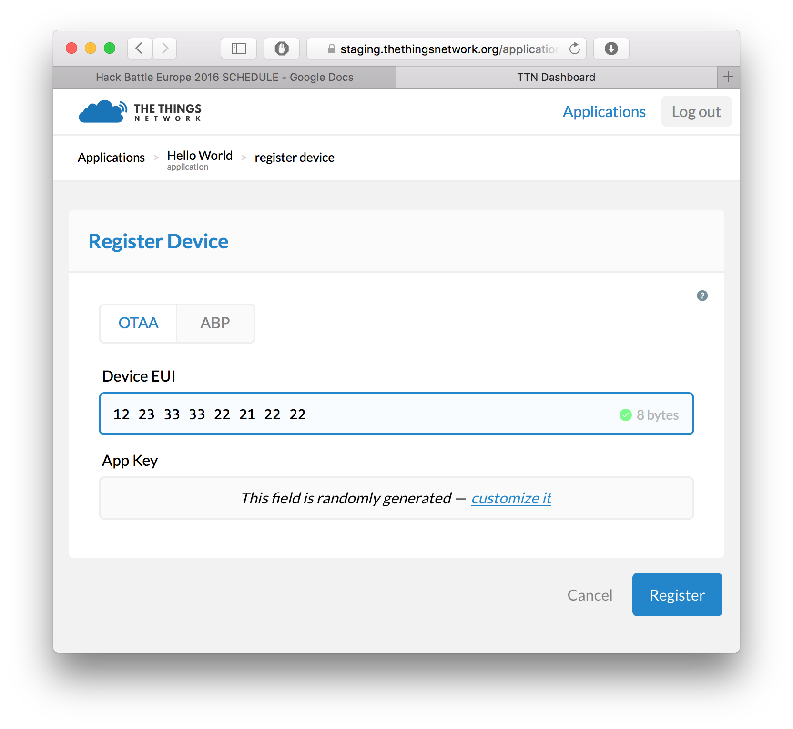
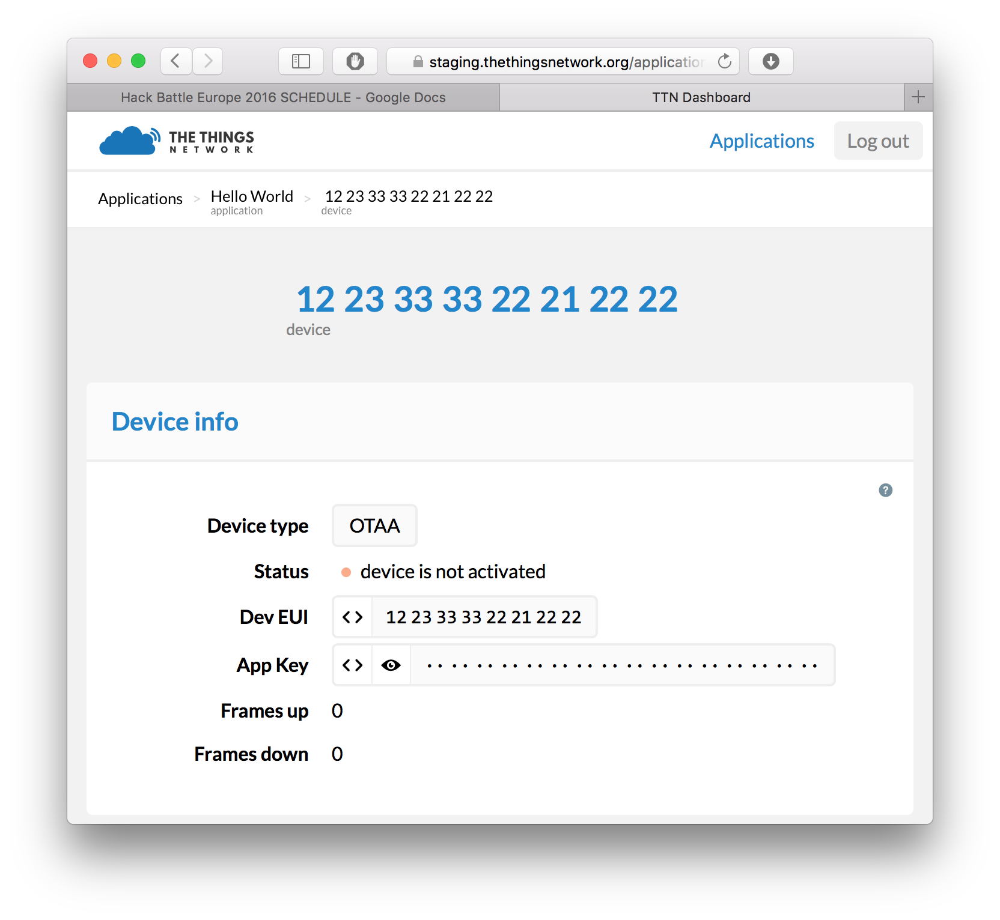

# The Things Uno MQTT Workshop

EclipseCon Europe, Toulouse, June 7, 2016

## Pre-requisites

1. The Things Uno (featuring Microchip RN2483 or RN2903)
2. Micro-USB cable
3. Laptop with Windows 7 or higher, Mac OS X or Linux

## Setup

### Arduino IDE

1. Download and install Arduino IDE 1.6.9 (for
   [Windows](https://www.arduino.cc/download_handler.php?f=/arduino-1.6.9-windows.exe),
   [Mac OS X](https://www.arduino.cc/download_handler.php?f=/arduino-1.6.9-macosx.zip)
   or [Linux](https://www.arduino.cc/download_handler.php?f=/arduino-1.6.9-linux64.tar.xz));
2. Download the latest The Things Uno Arduino Library
   ([zip](https://github.com/TheThingsNetwork/sdk/blob/master/devices/TheThingsUno/release/TheThingsUno.zip?raw=true));
3. Connect the The Things Uno to your computer using the Micro-USB cable;
4. In the Arduino IDE, go to **Sketch** > **Include Library** > **Add .ZIP
   Library** and select the downloaded zip file;
5. Select **Tools** > **Board** > **Arduino Leonardo**;
6. Select **Tools** > **Port** > the port that identifies as **Arduino
   Leonardo**. For example, on Mac OS X:
   

### The Things Network Dashboard

#### Create an Account

Your applications and devices can be managed by [The Things Network
dashboard][dashboard].
To use the dashboard you need a The Things Network account. You can [create
an account here][accounts].

After registering and validating your account, you will be able to
log in to [The Things Network dashboard][dashboard].

#### Create An Application

Users can create applications. Applications have an unique identifier, the EUI,
which is issued by The Things Network and is guaranteed to be unique.

Create your first The Things Network application by clicking
[create application](https://staging.thethingsnetwork.org/applications/create).
Fill in the desired application name (something like `Julia's temperature sensornet` if your name is Julia) and click **Create application**.


You will be redirected to the newly created Application page.


*Note: In the Application Info component, you can see the Access Key for that
application, this is a secret key to to get access to the data of your
application. You will need this key later.*

*Note: in every component on the dashboard there is a small help icon.
This opens a help message with details about that components.*

#### Register an OTAA Device

The Things Network supports the two LoRaWAN mechanisms to register devices:
activation by personalization (ABP) and over the air activation (OTAA). In this
workshop, we use OTAA. This requires you to register your device with its unique
DevEUI in The Things Network Dashboard.

##### Get Your Device EUI

To activate your device, we need to know its unique identifier, called the
Device EUI or DevEUI. The DevEUI is hard coded by the manufacturer, in this case
Microchip, into the LoRa module. This DevEUI is used to register the node in The
Things Network for identification. The DevEUI can be retrieved from the node with
the **device-info** sketch.

1. In the Arduino IDE, open: **File > Examples > TheThingsUno > DeviceInfo**
2. Upload sketch without modification.
3. Click **Sketch > Verify/Compile** (Arduino says *Done compiling*)
4. Click **Sketch > Upload** (Arduino says *Done uploading*)
5. The Arduino IDE will give feedback when you verify or upload the code to a
board. It should look similar to this:

```
Sketch uses 9,656 bytes (33%) of program storage space. Maximum is 28,672 bytes.
Global variables use 1,253 bytes (48%) of dynamic memory, leaving 1,307 bytes for local variables. Maximum is 2,560 bytes.
```

The Things Uno talks to the computer over a serial port. The data that is send
is displayed with the **Serial Monitor** of the Arduino IDE. Using the serial
monitor makes it possible to monitor the status of The Things Uno.

Open the serial monitor in the Arduino IDE: go to **Tools** >
**Serial Monitor**.

You should now be receiving data on the serial monitor, which prints something
like this:

```
Device Information

EUI: 0004A30B001B672E
Battery: 3304
AppEUI: 0000000000000000
DevEUI: 0004A30B001B672E
DevAddr: 00000000
Data Rate: 5
RX Delay 1: 1000
RX Delay 2: 2000

use the device `EUI` to register the device for OTAA
```

Save the `EUI: 0004A30B001B672E` (`DevEUI`) for later.  

##### Register the device

To register the device, go back to The Things Network dashboard and click
**Register Device** on the application page. This will take you to the device
registration page. Here, select **OTAA** and enter your DevEUI as obtained from
The Things Uno. We will let the App Key to be randomly generated. To continue,
click **Register**.



You will be redirected to the device info page.  Here you can view all
information about your device, send messages to the device and view messages
that were sent by the device.



## Hello World

### Configure Device

1. In the Arduino IDE, open **File** > **Examples** > **TheThingsUno** >
   **SendOTAA**
2. Change your `appEUI`, `appKey` to the values you can find on the application
   page. If you click the `<>` on the each of the fields on the Device page,
   their contents are shown as a C-style byte array literal which is extra
   handy for copy-pasting.

Use the information shown on the device page to fill in following code snippet:

```
// Copy paste the values found on the Application page here
const byte appEui[8] = { <insert AppEui> }; //for example: {0x70, 0xB3, 0xD5, 0x7E, 0xE0, 0xE0, 0x01, 0x4A1};
const byte appKey[16] = { <insert AppKey> }; //for example: {0x73, 0x6D, 0x24, 0xD2, 0x69, 0xBE, 0xE3, 0xAE, 0x0E, 0xCE, 0xF0, 0xBB, 0x6C, 0xA4, 0xBA, 0xFE};
```

### Run The Application On Your Device

1. Click **Sketch** > **Verify/Compile** and make sure that compilation works
   (Arduino says *Done compiling*)
2. Click **Sketch** > **Upload** (Arduino says *Done uploading*)
3. Go to **Tools** > **Serial Monitor** to see the output of your node. This
   should look like this:

```
Sending: mac tx uncnf 1 with 12 bytes
Successful transmission
Sending: mac tx uncnf 1 with 12 bytes
Successful transmission
...
```

### Get Your Data

If all goes well you should also be receiving messages from your device in the
Messages component on the device page. The payload you see here is
the the byte representation of the `Hello world!` string we are sending
from the device.


Using the payload like this is can be tricky: usually the raw bytes are of no
interest to an application using messages from a device.  That's why The Things
Network introduces the concept of *payload functions*. More on that later,
first let us send some actual data!

#### Embracing Bytes

Sending strings over LoRa is often a bad practice, as a high number of bytes
increases payload size and therefore requires more power and uses more precious
airtime. Instead, prefer to send bytes that encode your data in a compact way.
For instance, if we have a temperature reading, that is a `float`, depending on
the precision we need we could encode the integer and fractal parts as bytes in
a two-byte payload. Like so:

```
float temperature = 21.5; // This is a analog reading

int data = (int)(temperature * 100); // Get rid of fraction (data == 2150)
byte buf[2];
buf[0] = highByte(data);
buf[1] = lowByte(data);

ttu.sendBytes(buf, 2);
```

Set up the above loop in your Arduino and click **Sketch** > **Verify/Compile**
and **Sketch** > **Upload** again.  This will make the device send bytes
representing our temperature value `21.5`.

If you now have a look at the device page on the Dashboard you'll see your data
coming in. The payload should read `08 66` (the byte representation of `2150`).

*Note: how you encode your payload depends on the sensor values and the use case
of your application.

When sending booleans, try combining them in one byte by setting bits, and use a
bitmask to get the individual booleans. When sending floating point values whose
decimals you need, multiply by a value and cast to `int` (in the example above
we keep two decimals). Most numeric sensor values fit in one, two or three
bytes, including luminance, temperature, ranges, sound levels and GPS
coordinates.

Only send strings when the text is really variable, e.g. user input. For status
messages, consider using numeric status codes.*

#### Unpacking The Bytes

To make working with byte payloads easier, The Things Network allows you to
register payload functions for each application. The payload functions are
three functions: the *decoder*, the *converter* and the *validator*.

Here, we will only be using the *decoder* to unpack the bytes your device is
sending into messages that are meaningful to our application. Use the optional
*converter* function to convert units (e.g. voltage to Fahrenheit) and the
*validator* function to check whether the payload is valid (e.g. invalidate
outliers).

To set up the payload functions, go back to the Application view and click the
**edit** button in the Application Info component. This will bring you to the
Payload Function editor.


Here you can view, test and edit the payload functions for your application.

In the *decoder* section, enter the following to decode the payload:
```
function (bytes) {
  var data = (bytes[0] << 8) | bytes[1];
  return {
    temperature: data / 100.0,
  };
}
```

Before saving our payload function we can test it first by entering a test
payload in the box below. Enter `0866` and click **Test**. The test output
should correspond to the temperature value we sen earlier:

```
{
  "temperature": 21.5
}
```


If you are happy with the output of your payload function, click **Save**. All
incoming messages will now be decoded using these payload functions. You can see
if this worked by going back to the device page and looking at the messages. The
payload will now be logged in its decoded form.


### Getting Your Data

In this tutorial, we are using Node RED to get the data from The Things Network
routing services and push it to an application back-end.

1. Follow the instructions from your workshop facilitator to get to your Node
   RED environment
2. From the **input** category in the toolbox on the left, drop a new **TTN**
   node on your workflow
3. Double-click the node named `ttn`
7. Enter in **App EUI** your AppEUI (check the Application page)
8. Enter in **Access Key** your Access Key (check the Application page)
5. Enter for **Broker**: `staging.thethingsnetwork.org`
9. Click **Add**
10. From the **output** category, drop a new **debug** node on the flow and
    connect the upper output of the **ttn** node to the input of the **debug**
    node.

Your flow should look like this:


Click **Deploy** and monitor the debug tab for incoming messages. You will start
seeing messages like:
```
{ "temperature": 21.5 }
```

## Push to IFTTT

1. Go to [IFTTT Maker Channel](https://ifttt.com/maker)
2. Click **Connect**
3. Go to **Receive a web request**
4. Click **Create a new Recipe**
5. Type `Maker` in the search box to choose Maker as the trigger channel
6. Click **Receive a web request** as the trigger
7. Enter an **Event Name**, for example `temperature`
8. Pick an **Action Channel** and configure it
9. Use the fields `value1`, `value2` and/or `value3`
10. Click **Create Action**
11. Click **Create Recipe**
12. Go back to Node RED
13. Drop a new **Function** on the flow
14. Return `value1`, `value2` and/or `value3` as JSON object. For the previous
    example:
```
return {
    payload: {
        value1: msg.payload.temperature
    }
}
```
15. Drop a new **HTTP request** on the flow;
16. Select the **POST** method and enter the URL as seen on **How to Trigger
    Events** in IFTTT, for example:


[accounts]:  https://account.thethingsnetwork.org
[dashboard]: https://staging.thethingsnetwork.org
